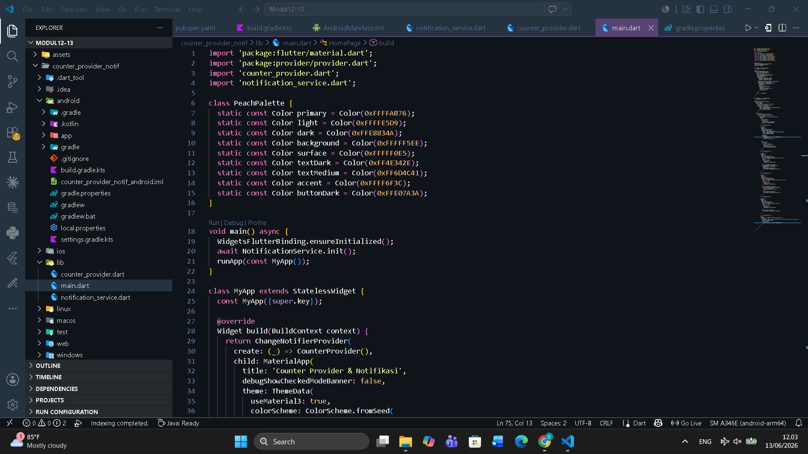
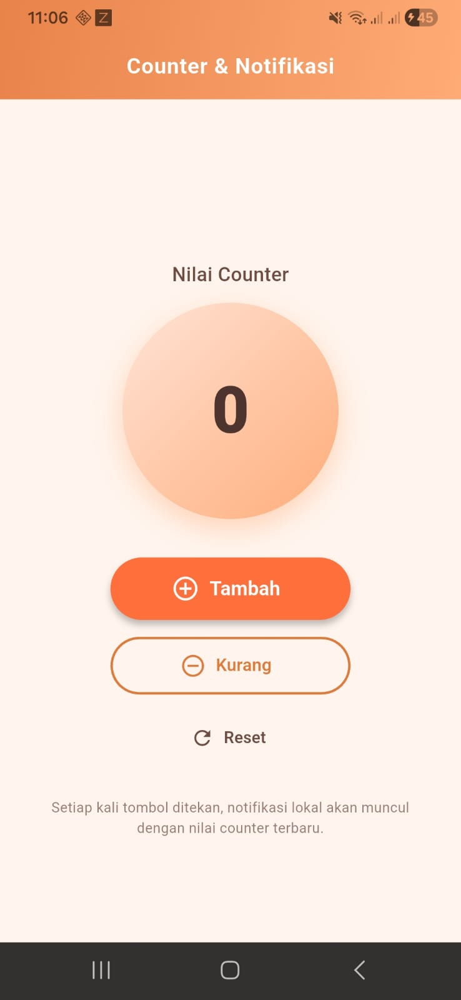
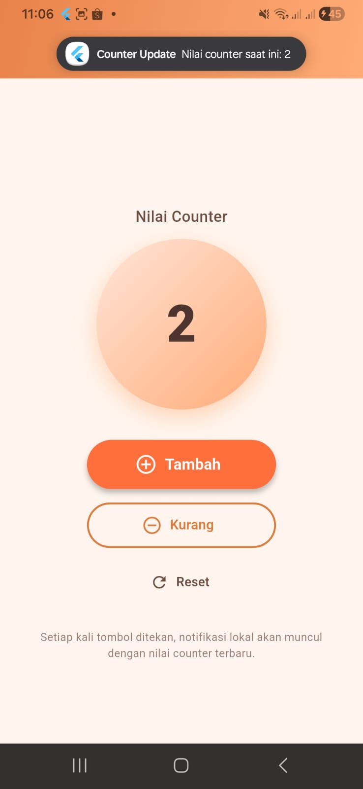
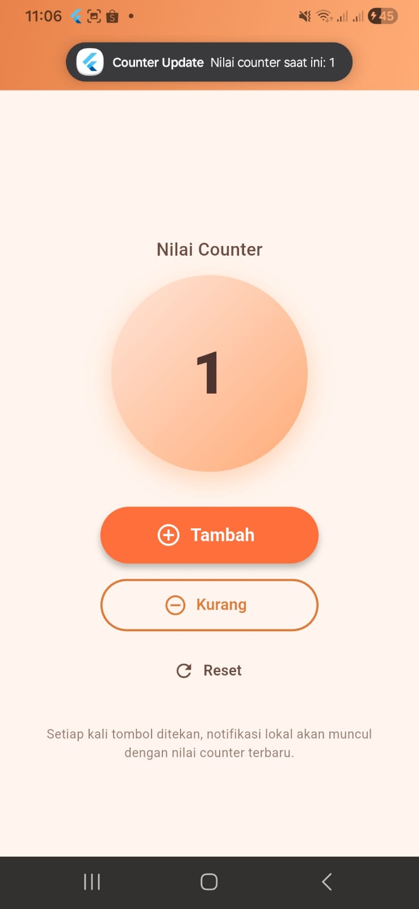
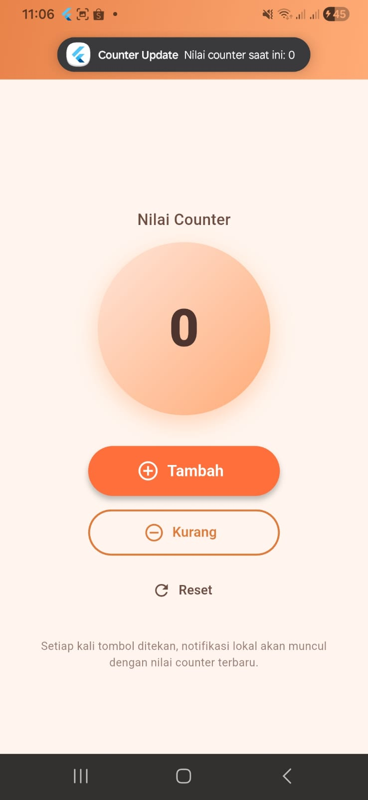

<div align="center">

## LAPORAN PRAKTIKUM <br> APLIKASI BERBASIS PLATFORM

<br>

### MODUL 12 & 13
### MOBILE

<br>
<br>


<br>
<br>
<br>

**Disusun oleh:**

**Diva Octaviani**  
**2311102006**

<br>

**KELAS PS1IF-11-REG01**

**Dosen: Dimas Fanny Hebrasianto Permadi, S.ST., M.Kom**

<br><br>

## PROGRAM STUDI S1 TEKNIK INFORMATIKA <br> FAKULTAS INFORMATIKA <br> UNIVERSITAS TELKOM PURWOKERTO <br> 2026 <br><br>

</div>

---

## 1. Dasar Teori

Flutter adalah framework open-source dari Google untuk membangun aplikasi mobile, web, dan desktop dari satu codebase menggunakan bahasa Dart. Pada praktikum modul 12 dan 13 ini, beberapa konsep utama yang digunakan adalah sebagai berikut.

**Provider** adalah package state management pada Flutter yang memungkinkan pengelolaan state secara efisien dan terpisah dari UI. Provider bekerja dengan prinsip Inversion of Control, di mana widget UI dapat listen (mendengarkan) perubahan state dari kelas yang memperluas `ChangeNotifier`. Ketika nilai state berubah, metode `notifyListeners()` dipanggil, yang kemudian memicu widget `Consumer` atau `context.watch()` untuk membangun ulang (rebuild) tampilan secara otomatis.

**ChangeNotifier** adalah kelas bawaan dari Flutter yang berfungsi sebagai pemegang data (state). Pada praktikum ini, `CounterProvider` memperluas kelas ini untuk menyimpan nilai counter. Setiap kali metode `increment()`, `decrement()`, atau `reset()` dipanggil, nilai counter diubah dan `notifyListeners()` dieksekusi untuk memberitahu UI bahwa data telah berubah.

**flutter_local_notifications** adalah package Flutter yang digunakan untuk menampilkan notifikasi lokal pada perangkat tanpa membutuhkan koneksi internet atau server backend. Notifikasi dikonfigurasi menggunakan `AndroidNotificationDetails` yang mencakup channel ID, nama channel, tingkat kepentingan (importance), dan prioritas. Pada Android 8.0 (API 26) ke atas, notifikasi wajib memiliki channel. Notifikasi ditampilkan menggunakan metode `show()` dari instance `FlutterLocalNotificationsPlugin`.

**Permission (Izin Aplikasi)** pada Android adalah mekanisme keamanan agar aplikasi tidak sembarangan mengakses fitur sensitif perangkat. Pada praktikum ini, permission `POST_NOTIFICATIONS` wajib dideklarasikan di `AndroidManifest.xml` untuk menampilkan notifikasi lokal. Selain itu, mulai Android 13 (API 33), izin notifikasi juga harus diminta secara runtime (saat aplikasi berjalan) menggunakan metode `requestNotificationsPermission()`.

**minSdkVersion** adalah konfigurasi di file `build.gradle` yang menentukan versi Android minimum yang didukung oleh aplikasi. Package `flutter_local_notifications` mengharuskan `minSdkVersion` minimal 21 (Android 5.0 Lollipop) agar fitur notifikasi dan channel dapat berjalan dengan baik tanpa error kompilasi.

---

## 2. Hasil Praktikum

### Langkah-Langkah:

**1.** Buka Visual Studio Code dan buat project Flutter baru dengan nama `counter_provider_notif` menggunakan perintah berikut di terminal:

```
flutter create counter_provider_notif
cd counter_provider_notif
```

**2.** Tambahkan dependency `provider` dan `flutter_local_notifications` pada file `pubspec.yaml` di bagian `dependencies`:

```yaml
dependencies:
  flutter:
    sdk: flutter
  provider: ^6.1.2
  flutter_local_notifications: ^17.2.4
```

**3.** Jalankan `flutter pub get` di terminal untuk mengunduh package.

```
flutter pub get
```

**4.** Ubah `minSdk` menjadi 21 pada file `android/app/build.gradle.kts` di dalam blok `defaultConfig`:

```kotlin
defaultConfig {
    applicationId = "com.example.counter_provider_notif"
    minSdk = 21
    targetSdk = flutter.targetSdkVersion
    versionCode = flutter.versionCode
    versionName = flutter.versionName
}
```

**5.** Tambahkan permission yang diperlukan pada file `android/app/src/main/AndroidManifest.xml`, letakkan sebelum tag `<application`:

```xml
<uses-permission android:name="android.permission.POST_NOTIFICATIONS"/>
<uses-permission android:name="android.permission.RECEIVE_BOOT_COMPLETED"/>
<uses-permission android:name="android.permission.VIBRATE"/>
```

**6.** Buat file baru `lib/notification_service.dart` untuk menangani inisialisasi dan menampilkan notifikasi lokal, termasuk request izin runtime untuk Android 13+:

```dart
import 'dart:io';
import 'package:flutter_local_notifications/flutter_local_notifications.dart';

class NotificationService {
  static final FlutterLocalNotificationsPlugin _plugin =
      FlutterLocalNotificationsPlugin();

  static Future<void> init() async {
    const AndroidInitializationSettings androidSettings =
        AndroidInitializationSettings('@mipmap/ic_launcher');

    const DarwinInitializationSettings iosSettings =
        DarwinInitializationSettings();

    const InitializationSettings settings = InitializationSettings(
      android: androidSettings,
      iOS: iosSettings,
    );

    await _plugin.initialize(settings);

    const AndroidNotificationChannel channel = AndroidNotificationChannel(
      'counter_channel',
      'Counter Updates',
      description: 'Notifikasi saat counter bertambah',
      importance: Importance.max,
    );

    await _plugin
        .resolvePlatformSpecificImplementation<
            AndroidFlutterLocalNotificationsPlugin>()
        ?.createNotificationChannel(channel);

    // Request izin notifikasi untuk Android 13+
    if (Platform.isAndroid) {
      final androidPlugin = _plugin.resolvePlatformSpecificImplementation<
          AndroidFlutterLocalNotificationsPlugin>();

      if (androidPlugin != null) {
        await androidPlugin.requestNotificationsPermission();
      }
    }
  }

  static Future<void> showNotification(int value) async {
    const AndroidNotificationDetails androidDetails =
        AndroidNotificationDetails(
      'counter_channel',
      'Counter Updates',
      channelDescription: 'Notifikasi saat counter bertambah',
      importance: Importance.max,
      priority: Priority.high,
    );

    const DarwinNotificationDetails iosDetails = DarwinNotificationDetails();

    const NotificationDetails details = NotificationDetails(
      android: androidDetails,
      iOS: iosDetails,
    );

    await _plugin.show(
      0,
      'Counter Update',
      'Nilai counter saat ini: $value',
      details,
    );
  }
}
```

**7.** Buat file baru `lib/counter_provider.dart` untuk menyimpan state counter menggunakan `ChangeNotifier`:

```dart
import 'package:flutter/material.dart';
import 'notification_service.dart';

class CounterProvider extends ChangeNotifier {
  int _counter = 0;

  int get counter => _counter;

  void increment() {
    _counter++;
    notifyListeners();
    NotificationService.showNotification(_counter);
  }

  void decrement() {
    if (_counter > 0) {
      _counter--;
      notifyListeners();
      NotificationService.showNotification(_counter);
    }
  }

  void reset() {
    _counter = 0;
    notifyListeners();
    NotificationService.showNotification(_counter);
  }
}
```

**8.** Buka `lib/main.dart`, hapus semua kode bawaan, lalu tambahkan kode berikut sebagai entry point aplikasi dengan implementasi UI bertema Peach dan Provider:

```dart
import 'package:flutter/material.dart';
import 'package:provider/provider.dart';
import 'counter_provider.dart';
import 'notification_service.dart';

class PeachPalette {
  static const Color primary = Color(0xFFFFAB76);
  static const Color light = Color(0xFFFFE5D9);
  static const Color dark = Color(0xFFE8834A);
  static const Color background = Color(0xFFFFF5EE);
  static const Color surface = Color(0xFFFFF0E5);
  static const Color textDark = Color(0xFF4E342E);
  static const Color textMedium = Color(0xFF6D4C41);
  static const Color accent = Color(0xFFFF6F3C);
  static const Color buttonDark = Color(0xFFE07A3A);
}

void main() async {
  WidgetsFlutterBinding.ensureInitialized();
  await NotificationService.init();
  runApp(const MyApp());
}

class MyApp extends StatelessWidget {
  const MyApp({super.key});

  @override
  Widget build(BuildContext context) {
    return ChangeNotifierProvider(
      create: (_) => CounterProvider(),
      child: MaterialApp(
        title: 'Counter Provider & Notifikasi',
        debugShowCheckedModeBanner: false,
        theme: ThemeData(
          useMaterial3: true,
          colorScheme: ColorScheme.fromSeed(
            seedColor: PeachPalette.primary,
            brightness: Brightness.light,
          ),
          scaffoldBackgroundColor: PeachPalette.background,
          appBarTheme: const AppBarTheme(
            backgroundColor: PeachPalette.primary,
            foregroundColor: Colors.white,
            elevation: 0,
            centerTitle: true,
            titleTextStyle: TextStyle(
              fontSize: 20,
              fontWeight: FontWeight.w700,
              color: Colors.white,
              letterSpacing: 0.5,
            ),
          ),
        ),
        home: const HomePage(),
      ),
    );
  }
}

class HomePage extends StatelessWidget {
  const HomePage({super.key});

  @override
  Widget build(BuildContext context) {
    return Scaffold(
      appBar: AppBar(
        title: const Text('Counter & Notifikasi'),
        flexibleSpace: Container(
          decoration: const BoxDecoration(
            gradient: LinearGradient(
              colors: [PeachPalette.dark, PeachPalette.primary],
              begin: Alignment.topLeft,
              end: Alignment.bottomRight,
            ),
          ),
        ),
      ),
      body: Center(
        child: Consumer<CounterProvider>(
          builder: (context, provider, child) {
            return Column(
              mainAxisAlignment: MainAxisAlignment.center,
              children: [
                Text(
                  'Nilai Counter',
                  style: TextStyle(
                    fontSize: 18,
                    color: PeachPalette.textMedium,
                    fontWeight: FontWeight.w500,
                  ),
                ),
                const SizedBox(height: 12),

                Container(
                  width: 180,
                  height: 180,
                  decoration: BoxDecoration(
                    shape: BoxShape.circle,
                    gradient: const LinearGradient(
                      colors: [PeachPalette.light, PeachPalette.primary],
                      begin: Alignment.topLeft,
                      end: Alignment.bottomRight,
                    ),
                    boxShadow: [
                      BoxShadow(
                        color: PeachPalette.primary.withOpacity(0.45),
                        blurRadius: 20,
                        offset: const Offset(0, 8),
                      ),
                    ],
                  ),
                  child: Center(
                    child: Text(
                      '${provider.counter}',
                      style: const TextStyle(
                        fontSize: 60,
                        fontWeight: FontWeight.w900,
                        color: PeachPalette.textDark,
                      ),
                    ),
                  ),
                ),
                const SizedBox(height: 32),

                // Tombol Tambah
                SizedBox(
                  width: 200,
                  height: 52,
                  child: ElevatedButton.icon(
                    onPressed: provider.increment,
                    icon: const Icon(Icons.add_circle_outline, size: 24),
                    label: const Text(
                      'Tambah',
                      style: TextStyle(
                        fontSize: 18,
                        fontWeight: FontWeight.w700,
                      ),
                    ),
                    style: ElevatedButton.styleFrom(
                      backgroundColor: PeachPalette.accent,
                      foregroundColor: Colors.white,
                      elevation: 4,
                      shape: RoundedRectangleBorder(
                        borderRadius: BorderRadius.circular(30),
                      ),
                    ),
                  ),
                ),
                const SizedBox(height: 14),

                // Tombol Kurang
                SizedBox(
                  width: 200,
                  height: 48,
                  child: OutlinedButton.icon(
                    onPressed: provider.decrement,
                    icon: const Icon(Icons.remove_circle_outline, size: 22),
                    label: const Text(
                      'Kurang',
                      style: TextStyle(
                        fontSize: 16,
                        fontWeight: FontWeight.w600,
                      ),
                    ),
                    style: OutlinedButton.styleFrom(
                      foregroundColor: PeachPalette.buttonDark,
                      side: const BorderSide(
                        color: PeachPalette.buttonDark,
                        width: 2,
                      ),
                      shape: RoundedRectangleBorder(
                        borderRadius: BorderRadius.circular(30),
                      ),
                    ),
                  ),
                ),
                const SizedBox(height: 14),

                // Tombol Reset
                SizedBox(
                  width: 200,
                  height: 44,
                  child: TextButton.icon(
                    onPressed: provider.reset,
                    icon: const Icon(Icons.refresh, size: 20),
                    label: const Text(
                      'Reset',
                      style: TextStyle(
                        fontSize: 15,
                        fontWeight: FontWeight.w600,
                      ),
                    ),
                    style: TextButton.styleFrom(
                      foregroundColor: PeachPalette.textMedium,
                    ),
                  ),
                ),

                const SizedBox(height: 28),

                Padding(
                  padding: const EdgeInsets.symmetric(horizontal: 40),
                  child: Text(
                    'Setiap kali tombol ditekan, notifikasi lokal akan muncul dengan nilai counter terbaru.',
                    textAlign: TextAlign.center,
                    style: TextStyle(
                      fontSize: 13,
                      color: PeachPalette.textMedium.withOpacity(0.7),
                    ),
                  ),
                ),
              ],
            );
          },
        ),
      ),
    );
  }
}
```

**9.** Hubungkan perangkat Samsung ke PC menggunakan kabel USB, aktifkan USB Debugging pada Developer Options di HP, lalu jalankan aplikasi dengan perintah:

```
flutter run
```

**10.** Saat pertama kali dijalankan, aplikasi akan meminta izin notifikasi. Pilih **Allow/Izinkan** agar notifikasi dapat muncul di sistem saat tombol ditekan.

### Output:

### 1. Source Code


### 2. Tampilan Aplikasi
<table>
  <tr>
    <td align="center"><b>Tampilan Awal (Counter = 0)</b></td>
    <td align="center"><b>Saat Klik Tombol Tambah (+)</b></td>
  </tr>
  <tr>
    <td></td>
    <td></td>
  </tr>
</table>
<br>
<table>
  <tr>
    <td align="center"><b>Saat Klik Tombol Kurang (−)</b></td>
    <td align="center"><b>Saat Klik Tombol Reset</b></td>
  </tr>
  <tr>
    <td></td>
    <td></td>
  </tr>
</table>
<br>