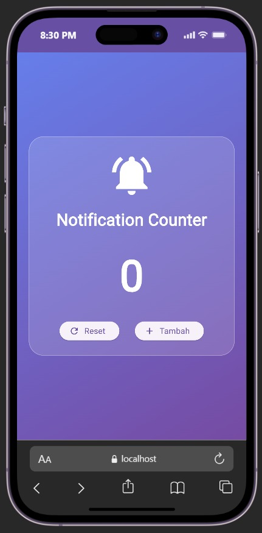
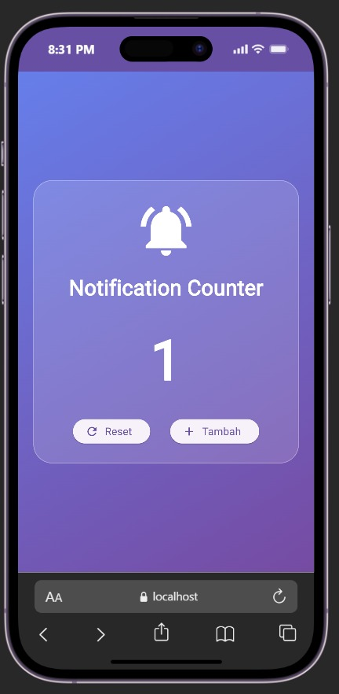
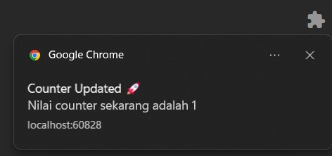

<div align="center">
  <br />
  <h1>LAPORAN PRAKTIKUM <br>APLIKASI BERBASIS PLATFORM</h1>
  <br />
  <h3>MODUL 12 & 13<br> Penerapan Provider dan Notifikasi pada Flutter </h3>
  <br />
   
  <br />
  <br />
  <br />
  <h3>Disusun Oleh :</h3>
  <p>
    <strong>Nadhif Atha Zaki</strong><br>
    <strong>2311102007</strong><br>
    <strong>S1 IF-11-01</strong>
  </p>
  <br />
  <br />
  <h3>Dosen Pengampu :</h3>
  <p>
    <strong>Dimas Fanny Hebrasianto Permadi, S.ST., M.Kom</strong>
  </p>
  <br />
  <br />
    <h4>Asisten Praktikum :</h4>
    <strong> Apri Pandu Wicaksono </strong> <br>
    <strong>Rangga Pradarrell Fathi</strong>
  <br />
  <h3>LABORATORIUM HIGH PERFORMANCE
 <br>FAKULTAS INFORMATIKA <br>UNIVERSITAS TELKOM PURWOKERTO <br>2026</h3>
</div>

---

# 1. Dasar Teori

### Flutter

Flutter adalah sebuah toolkit UI open-source besutan Google yang memungkinkan satu basis kode digunakan untuk menghasilkan aplikasi pada banyak platform sekaligus, baik mobile, web, maupun desktop. Bahasa yang menjadi fondasi Flutter adalah Dart, dan framework ini dilengkapi koleksi widget siap pakai untuk merancang tampilan yang adaptif terhadap berbagai ukuran layar.

### State Management dengan Provider

Provider merupakan pustaka pengelolaan state pada Flutter yang berfungsi menyalurkan dan menyinkronkan data antar widget tanpa harus melewatinya secara manual lapis demi lapis (props drilling). Mekanismenya bertumpu pada class `ChangeNotifier`, di mana setiap kali ada perubahan data, method `notifyListeners()` dipanggil untuk memberi sinyal kepada widget pendengar (listener) agar membangun ulang tampilannya.

### Notifikasi pada Aplikasi Flutter Web

Pada praktikum ini, notifikasi yang ditampilkan bukan berasal dari pustaka pihak ketiga seperti `flutter_local_notifications`, melainkan memanfaatkan Web Notification API milik browser melalui pustaka `dart:html`. Pendekatan ini cocok diterapkan ketika target build aplikasi adalah web, karena Flutter dapat berinteraksi langsung dengan API notifikasi bawaan browser tanpa dependensi tambahan untuk platform native.

---

# 2. Implementasi Program

### Entry Point Aplikasi

File: `main.dart`

```dart
import 'package:flutter/material.dart';
import 'package:provider/provider.dart';

import 'providers/counter_provider.dart';
import 'pages/home_page.dart';
import 'services/notification_service.dart';

void main() async {
  WidgetsFlutterBinding.ensureInitialized();

  await NotificationService.initialize();

  runApp(
    MultiProvider(
      providers: [ChangeNotifierProvider(create: (_) => CounterProvider())],
      child: const MyApp(),
    ),
  );
}

class MyApp extends StatelessWidget {
  const MyApp({super.key});

  @override
  Widget build(BuildContext context) {
    return MaterialApp(
      debugShowCheckedModeBanner: false,
      title: 'Provider Notification App',
      theme: ThemeData(useMaterial3: true),
      home: const HomePage(),
    );
  }
}
```

Penjelasan singkat: sebelum aplikasi dijalankan, `WidgetsFlutterBinding.ensureInitialized()` dipanggil agar binding Flutter siap menerima proses asinkron, kemudian `NotificationService.initialize()` dieksekusi untuk meminta izin notifikasi pada browser. Objek `CounterProvider` didaftarkan lewat `MultiProvider` sehingga nilainya bisa diakses oleh widget mana pun di bawah pohon widget tersebut.

### Halaman Utama

File: `home_page.dart`

```dart
import 'package:flutter/material.dart';
import 'package:provider/provider.dart';

import '../providers/counter_provider.dart';
import '../services/notification_service.dart';

class HomePage extends StatelessWidget {
  const HomePage({super.key});

  @override
  Widget build(BuildContext context) {
    final counterProvider = Provider.of<CounterProvider>(context);

    return Scaffold(
      body: Container(
        decoration: const BoxDecoration(
          gradient: LinearGradient(
            colors: [Color(0xff667eea), Color(0xff764ba2)],
            begin: Alignment.topLeft,
            end: Alignment.bottomRight,
          ),
        ),
        child: Center(
          child: Container(
            width: 350,
            padding: const EdgeInsets.all(25),
            decoration: BoxDecoration(
              color: Colors.white.withOpacity(0.15),
              borderRadius: BorderRadius.circular(25),
              border: Border.all(color: Colors.white30),
            ),
            child: Column(
              mainAxisSize: MainAxisSize.min,
              children: [
                const Icon(
                  Icons.notifications_active,
                  size: 80,
                  color: Colors.white,
                ),
                const SizedBox(height: 15),
                const Text(
                  "Notification Counter",
                  style: TextStyle(
                    color: Colors.white,
                    fontSize: 28,
                    fontWeight: FontWeight.bold,
                  ),
                ),
                const SizedBox(height: 25),
                Text(
                  "${counterProvider.counter}",
                  style: const TextStyle(
                    color: Colors.white,
                    fontSize: 72,
                    fontWeight: FontWeight.bold,
                  ),
                ),
                const SizedBox(height: 25),
                Row(
                  mainAxisAlignment: MainAxisAlignment.spaceEvenly,
                  children: [
                    ElevatedButton.icon(
                      onPressed: () {
                        counterProvider.reset();
                      },
                      icon: const Icon(Icons.refresh),
                      label: const Text("Reset"),
                    ),
                    ElevatedButton.icon(
                      onPressed: () {
                        counterProvider.increment();
                        NotificationService.showNotification(
                          counterProvider.counter,
                        );
                      },
                      icon: const Icon(Icons.add),
                      label: const Text("Tambah"),
                    ),
                  ],
                ),
              ],
            ),
          ),
        ),
      ),
    );
  }
}
```

Halaman ini menampilkan kartu transparan bergradasi ungu yang berisi ikon lonceng, label judul, angka counter, dan dua tombol aksi. Nilai `counterProvider.counter` diambil melalui `Provider.of<CounterProvider>(context)` sehingga setiap kali nilainya berubah, widget `Text` yang menampilkan angka tersebut otomatis ter-render ulang. Tombol "Tambah" memanggil dua hal sekaligus: menaikkan counter lewat `increment()` dan langsung memicu notifikasi browser dengan nilai counter terbaru, sedangkan tombol "Reset" mengembalikan counter ke nol.

### Provider Counter

File: `counter_provider.dart`

```dart
import 'package:flutter/material.dart';

class CounterProvider extends ChangeNotifier {
  int _counter = 0;

  int get counter => _counter;

  void increment() {
    _counter++;
    notifyListeners();
  }

  void reset() {
    _counter = 0;
    notifyListeners();
  }
}
```

Class ini menyimpan nilai counter pada variabel privat `_counter` yang hanya dapat dibaca dari luar melalui getter `counter`. Dua method disediakan untuk memodifikasi data: `increment()` untuk menambah nilai satu per satu, dan `reset()` untuk mengembalikannya ke nol. Setiap kali salah satu method tersebut dipanggil, `notifyListeners()` dieksekusi agar seluruh widget yang sedang "mendengarkan" provider ini langsung memperbarui tampilannya.

### Layanan Notifikasi

File: `notification_service.dart`

```dart
// ignore: avoid_web_libraries_in_flutter
import 'dart:html' as html;

class NotificationService {
  static Future<void> initialize() async {
    if (html.Notification.permission != "granted") {
      await html.Notification.requestPermission();
    }
  }

  static void showNotification(int counter) {
    if (html.Notification.permission == "granted") {
      html.Notification(
        "Counter Updated 🚀",
        body: "Nilai counter sekarang adalah $counter",
      );
    }
  }
}
```

Berbeda dari pendekatan native yang umumnya memakai `flutter_local_notifications`, layanan ini langsung memanfaatkan Web Notification API bawaan browser melalui `dart:html`. Method `initialize()` mengecek status izin notifikasi browser dan memintanya apabila belum diberikan, sementara `showNotification()` hanya akan menampilkan pop-up notifikasi jika izin tersebut sudah berstatus "granted", dengan judul "Counter Updated 🚀" dan isi pesan berupa nilai counter yang sedang berjalan.

---

# 3. Hasil Tampilan

### Tampilan Awal Aplikasi



### Tampilan Setelah Tombol Tambah Ditekan



### Tampilan Notifikasi Browser



---

# 4. Mekanisme Provider dalam Aplikasi

Pengelolaan nilai counter pada aplikasi ini bertumpu pada class `CounterProvider`, yang menjadi satu-satunya sumber kebenaran (single source of truth) untuk data counter. Widget `HomePage` mengakses provider ini melalui `Provider.of<CounterProvider>(context)`, sehingga ketika `increment()` atau `reset()` dipanggil dan diikuti `notifyListeners()`, Flutter secara otomatis membangun ulang bagian widget yang bergantung pada data tersebut tanpa perlu kode tambahan untuk sinkronisasi tampilan.

---

# 5. Mekanisme Notifikasi yang Digunakan

Berbeda dari pendekatan berbasis plugin native, aplikasi ini menampilkan notifikasi dengan memanfaatkan kemampuan browser secara langsung lewat `dart:html`. Saat aplikasi pertama kali dijalankan, izin notifikasi diminta melalui `NotificationService.initialize()`. Selanjutnya, setiap kali tombol "Tambah" ditekan, `showNotification()` dipanggil untuk memunculkan pop-up notifikasi bertajuk "Counter Updated 🚀" yang menampilkan nilai counter terbaru sebagai isi pesannya.

---

# 6. Kesimpulan

Melalui praktikum ini, penerapan State Management menggunakan Provider berhasil dipadukan dengan mekanisme notifikasi berbasis Web Notification API pada aplikasi Flutter Web. Provider terbukti efektif dalam mengelola dan menyebarkan perubahan data counter ke seluruh widget terkait secara otomatis, sementara notifikasi browser memberi umpan balik instan kepada pengguna setiap kali nilai counter diperbarui. Pengujian yang dilakukan menunjukkan bahwa fitur tambah dan reset counter berjalan sesuai harapan, dan notifikasi tampil dengan nilai yang akurat sesuai kondisi counter terkini.
