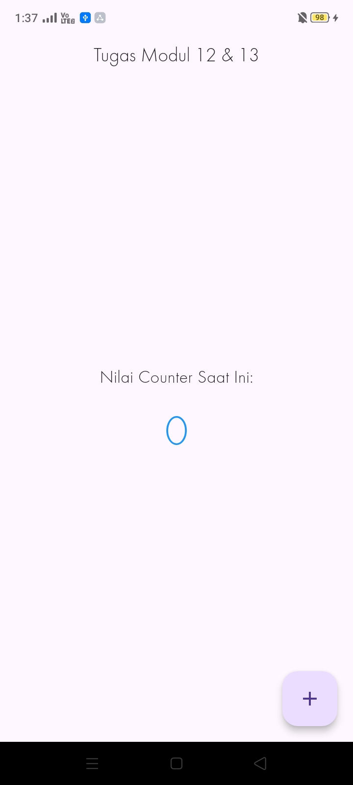
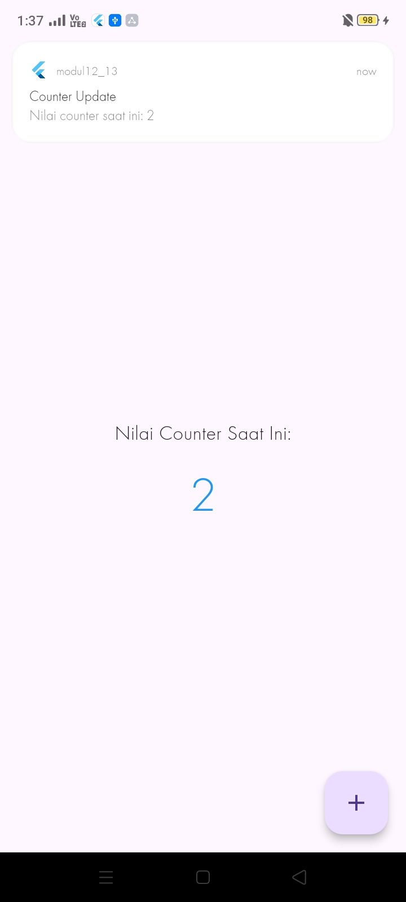

<div align="center">

# LAPORAN PRAKTIKUM
# APLIKASI BERBASIS PLATFORM


## MODUL 12&13
## MOBILE


**Disusun Oleh :**

**Sherine Naura Early Gunawan**

**2311102020**

**S1 IF-11-REG01**

**PROGRAM STUDI S1 INFORMATIKA**

**FAKULTAS INFORMATIKA**

**UNIVERSITAS TELKOM PURWOKERTO**

**2025/2026**

</div>


---

## 1. Source Code 

```dart
import 'package:flutter/material.dart';
import 'package:provider/provider.dart';
import 'package:flutter_local_notifications/flutter_local_notifications.dart';

class NotificationService {
  static final FlutterLocalNotificationsPlugin _notificationsPlugin =
      FlutterLocalNotificationsPlugin();

  static Future<void> initialize() async {
    const AndroidInitializationSettings initializationSettingsAndroid =
        AndroidInitializationSettings('@mipmap/ic_launcher');

    const InitializationSettings initializationSettings =
        InitializationSettings(android: initializationSettingsAndroid);

    await _notificationsPlugin.initialize(
      settings: initializationSettings,
      onDidReceiveNotificationResponse: (NotificationResponse response) {},
    );
  }

  static Future<void> showNotification(int count) async {
    const AndroidNotificationDetails androidDetails =
        AndroidNotificationDetails(
          'counter_channel',
          'Counter Notifications',
          channelDescription: 'Notifikasi untuk update nilai counter',
          importance: Importance.max,
          priority: Priority.high,
        );

    const NotificationDetails platformDetails = NotificationDetails(
      android: androidDetails,
    );

    await _notificationsPlugin.show(
      id: 0,
      title: 'Counter Update',
      body: 'Nilai counter saat ini: $count',
      notificationDetails: platformDetails,
    );
  }
}

class CounterProvider extends ChangeNotifier {
  int _count = 0;

  int get count => _count;

  void increment() {
    _count++;
    notifyListeners();
    NotificationService.showNotification(_count);
  }
}

void main() async {
  WidgetsFlutterBinding.ensureInitialized();
  await NotificationService.initialize();

  runApp(
    ChangeNotifierProvider(
      create: (context) => CounterProvider(),
      child: const MyApp(),
    ),
  );
}

class MyApp extends StatelessWidget {
  const MyApp({super.key});

  @override
  Widget build(BuildContext context) {
    return MaterialApp(
      debugShowCheckedModeBanner: false,
      title: 'Provider & Notifikasi',
      theme: ThemeData(primarySwatch: Colors.blue),
      home: const CounterScreen(),
    );
  }
}

class CounterScreen extends StatelessWidget {
  const CounterScreen({super.key});

  @override
  Widget build(BuildContext context) {
    final counterProvider = Provider.of<CounterProvider>(context);

    return Scaffold(
      appBar: AppBar(
        title: const Text('Tugas Modul 12 & 13'),
        centerTitle: true,
      ),
      body: Center(
        child: Column(
          mainAxisAlignment: MainAxisAlignment.center,
          children: [
            const Text(
              'Nilai Counter Saat Ini:',
              style: TextStyle(fontSize: 20),
            ),
            const SizedBox(height: 10),
            Text(
              '${counterProvider.count}',
              style: const TextStyle(
                fontSize: 48,
                fontWeight: FontWeight.bold,
                color: Colors.blue,
              ),
            ),
          ],
        ),
      ),
      floatingActionButton: FloatingActionButton(
        onPressed: () {
          Provider.of<CounterProvider>(context, listen: false).increment();
        },
        child: const Icon(Icons.add),
      ),
    );
  }
}
```

## 2. Penjelasan
### a. Cara Kerja Provider pada Aplikasi
Aplikasi ini menerapkan state management menggunakan provider untuk memisahkan logika data (state) dari struktur tampilan antarmuka (UI). Prosesnya berjalan melalui mekanisme berikut:
- ChangeNotifier (CounterProvider): Kelas ini bertindak sebagai media penyimpanan state utama untuk data counter (_count). Di dalam kelas ini terdapat fungsi increment() untuk menaikkan nilai counter secara inkremental. Setelah nilai ditambahkan, fungsi mengeksekusi metode notifyListeners().
```dart
class CounterProvider extends ChangeNotifier {
  int _count = 0;

  int get count => _count;

  void increment() {
    _count++;
    notifyListeners();
    NotificationService.showNotification(_count);
  }
}
```

- Sistem Re-render Tampilan (notifyListeners): Metode notifyListeners() di dalam fungsi increment() bertugas memancarkan sinyal pemberitahuan secara real-time ke seluruh komponen UI yang terhubung agar objek tampilan segera memperbarui dirinya menggunakan nilai data terbaru.
```dart
void increment() {
    _count++;
    notifyListeners(); 
    NotificationService.showNotification(_count);
  }
```

- ChangeNotifierProvider: Kelas ChangeNotifierProvider diletakkan di dalam fungsi main() untuk membungkus komponen root MyApp(). Langkah ini bertujuan mendaftarkan instansiasi CounterProvider ke dalam widget tree agar datanya bisa diakses secara global oleh halaman lain.
```dart
void main() async {
  WidgetsFlutterBinding.ensureInitialized();
  await NotificationService.initialize();

  runApp(
    ChangeNotifierProvider(
      create: (context) => CounterProvider(),
      child: const MyApp(),
    ),
  );
}
```

- Konsumsi Data pada Tampilan UI (Provider.of): Pada kelas CounterScreen, data dipantau menggunakan ekspresi Provider.of<CounterProvider>(context). Ketika nilai berubah, objek Text otomatis melakukan re-build. Sementara itu, tombol menggunakan parameter listen: false agar tombol hanya memicu fungsi aksi tanpa ikut di-render ulang.
```dart
final counterProvider = Provider.of<CounterProvider>(context);
Text('${counterProvider.count}');

floatingActionButton: FloatingActionButton(
  onPressed: () {
    Provider.of<CounterProvider>(context, listen: false).increment();
  },
  child: const Icon(Icons.add),
),
```

### b. Cara Kerja Notifikasi yang Digunakan
- Inisialisasi Perangkat Awal (initialize): Metode ini dieksekusi di dalam fungsi main() saat aplikasi pertama kali dimuat. Langkah ini mendaftarkan setelan spesifik Android (AndroidInitializationSettings) dengan menyertakan ikon bawaan sistem @mipmap/ic_launcher ke parameter settings.
```dart
static final FlutterLocalNotificationsPlugin _notificationsPlugin =
      FlutterLocalNotificationsPlugin();

  static Future<void> initialize() async {
    const AndroidInitializationSettings initializationSettingsAndroid =
        AndroidInitializationSettings('@mipmap/ic_launcher');

    const InitializationSettings initializationSettings =
        InitializationSettings(android: initializationSettingsAndroid);

    await _notificationsPlugin.initialize(
      settings: initializationSettings,
      onDidReceiveNotificationResponse: (NotificationResponse response) {},
    );
  }
```

- Konfigurasi Saluran Android (AndroidNotificationDetails): Sistem Android mewajibkan adanya saluran pesan. Objek AndroidNotificationDetails mendefinisikan ID saluran (counter_channel), nama, serta tingkat importance: Importance.max dan priority: Priority.high agar notifikasi diizinkan muncul sebagai banner pop-up melayang di layar.
```dart
const AndroidNotificationDetails androidDetails =
        AndroidNotificationDetails(
          'counter_channel',
          'Counter Notifications',
          channelDescription: 'Notifikasi untuk update nilai counter',
          importance: Importance.max,
          priority: Priority.high,
        );

    const NotificationDetails platformDetails = NotificationDetails(
      android: androidDetails,
    );
```

- Pemicuan Notifikasi (Triggering): Integrasi sistem terjadi saat fungsi increment() pada kelas provider dijalankan. Sesaat setelah nilai data dinaikkan di memori, fungsi asinkron NotificationService.showNotification(_count) dipanggil dengan melemparkan parameter nilai variabel counter terbaru.
```dart
void increment() {
    _count++;
    notifyListeners();
    NotificationService.showNotification(_count); // Memanggil notifikasi
  }
```

- Pengiriman dan Tampilan Pesan (_notificationsPlugin.show): Metode ini mengirimkan data visual ke sistem operasi perangkat. Parameter title diatur tetap, sedangkan parameter body diisi secara dinamis menggunakan interpolasi string $count untuk memuat nilai counter.
```dart
await _notificationsPlugin.show(
      id: 0,
      title: 'Counter Update',
      body: 'Nilai counter saat ini: $count',
      notificationDetails: platformDetails,
    );
```

---

## 3. Hasil

<div align="center">
    
    
</div>