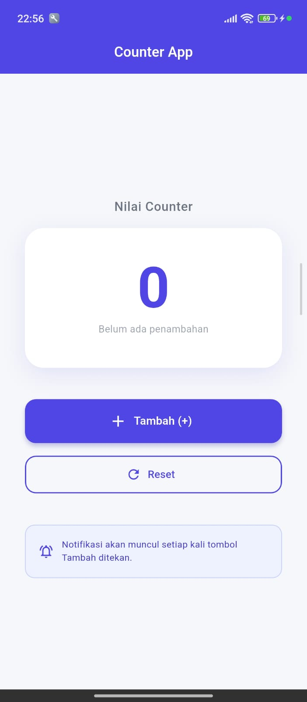
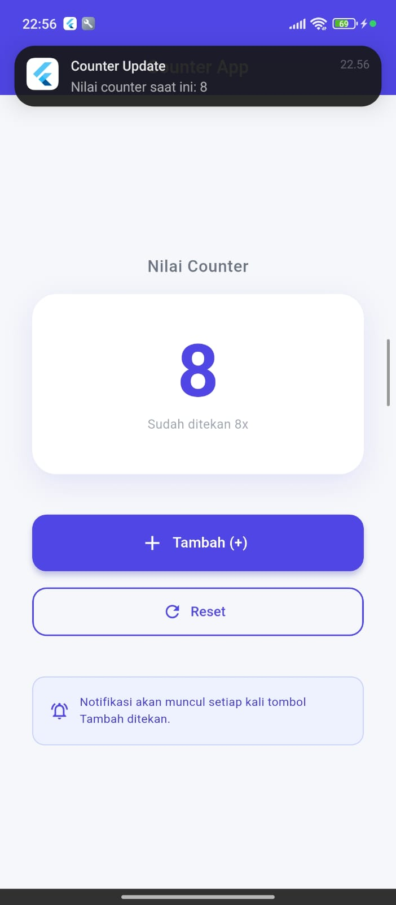

<div align="center">
  <br />
  <h1>LAPORAN PRAKTIKUM <br>APLIKASI BERBASIS PLATFORM</h1>
  <br />
  <h3>MODUL 12-13 - Mobile <br> COUNTER APP  </h3>
  <br />
   
  <br />
  <br />
  <br />
  <h3>Disusun Oleh :</h3>
  <p>
    <strong>Rizal Dwi Anggoro</strong><br>
    <strong>2311102034</strong><br>
    <strong>IF-11-REG01</strong>
  </p>
  <br />
  <h3>Dosen Pengampu :</h3>
  <p>
    <strong>Dimas Fanny Hebrasianto Permadi, S.ST., M.Kom</strong>
  </p>
  <br />
  <br />
    <h4>Asisten Praktikum :</h4>
    <strong> Apri Pandu Wicaksono </strong> <br>
    <strong>Rangga Pradarrell Fathi</strong>
  <br />
  <h3>LABORATORIUM HIGH PERFORMANCE
 <br>FAKULTAS INFORMATIKA <br>UNIVERSITAS TELKOM PURWOKERTO <br>2026</h3>
</div>

---

## 1. Struktur Folder

```
lib/
├── main.dart                    → Entry point, inisialisasi Provider & Notifikasi
├── providers/
│   └── counter_provider.dart    → State management (Modul 12)
├── screens/
│   └── home_screen.dart         → Tampilan UI
└── services/
    └── notification_service.dart → Local Notification (Modul 13)
```

---

## 2. Code dan Penjelasan

### `lib/main.dart`

```dart
import 'package:flutter/material.dart';
import 'package:provider/provider.dart';
import 'providers/counter_provider.dart';
import 'screens/home_screen.dart';
import 'services/notification_service.dart';

void main() async {
  WidgetsFlutterBinding.ensureInitialized();
  await NotificationService().initialize();

  runApp(
    ChangeNotifierProvider(
      create: (_) => CounterProvider(),
      child: const MyApp(),
    ),
  );
}
```

`main.dart` menginisialisasi plugin notifikasi sebelum memulai aplikasi. `ChangeNotifierProvider` menyiapkan `CounterProvider` agar state counter tersedia di seluruh widget tree.

### `lib/providers/counter_provider.dart`

```dart
import 'package:flutter/foundation.dart';

class CounterProvider extends ChangeNotifier {
  int _counter = 0;

  int get counter => _counter;

  void increment() {
    _counter++;
    notifyListeners();
  }

  void reset() {
    _counter = 0;
    notifyListeners();
  }
}
```

`CounterProvider` menyimpan nilai counter dan memberitahu widget terkait setiap kali `increment()` atau `reset()` dijalankan. `notifyListeners()` membuat UI yang mendengarkan provider otomatis rebuild.

### `lib/screens/home_screen.dart`

```dart
import 'package:flutter/material.dart';
import 'package:provider/provider.dart';
import '../providers/counter_provider.dart';
import '../services/notification_service.dart';

class HomeScreen extends StatelessWidget {
  const HomeScreen({super.key});

  @override
  Widget build(BuildContext context) {
    return Scaffold(
      body: Consumer<CounterProvider>(
        builder: (context, counterProvider, child) {
          return ElevatedButton.icon(
            onPressed: () async {
              counterProvider.increment();
              await NotificationService().showCounterNotification(counterProvider.counter);
            },
            icon: const Icon(Icons.add),
            label: const Text('Tambah (+)'),
          );
        },
      ),
    );
  }
}
```

`HomeScreen` menggunakan `Consumer<CounterProvider>` untuk membaca state counter. Saat tombol ditekan, nilai counter bertambah dan notifikasi lokal ditampilkan dengan angka terbaru.

### `lib/services/notification_service.dart`

```dart
import 'package:flutter_local_notifications/flutter_local_notifications.dart';
import 'package:permission_handler/permission_handler.dart';

class NotificationService {
  static final NotificationService _instance = NotificationService._internal();
  factory NotificationService() => _instance;
  NotificationService._internal();

  final FlutterLocalNotificationsPlugin _plugin = FlutterLocalNotificationsPlugin();

  Future<void> initialize() async {
    const AndroidInitializationSettings androidSettings = AndroidInitializationSettings('@mipmap/ic_launcher');
    const DarwinInitializationSettings iosSettings = DarwinInitializationSettings(
      requestAlertPermission: true,
      requestBadgePermission: true,
      requestSoundPermission: true,
    );

    const InitializationSettings initSettings = InitializationSettings(
      android: androidSettings,
      iOS: iosSettings,
    );

    await _plugin.initialize(initSettings);
    await _requestPermission();
  }

  Future<void> _requestPermission() async {
    final status = await Permission.notification.status;
    if (!status.isGranted) {
      await Permission.notification.request();
    }
  }

  Future<void> showCounterNotification(int counterValue) async {
    const AndroidNotificationDetails androidDetails = AndroidNotificationDetails(
      'counter_channel',
      'Counter Notifications',
      channelDescription: 'Notifikasi untuk perubahan nilai counter',
      importance: Importance.high,
      priority: Priority.high,
      icon: '@mipmap/ic_launcher',
    );

    const DarwinNotificationDetails iosDetails = DarwinNotificationDetails(
      presentAlert: true,
      presentBadge: true,
      presentSound: true,
    );

    const NotificationDetails notifDetails = NotificationDetails(
      android: androidDetails,
      iOS: iosDetails,
    );

    await _plugin.show(
      0,
      'Counter Update',
      'Nilai counter saat ini: $counterValue',
      notifDetails,
    );
  }
}
```

`NotificationService` menggunakan singleton agar plugin notifikasi hanya diinisialisasi sekali. Metode `initialize()` menyiapkan platform-notification settings, sementara `showCounterNotification()` menampilkan pesan saat counter berubah.

## 3. Cara Kerja Provider dan Notifikasi

- Provider:
  - Aplikasi menggunakan `provider` untuk mengelola state counter dengan `CounterProvider`.
  - Ketika nilai counter berubah, `notifyListeners()` memberi tahu widget yang mendengarkan agar rebuild.
  - `HomeScreen` menggunakan `Consumer<CounterProvider>` untuk menampilkan nilai counter terbaru secara otomatis.

- Notifikasi:
  - `NotificationService` diinisialisasi di `main()` sebelum aplikasi dijalankan.
  - Setiap kali tombol `Tambah (+)` ditekan, aplikasi menampilkan notifikasi lokal dengan teks nilai counter.
  - Untuk Android, pengaturan channel dan ikon disiapkan lewat `AndroidNotificationDetails`.
  - Untuk iOS, permission dan opsi presentasi disiapkan lewat `DarwinInitializationSettings`.

- Alur keseluruhan:
  1. `main()` memanggil `NotificationService().initialize()`.
  2. Aplikasi dijalankan dengan `ChangeNotifierProvider` untuk `CounterProvider`.
  3. Di `HomeScreen`, tombol `Tambah (+)` menaikkan counter dan memicu notifikasi.
  4. UI update otomatis karena `CounterProvider` memanggil `notifyListeners()`.

  ## 4. Hasil Tampilan
  

  

