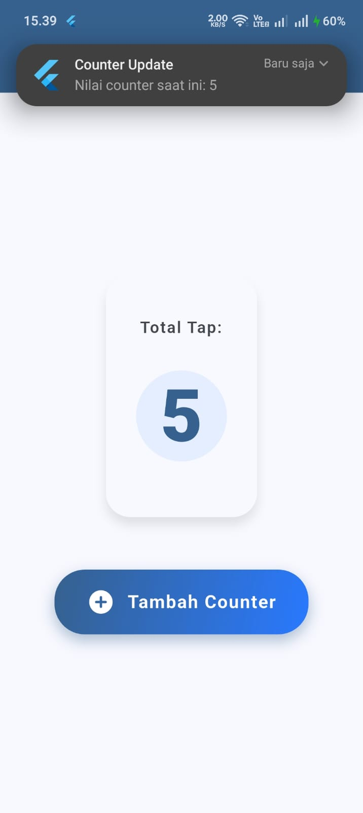

<div align="center">
  <br />

  <h1>LAPORAN PRAKTIKUM <br>
  APLIKASI BERBASIS PLATFORM
  </h1>

  <br />

  <h3>Modul 12-13 Mobile</h3>
IMPLEMENTASI PROVIDER & NOTIFIKASI PADA FLUTTER
  <br>
  
  </h3>

  <br />

  <p align="center">

</p>

  <br />
  <br />
  <br />

  <h3>Disusun Oleh :</h3>

  <p>
    <strong>Aisyah Anis Mazaya</strong><br>
    <strong>2311102095</strong><br>
    <strong>S1 IF-11-REG01</strong>
  </p>

  <br />

  <h3>Dosen Pengampu :</h3>

  <p>
    <strong>Dimas Fanny Hebrasianto Permadi, S.ST., M.Kom</strong>
  </p>
  
  <br />
  <br />
    <h4>Asisten Praktikum :</h4>
    <strong>Apri Pandu Wicaksono </strong> <br>
    <strong>Rangga Pradarrell Fathi</strong>
  <br />

  <h3>LABORATORIUM HIGH PERFORMANCE
 <br>FAKULTAS INFORMATIKA <br>UNIVERSITAS TELKOM PURWOKERTO <br>2026</h3>
</div>

<hr>

### Dasar Teori
1. State Management dan Pustaka Provider
Dalam paradigma pengembangan aplikasi reaktif state management merupakan mekanisme fundamental yang digunakan untuk mengontrol siklus hidup data dan menyinkronkan status antarmuka pengguna (UI) secara dinamis. Provider merupakan salah satu pustaka state management yang direkomendasikan pada ekosistem Flutter. Beroperasi di atas konsep inti InheritedWidget, arsitektur ini mendistribusikan aliran data ke seluruh tingkatan pohon widget secara hierarkis. Penggunaan pustaka ini memungkinkan pemisahan antara logika bisnis dan lapisan presentasi, serta meminimalisasi kompleksitas pengiriman parameter antar-komponen (prop drilling). Pendekatan ini memastikan bahwa proses rendering ulang hanya dieksekusi pada widget yang secara eksplisit berlangganan terhadap pembaruan data (listener), sehingga performa aplikasi menjadi lebih optimal.

2. Notifikasi Lokal (Local Notification)
Notifikasi lokal adalah metode penyampaian pesan interaktif yang diproses dan dieksekusi sepenuhnya oleh sistem perangkat (client-side), tanpa memerlukan intervensi atau koneksi ke peladen (server) eksternal. Berbeda dengan push notification yang bergantung pada layanan terpusat seperti Firebase Cloud Messaging, notifikasi lokal diinisiasi langsung oleh fungsi internal aplikasi saat sebuah kondisi atau pemicu (trigger) terpenuhi. Pada sistem operasi modern, khususnya Android versi 8.0 (API level 26) ke atas, implementasi fitur ini mewajibkan pendefinisian Notification Channel. Konfigurasi kanal tersebut berfungsi untuk mengatur karakteristik perilaku notifikasi, termasuk tingkat kepentingan (importance level) dan prioritas kemunculan (heads-up display), agar informasi dapat tersampaikan kepada pengguna secara real-time.
---

### SOURCE CODE
### build.gradle.kts
```dart
plugins {
    id("com.android.application")
    id("kotlin-android")
    // The Flutter Gradle Plugin must be applied after the Android and Kotlin Gradle plugins.
    id("dev.flutter.flutter-gradle-plugin")
}

android {
    namespace = "com.example.modul_abp_12_13"
    compileSdk = flutter.compileSdkVersion
    ndkVersion = flutter.ndkVersion

    compileOptions {
        sourceCompatibility = JavaVersion.VERSION_17
        targetCompatibility = JavaVersion.VERSION_17
        // Penulisan desugaring untuk Kotlin DSL (.kts)
        isCoreLibraryDesugaringEnabled = true 
    }

    kotlinOptions {
        jvmTarget = JavaVersion.VERSION_17.toString()
    }

    defaultConfig {
        // TODO: Specify your own unique Application ID (https://developer.android.com/studio/build/application-id.html).
        applicationId = "com.example.modul_abp_12_13"
        // You can update the following values to match your application needs.
        // For more information, see: https://flutter.dev/to/review-gradle-config.
        minSdk = flutter.minSdkVersion
        targetSdk = flutter.targetSdkVersion
        versionCode = flutter.versionCode
        versionName = flutter.versionName
    }

    buildTypes {
        release {
            // TODO: Add your own signing config for the release build.
            // Signing with the debug keys for now, so `flutter run --release` works.
            signingConfig = signingConfigs.getByName("debug")
        }
    }
}

flutter {
    source = "../.."
}

dependencies {
    coreLibraryDesugaring("com.android.tools:desugar_jdk_libs:2.0.3")
}
```
build.gradle.kts tingkat aplikasi (app-level), pengaturan difokuskan pada penyesuaian parameter kompilasi Android agar mendukung pustaka eksternal yang diimplementasikan. Konfigurasi ini menetapkan kompatibilitas kode sumber dan target kompilasi pada Java 17 untuk menyesuaikan dengan standar lingkungan pengembangan terbaru. Pembaruan yang paling krusial pada skrip ini adalah pengaktifan fitur core library desugaring melalui parameter isCoreLibraryDesugaringEnabled = true yang disusul dengan injeksi dependensi desugar_jdk_libs. Implementasi metode ini diwajibkan untuk menerjemahkan antarmuka pemrograman aplikasi (API) Java versi baru agar tetap dapat dieksekusi secara kompatibel oleh sistem operasi Android yang lebih lama, sehingga kegagalan kompilasi (build failure) akibat penggunaan pustaka flutter_local_notifications dapat dihindari.

### AndroidManifest.xml
```xml
<manifest xmlns:android="http://schemas.android.com/apk/res/android">
<uses-permission android:name="android.permission.POST_NOTIFICATIONS"/>
    <application
        android:label="modul_abp_12_13"
        android:name="${applicationName}"
        android:icon="@mipmap/ic_launcher">
```
modifikasi dilakukan dengan menambahkan deklarasi perizinan `<uses-permission android:name="android.permission.POST_NOTIFICATIONS"/>` tepat sebelum blok konfigurasi aplikasi. Penambahan baris kode ini merupakan protokol wajib (mandatory) yang diamanatkan oleh sistem operasi Android, khususnya untuk versi 13 (API level 33) ke atas. Deklarasi ini berfungsi untuk meminta hak akses eksplisit dan otorisasi keamanan kepada sistem perangkat agar aplikasi diizinkan untuk memublikasikan pemberitahuan (notifikasi lokal) ke layar pengguna.

### Main.dart
```dart
import 'package:flutter/material.dart';
import 'package:provider/provider.dart';
import 'package:flutter_local_notifications/flutter_local_notifications.dart';

// Inisialisasi awal plugin notifikasi
final FlutterLocalNotificationsPlugin flutterLocalNotificationsPlugin =
    FlutterLocalNotificationsPlugin();

void main() async {
  WidgetsFlutterBinding.ensureInitialized();

  const AndroidInitializationSettings initializationSettingsAndroid =
      AndroidInitializationSettings('@mipmap/ic_launcher');
  const InitializationSettings initializationSettings =
      InitializationSettings(android: initializationSettingsAndroid);
      
  await flutterLocalNotificationsPlugin.initialize(initializationSettings);

  runApp(
    // Mendaftarkan Provider di root agar state bisa diakses di seluruh widget
    ChangeNotifierProvider(
      create: (context) => CounterProvider(),
      child: const MyApp(),
    ),
  );
}

class CounterProvider extends ChangeNotifier {
  int _count = 0;

  int get count => _count;

  void increment() async {
    _count++;
    // Memberitahu UI untuk me-render ulang nilai terbaru
    notifyListeners();
    // Memanggil fungsi notifikasi setiap kali state bertambah
    await _showNotification(_count);
  }

  Future<void> _showNotification(int currentCount) async {
    // Konfigurasi channel notifikasi
    const AndroidNotificationDetails androidDetails = AndroidNotificationDetails(
      'counter_channel_id', 
      'Counter Update Channel',
      importance: Importance.max,
      priority: Priority.high,
    );
    
    const NotificationDetails platformDetails = 
        NotificationDetails(android: androidDetails);

    // Menampilkan notifikasi lokal
    await flutterLocalNotificationsPlugin.show(
      0, 
      'Counter Update', 
      'Nilai counter saat ini: $currentCount', 
      platformDetails,
    );
  }
}

class MyApp extends StatelessWidget {
  const MyApp({super.key});

  @override
  Widget build(BuildContext context) {
    return MaterialApp(
      debugShowCheckedModeBanner: false,
      title: 'Tugas Praktik Provider & Notif',
      theme: ThemeData(
        colorScheme: ColorScheme.fromSeed(
            seedColor: Colors.blue, brightness: Brightness.light),
        useMaterial3: true,
      ),
      home: const HomeScreen(),
    );
  }
}

class HomeScreen extends StatelessWidget {
  const HomeScreen({super.key});

  @override
  Widget build(BuildContext context) {
    // Membaca state/nilai counter dari Provider
    final counterProvider = Provider.of<CounterProvider>(context);
    final colorScheme = Theme.of(context).colorScheme;

    return Scaffold(
      backgroundColor: colorScheme.background,
      appBar: AppBar(
        title: Text(
          'Counter & Notification',
          style: TextStyle(
            color: colorScheme.onPrimary,
            fontWeight: FontWeight.w600,
            fontSize: 20,
          ),
        ),
        backgroundColor: colorScheme.primary,
        elevation: 0, 
        centerTitle: true, 
      ),
      body: SafeArea(
        child: Center(
          child: Padding(
            padding: const EdgeInsets.symmetric(horizontal: 24.0),
            child: Column(
              mainAxisAlignment: MainAxisAlignment.center,
              children: [
                // BAGIAN CARD ANGKA 
                Card(
                  elevation: 8,
                  shadowColor: colorScheme.shadow.withOpacity(0.4),
                  shape: RoundedRectangleBorder(
                    borderRadius: BorderRadius.circular(24),
                  ),
                  color: colorScheme.surface,
                  child: Padding(
                    padding: const EdgeInsets.symmetric(
                        vertical: 40.0, horizontal: 30.0),
                    child: Column(
                      children: [
                        Text(
                          'Total Tap:',
                          textAlign: TextAlign.center,
                          style: TextStyle(
                            fontSize: 16,
                            fontWeight: FontWeight.w600,
                            letterSpacing: 1.2,
                            color: colorScheme.onSurfaceVariant,
                          ),
                        ),
                        const SizedBox(height: 16),
                        Container(
                          padding: const EdgeInsets.all(24),
                          decoration: BoxDecoration(
                            color: colorScheme.primaryContainer.withOpacity(0.5),
                            shape: BoxShape.circle,
                          ),
                          child: Text(
                            // Menampilkan nilai state yang diambil dari provider
                            '${counterProvider.count}',
                            style: TextStyle(
                              fontSize: 72,
                              fontWeight: FontWeight.w900,
                              color: colorScheme.primary,
                              height: 1.0,
                            ),
                          ),
                        ),
                      ],
                    ),
                  ),
                ),
                
                const SizedBox(height: 48), 
                
                // Menggunakan InkWell
                InkWell(
                  onTap: () => counterProvider.increment(),
                  borderRadius: BorderRadius.circular(30),
                  child: Container(
                    padding: const EdgeInsets.symmetric(vertical: 18, horizontal: 32),
                    decoration: BoxDecoration(
                   
                      gradient: LinearGradient(
                        colors: [colorScheme.primary, Colors.blueAccent.shade400],
                        begin: Alignment.topLeft,
                        end: Alignment.bottomRight,
                      ),
                      borderRadius: BorderRadius.circular(30),
                      boxShadow: [
                        BoxShadow(
                          color: colorScheme.primary.withOpacity(0.4),
                          blurRadius: 12,
                          offset: const Offset(0, 6),
                        ),
                      ],
                    ),
                    child: Row(
                      mainAxisSize: MainAxisSize.min, // Agar lebar tombol menyesuaikan isi
                      children: const [
                        Icon(Icons.add_circle_rounded, color: Colors.white, size: 28),
                        SizedBox(width: 12),
                        Text(
                          'Tambah Counter',
                          style: TextStyle(
                            color: Colors.white,
                            fontSize: 18,
                            fontWeight: FontWeight.bold,
                            letterSpacing: 1.0,
                          ),
                        ),
                      ],
                    ),
                  ),
                ),
              ],
            ),
          ),
        ),
      ),
    );
  }
}
```
Implementasi pada file `main.dart` difokuskan pada pengelolaan state menggunakan pustaka Provider serta integrasi Local Notification. Secara struktural, aplikasi dienkapsulasi oleh ChangeNotifierProvider pada tahapan inisialisasi awal guna mendistribusikan state ke seluruh hierarki komponen secara global. Logika pengelolaan angka ditangani secara terpusat oleh kelas CounterProvider. Pada kelas ini, aksi dari tombol antarmuka diarahkan ke metode increment(), yang secara sekuensial akan menambah nilai variabel counter sebanyak satu angka dan memanggil fungsi notifyListeners() untuk merender ulang antarmuka yang terdampak secara spesifik. Bersamaan dengan pembaruan data tersebut, sistem secara langsung memicu fungsi notifikasi lokal untuk menampilkan pop-up secara real-time dengan memuat judul "Counter Update" dan pesan dinamis berisi angka terbaru. Pada lapisan presentasi, nilai reaktif tersebut divisualisasikan menggunakan komponen Card berbayang agar tata letak informasi menjadi lebih terpusat, modern, dan mudah dibaca oleh pengguna.

### TAMPILAN 



