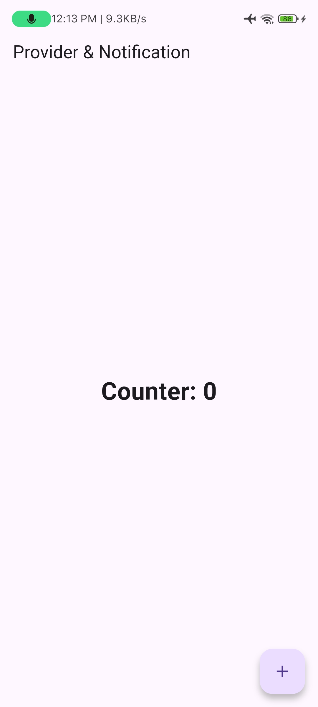
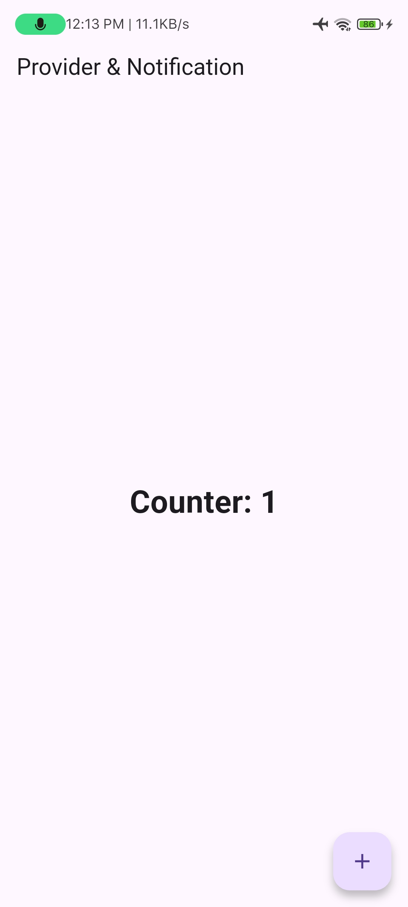

<div align="center">
  <br />
  <h1>LAPORAN PRAKTIKUM <br>APLIKASI BERBASIS PLATFORM</h1>
  <br />
  <h3>MODUL 12 & 13<br> Implementasi Provider dan Notifikasi pada Flutter </h3>
  <br />
   
  <br />
  <br />
  <br />
  <h3>Disusun Oleh :</h3>
  <p>
    <strong>Muhammad Hamzah Haifan Ma'ruf</strong><br>
    <strong>2311102091</strong><br>
    <strong>S1 IF-11-REG01</strong>
  </p>
  <br />
  <br />
  <h3>Dosen Pengampu :</h3>
  <p>
    <strong>Dimas Fanny Hebrasianto Permadi, S.ST., M.Kom</strong>
  </p>
  <br />
  <br />
    <h4>Asisten Praktikum :</h4>
    <strong> Apri Pandu Wicaksono </strong> <br>
    <strong>Rangga Pradarrell Fathi</strong>
  <br />
  <h3>LABORATORIUM HIGH PERFORMANCE
 <br>FAKULTAS INFORMATIKA <br>UNIVERSITAS TELKOM PURWOKERTO <br>2026</h3>
</div>

---

# 1. Dasar Teori

### Flutter

Flutter merupakan framework open-source yang dikembangkan oleh Google untuk membangun aplikasi mobile, web, dan desktop menggunakan satu basis kode (single codebase). Flutter menggunakan bahasa pemrograman Dart dan menyediakan berbagai widget untuk membangun antarmuka pengguna yang responsif.

### State Management Provider

Provider merupakan salah satu metode state management pada Flutter yang digunakan untuk mengelola dan membagikan data ke berbagai widget dalam aplikasi. Provider memanfaatkan class `ChangeNotifier` untuk memberi tahu widget ketika terjadi perubahan data melalui method `notifyListeners()`.

### Local Notification

Local Notification adalah notifikasi yang dibuat dan ditampilkan langsung oleh aplikasi tanpa memerlukan server eksternal. Pada praktikum ini digunakan package `flutter_local_notifications` untuk menampilkan notifikasi setiap kali nilai counter bertambah.

---

# 2. Implementasi Program

### Counter Provider

File: `counter_provider.dart`

```dart
import 'package:flutter/material.dart';

class CounterProvider extends ChangeNotifier {
  int _counter = 0;

  int get counter => _counter;

  void increment() {
    _counter++;
    notifyListeners();
  }
}
```

### Penjelasan

- Variabel `_counter` digunakan untuk menyimpan nilai counter.
- Getter `counter` digunakan untuk mengambil nilai counter.
- Method `increment()` digunakan untuk menambah nilai counter sebesar satu.
- Method `notifyListeners()` digunakan untuk memberi tahu widget bahwa data telah berubah sehingga tampilan diperbarui secara otomatis.

### Notification Service

File: `notification_service.dart`

```dart
import 'package:flutter_local_notifications/flutter_local_notifications.dart';

class NotificationService {
  static final FlutterLocalNotificationsPlugin
      flutterLocalNotificationsPlugin =
      FlutterLocalNotificationsPlugin();

  static Future<void> init() async {
    const AndroidInitializationSettings androidSettings =
        AndroidInitializationSettings('@mipmap/ic_launcher');

    const InitializationSettings initializationSettings =
        InitializationSettings(
      android: androidSettings,
    );

    await flutterLocalNotificationsPlugin.initialize(
      initializationSettings,
    );
  }

  static Future<void> showNotification(int counter) async {
    const AndroidNotificationDetails androidDetails =
        AndroidNotificationDetails(
      'counter_channel',
      'Counter Notification',
      importance: Importance.max,
      priority: Priority.high,
    );

    const NotificationDetails notificationDetails =
        NotificationDetails(
      android: androidDetails,
    );

    await flutterLocalNotificationsPlugin.show(
      0,
      'Counter Update',
      'Nilai counter saat ini: $counter',
      notificationDetails,
    );
  }
}
```

---

# 3. Hasil Tampilan

### Tampilan Awal Aplikasi



### Tampilan Setelah Klik +



### Tampilan Notifikasi


---

# 4. Cara Kerja Provider pada Aplikasi

Provider digunakan untuk mengelola nilai counter pada aplikasi. Class `CounterProvider` menyimpan data counter dan menyediakan method `increment()` untuk menambah nilainya. Ketika nilai counter berubah, method `notifyListeners()` dipanggil sehingga widget yang menggunakan Provider akan melakukan rebuild secara otomatis.

---

# 5. Cara Kerja Notifikasi yang Digunakan

Notifikasi pada aplikasi menggunakan package `flutter_local_notifications`. Saat tombol tambah ditekan, aplikasi memanggil method `showNotification()` yang akan membuat notifikasi baru. Notifikasi tersebut memiliki judul **Counter Update** dan pesan berupa nilai counter terbaru.

---

# 6. Kesimpulan

Aplikasi berhasil mengimplementasikan State Management menggunakan Provider dan Local Notification pada Flutter. Provider digunakan untuk mengelola perubahan nilai counter secara efisien, sedangkan Local Notification digunakan untuk memberikan informasi kepada pengguna setiap kali nilai counter berubah. Hasil pengujian menunjukkan bahwa nilai counter dapat bertambah dengan benar dan notifikasi berhasil ditampilkan sesuai dengan nilai counter terbaru.
