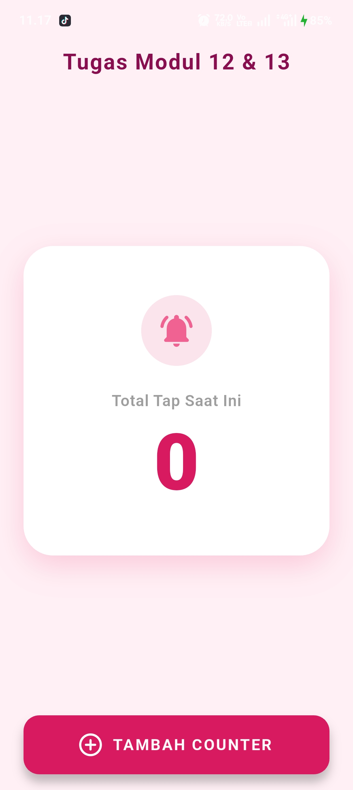
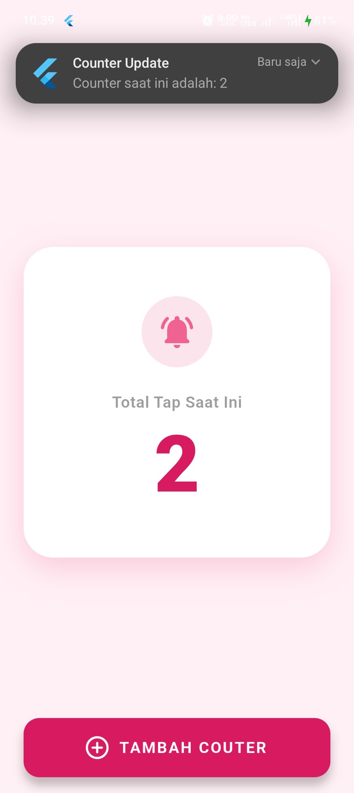

<div align="center">
  <br />

  <h1>LAPORAN PRAKTIKUM <br>
  APLIKASI BERBASIS PLATFORM
  </h1>

  <br />

  <h3>Modul 12-13 Mobile</h3>
IMPLEMENTASI PROVIDER & NOTIFIKASI PADA FLUTTER
  <br>
  
  </h3>

  <br />

  <p align="center">

</p>

  <br />
  <br />
  <br />

  <h3>Disusun Oleh :</h3>

  <p>
    <strong>Aisyah Anis Mazaya</strong><br>
    <strong>2311102095</strong><br>
    <strong>S1 IF-11-REG01</strong>
  </p>

  <br />

  <h3>Dosen Pengampu :</h3>

  <p>
    <strong>Dimas Fanny Hebrasianto Permadi, S.ST., M.Kom</strong>
  </p>
  
  <br />
  <br />
    <h4>Asisten Praktikum :</h4>
    <strong>Apri Pandu Wicaksono </strong> <br>
    <strong>Rangga Pradarrell Fathi</strong>
  <br />

  <h3>LABORATORIUM HIGH PERFORMANCE
 <br>FAKULTAS INFORMATIKA <br>UNIVERSITAS TELKOM PURWOKERTO <br>2026</h3>
</div>

<hr>

### Dasar Teori
1. State Management (Provider): Merupakan pustaka (library) pengelolaan status aplikasi yang direkomendasikan dalam ekosistem Flutter. Pendekatan ini memisahkan logika data bisnis secara terpusat dari elemen presentasi visual (UI). Melalui arsitektur ini, data di dalam aplikasi dapat didistribusikan secara efisien ke widget mana pun yang membutuhkan tanpa harus melewati proses pengiriman parameter antar-konstruktor secara berantai (prop drilling).

2. ChangeNotifier: Kelas fundamental dari Flutter SDK yang berfungsi sebagai model data penampung state. Kelas ini dilengkapi dengan fungsi notifyListeners(). Ketika terjadi perubahan data di dalam variabel model (misalnya nilai counter bertambah pemanggilan fungsi tersebut akan mengirimkan sinyal pembaruan secara otomatis ke komponen antarmuka yang mengamati model tersebut.

3. ChangeNotifierProvider: Sebuah widget khusus dari paket provider yang bertugas untuk menginstansiasi kelas ChangeNotifier dan menyuntikkannya ke dalam widget tree. Komponen ini berfungsi sebagai jembatan yang mendengarkan sinyal perubahan dari ChangeNotifier agar data tersebut siap dikonsumsi oleh sub-pohon widget di bawahnya.

4. Consumer: Widget bertipe listener yang digunakan untuk membaca data dari ChangeNotifier. Implementasi Consumer sangat krusial untuk optimasi memori dan efisiensi rendering, karena hanya elemen widget di dalam blok fungsi pembangun (builder) miliknya saja yang akan dibangun ulang (rebuild) saat terjadi perubahan status data, sedangkan komponen visual lainnya tetap dipertahankan.

5. Local Notification: Mekanisme pengiriman pesan peringatan atau informasi kepada pengguna yang dieksekusi secara mandiri di sisi perangkat (client-side) tanpa bergantung pada koneksi internet atau layanan cloud server pihak ketiga (seperti FCM). Pustaka flutter_local_notifications digunakan untuk memicu antarmuka sistem operasi agar menampilkan bilah notifikasi secara real-time dengan menetapkan parameter Notification Channel (ID, nama, dan tingkat prioritas) sesuai dengan standar keamanan sistem operasi mobile modern.
---

### SOURCE CODE
### Main.dart
```dart
import 'package:flutter/material.dart';
import 'package:provider/provider.dart';
import 'counter_provider.dart';
import 'notification_service.dart';

void main() async {
  WidgetsFlutterBinding.ensureInitialized();
  await NotificationService().initNotification();

  runApp(
    ChangeNotifierProvider(
      create: (context) => CounterProvider(),
      child: const MyApp(),
    ),
  );
}

class MyApp extends StatelessWidget {
  const MyApp({super.key});

  @override
  Widget build(BuildContext context) {
    return MaterialApp(
      title: 'Counter & Notification',
      debugShowCheckedModeBanner: false,
      theme: ThemeData(
        useMaterial3: true, // Mengaktifkan desain Material 3 
        colorScheme: ColorScheme.fromSeed(
          seedColor: const Color(0xFFF48FB1),
          background: const Color(0xFFFFF0F5), 
        ),
      ),
      home: const CounterPage(),
    );
  }
}

class CounterPage extends StatelessWidget {
  const CounterPage({super.key});

  @override
  Widget build(BuildContext context) {
    return Scaffold(
      backgroundColor: const Color(0xFFFFF0F5), // Background halaman
      appBar: AppBar(
        backgroundColor: Colors.transparent, 
        elevation: 0,
        title: const Text(
          'Tugas Modul 12 & 13',
          style: TextStyle(
            color: Color(0xFF880E4F), 
            fontWeight: FontWeight.bold,
            letterSpacing: 1.2,
          ),
        ),
        centerTitle: true,
      ),
      body: Center(
        child: Padding(
          padding: const EdgeInsets.symmetric(horizontal: 24.0),
          child: Column(
            mainAxisAlignment: MainAxisAlignment.center,
            children: [
              // Membuat layout kartu (Card) dengan efek bayangan
              Container(
                width: double.infinity,
                padding: const EdgeInsets.symmetric(vertical: 50),
                decoration: BoxDecoration(
                  color: Colors.white,
                  borderRadius: BorderRadius.circular(30),
                  boxShadow: [
                    BoxShadow(
                      color: const Color(0xFFF48FB1).withOpacity(0.4),
                      blurRadius: 25,
                      offset: const Offset(0, 10),
                    ),
                  ],
                ),
                child: Column(
                  children: [
                    // Ikon lonceng dekoratif
                    Container(
                      padding: const EdgeInsets.all(16),
                      decoration: BoxDecoration(
                        color: const Color(0xFFFCE4EC),
                        shape: BoxShape.circle,
                      ),
                      child: const Icon(
                        Icons.notifications_active_rounded,
                        size: 40,
                        color: Color(0xFFF06292),
                      ),
                    ),
                    const SizedBox(height: 24),
                    const Text(
                      'Total Tap Saat Ini',
                      style: TextStyle(
                        fontSize: 16,
                        color: Colors.grey,
                        fontWeight: FontWeight.w600,
                        letterSpacing: 0.5,
                      ),
                    ),
                    const SizedBox(height: 8),
                    // Konsumen nilai counter
                    Consumer<CounterProvider>(
                      builder: (context, provider, child) {
                        return Text(
                          '${provider.counter}',
                          style: const TextStyle(
                            fontSize: 80,
                            fontWeight: FontWeight.w900,
                            color: Color(0xFFD81B60),
                            height: 1.1,
                          ),
                        );
                      },
                    ),
                  ],
                ),
              ),
              const SizedBox(height: 80), 
            ],
          ),
        ),
      ),
      // Tombol melayang diposisikan di tengah bawah dengan ukuran lebih lebar
      floatingActionButtonLocation: FloatingActionButtonLocation.centerFloat,
      floatingActionButton: Container(
        margin: const EdgeInsets.symmetric(horizontal: 24),
        width: double.infinity,
        height: 60,
        child: FloatingActionButton.extended(
          onPressed: () {
            context.read<CounterProvider>().incrementCounter();
          },
          backgroundColor: const Color(0xFFD81B60), // Warna tombol solid
          foregroundColor: Colors.white,
          elevation: 8,
          icon: const Icon(Icons.add_circle_outline_rounded, size: 28),
          label: const Text(
            'TAMBAH COUNTER',
            style: TextStyle(
              fontSize: 16,
              fontWeight: FontWeight.bold,
              letterSpacing: 1.5,
            ),
          ),
        ),
      ),
    );
  }
}
```
`main.dart` File ini merupakan titik masuk utama (entry point) aplikasi sekaligus pengatur tata letak antarmuka pengguna (UI) dengan menerapkan tema modern soft pink berbasis Material 3. Fungsi inti dari komponen ini adalah membungkus aplikasi dengan ChangeNotifierProvider agar data counter dapat diakses secara global serta menggunakan komponen Consumer untuk merender ulang teks angka secara spesifik tanpa harus memuat ulang seluruh halaman saat tombol penambahan ditekan.
---

### counter_provider.dart
```dart
import 'package:flutter/material.dart';
import 'notification_service.dart';

class CounterProvider extends ChangeNotifier {
  int _counter = 0;
  final NotificationService _notificationService = NotificationService();

  int get counter => _counter;

  void incrementCounter() {
    _counter++;
    notifyListeners(); // Memberitahu UI untuk melakukan pembangunan ulang (rebuild)
    _notificationService.showNotification(_counter); // Memicu notifikasi lokal
  }
}
```
`counter_provider.dart` File ini bertindak sebagai lapisan logika bisnis (state management) yang mengatur siklus hidup data aplikasi. Fungsi intinya adalah menyimpan variabel nilai counter secara terpusat dan menyediakan metode incrementCounter(). Ketika tombol ditekan, metode tersebut akan menambah nilai angka, memicu fungsi notifyListeners() untuk menyiarkan perubahan data ke antarmuka pengguna serta memerintahkan NotificationService untuk menampilkan notifikasi baru.
---

### notification_service.dart
```dart
import 'package:flutter_local_notifications/flutter_local_notifications.dart';

class NotificationService {
  // Singleton pattern 
  static final NotificationService _instance = NotificationService._internal();
  factory NotificationService() => _instance;
  NotificationService._internal();

  final FlutterLocalNotificationsPlugin _flutterLocalNotificationsPlugin =
      FlutterLocalNotificationsPlugin();

  // Fungsi inisialisasi awal notifikasi
  Future<void> initNotification() async {
    const AndroidInitializationSettings initializationSettingsAndroid =
        AndroidInitializationSettings('@mipmap/ic_launcher');
    const InitializationSettings initializationSettings =
        InitializationSettings(android: initializationSettingsAndroid);
    
    await _flutterLocalNotificationsPlugin.initialize(initializationSettings);
  }

  // Fungsi notifikasi
  Future<void> showNotification(int count) async {
    const AndroidNotificationDetails androidPlatformChannelSpecifics =
        AndroidNotificationDetails(
      'counter_channel_id',
      'Counter Notifications',
      channelDescription: 'Channel untuk notifikasi update counter',
      importance: Importance.max,
      priority: Priority.high,
    );
    const NotificationDetails platformChannelSpecifics =
        NotificationDetails(android: androidPlatformChannelSpecifics);

    await _flutterLocalNotificationsPlugin.show(
      0,
      'Counter Update',
      'Counter saat ini adalah: $count',
      platformChannelSpecifics,
    );
  }
}
```
`notification_service.dart` File ini berfungsi sebagai penyedia layanan notifikasi lokal pada perangkat menggunakan pola desain Singleton agar satu objek dapat digunakan secara global. Fungsi inti dari berkas ini adalah melakukan inisialisasi awal pengaturan notifikasi untuk sistem operasi Android, serta menyediakan fungsi showNotification() untuk memicu dan menampilkan bilah pesan pop-up di layar HP yang memuat informasi pembaruan nilai counter secara real-time.
---

### TAMPILAN 



