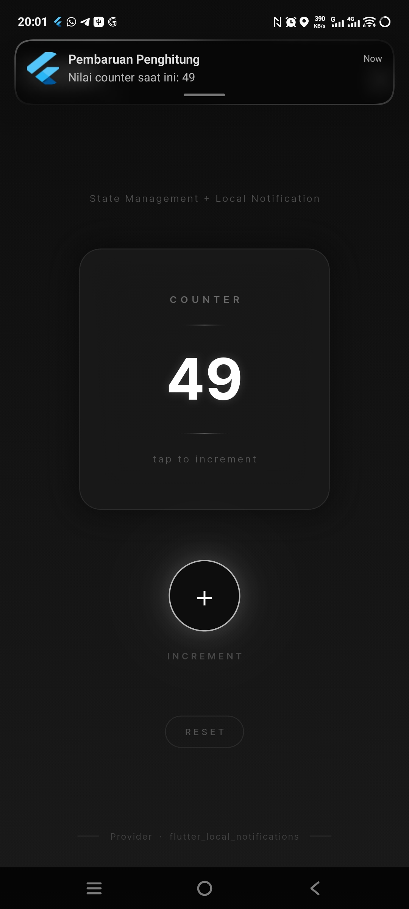

<div align="center">
  <br />
  <h1>LAPORAN PRAKTIKUM <br>APLIKASI BERBASIS PLATFORM</h1>
  <br />
  <h2>MODUL 12 & 13 FLUTTER</h2>
  <br /><br />

  

  <br /><br /><br />

  <h3>Disusun Oleh :</h3>

  <p>
    <strong>Rafaldo Al Maqdis</strong><br>
    <strong>2311102099</strong><br>
    <strong>S1 IF-11-REG 01</strong>
  </p>

  <br />

  <h3>Dosen Pengampu :</h3>

  <p>
    <strong>Dimas Fanny Hebrasianto Permadi, S.ST., M.Kom</strong>
  </p>

  <br /><br />

  <h4>Asisten Praktikum :</h4>

  <p>
    <strong>Apri Pandu Wicaksono</strong><br>
    <strong>Rangga Pradarrell Fathi</strong>
  </p>

  <br />

  <h2>
  LABORATORIUM HIGH PERFORMANCE <br>
  FAKULTAS INFORMATIKA <br>
  UNIVERSITAS TELKOM PURWOKERTO <br>
  2026
  </h2>
</div>

---

# 1. Pendahuluan

Flutter merupakan framework open-source yang dikembangkan oleh Google untuk membangun aplikasi multiplatform dengan satu basis kode. Dalam pengembangan aplikasi mobile modern, pengelolaan state yang efisien dan kemampuan memberikan feedback kepada pengguna secara real-time merupakan dua aspek yang sangat krusial. Dua kemampuan penting tersebut dapat diwujudkan melalui **State Management** menggunakan Provider dan **Local Notification** menggunakan `flutter_local_notifications`.

Pada praktikum ini, fokus pembahasan adalah penerapan **Provider** sebagai solusi state management dan integrasi **Local Notification** dalam satu aplikasi Flutter yang terintegrasi. Kedua konsep ini saling melengkapi: Provider mengelola perubahan state secara reaktif dan efisien, sementara Local Notification memberikan feedback kepada pengguna di luar antarmuka aplikasi.

Aplikasi yang dibuat pada praktikum ini bernama **Counter Notification App**. Aplikasi mendemonstrasikan:
1. **Provider State Management** — Mengelola nilai counter menggunakan `ChangeNotifier` sehingga perubahan state tersebar secara reaktif ke seluruh widget yang membutuhkannya.
2. **Local Notification** — Mengirimkan notifikasi lokal secara otomatis setiap kali nilai counter bertambah, menampilkan nilai terkini kepada pengguna.
3. **UI Dark Luxury** — Antarmuka modern dengan tema gelap elegan menggunakan glassmorphism, efek glow, dan animasi halus.

Aplikasi menggunakan arsitektur berbasis Provider, null safety, serta pemisahan kode ke dalam beberapa layer (provider, screen, service, widget) untuk keterbacaan dan maintainability yang lebih baik.

---

# 2. Dasar Teori

## 2.1 Flutter dan Null Safety

Flutter adalah framework UI open-source berbasis Dart untuk membangun aplikasi Android, iOS, web, dan desktop dari satu basis kode. Sejak Dart 2.12, Flutter mendukung **null safety** secara penuh, yang berarti variabel tidak dapat bernilai `null` kecuali secara eksplisit dideklarasikan dengan tanda `?`.

```dart
int _counter = 0;       // Tidak boleh null
String? _message;       // Boleh null
```

## 2.2 State Management dengan Provider

State management adalah cara mengelola dan mendistribusikan data (state) ke seluruh bagian aplikasi. Flutter menyediakan berbagai pendekatan state management, salah satunya adalah **Provider** — solusi resmi yang direkomendasikan oleh tim Flutter.

Provider bekerja dengan konsep **InheritedWidget** yang dibungkus lebih sederhana. Data disimpan dalam sebuah class yang di-*provide* ke widget tree, dan widget yang membutuhkan data tersebut dapat mengaksesnya tanpa perlu melewatkan data secara manual melalui constructor.

```dart
// Menyediakan provider ke widget tree
ChangeNotifierProvider(
  create: (_) => CounterProvider(),
  child: MyApp(),
);

// Membaca nilai dari provider (tidak rebuild)
final counter = context.read<CounterProvider>().counter;

// Mendengarkan perubahan (rebuild saat berubah)
final counter = context.watch<CounterProvider>().counter;

// Menggunakan Consumer widget
Consumer<CounterProvider>(
  builder: (context, provider, child) {
    return Text('${provider.counter}');
  },
);
```

## 2.3 ChangeNotifier

`ChangeNotifier` adalah mixin/class bawaan Flutter yang menyediakan mekanisme notifikasi kepada listener ketika terjadi perubahan state. Class model yang extends `ChangeNotifier` harus memanggil `notifyListeners()` setiap kali state berubah agar semua widget yang mendengarkan ikut diperbarui.

```dart
class CounterProvider extends ChangeNotifier {
  int _counter = 0;

  int get counter => _counter;

  void incrementCounter() {
    _counter++;
    notifyListeners(); // Memberitahu semua listener bahwa state berubah
  }
}
```

## 2.4 flutter_local_notifications

`flutter_local_notifications` adalah package yang memungkinkan aplikasi Flutter untuk menampilkan notifikasi lokal tanpa memerlukan koneksi internet. Notifikasi dikirim melalui sistem notifikasi Android (Notification Manager) atau iOS (UNUserNotificationCenter).

**Inisialisasi:**
```dart
final FlutterLocalNotificationsPlugin flutterLocalNotificationsPlugin =
    FlutterLocalNotificationsPlugin();

const AndroidInitializationSettings androidSettings =
    AndroidInitializationSettings('@mipmap/ic_launcher');

const InitializationSettings initSettings =
    InitializationSettings(android: androidSettings);

await flutterLocalNotificationsPlugin.initialize(initSettings);
```

**Menampilkan notifikasi:**
```dart
const AndroidNotificationDetails androidDetails = AndroidNotificationDetails(
  'counter_channel',
  'Counter Notifications',
  importance: Importance.high,
  priority: Priority.high,
);

await flutterLocalNotificationsPlugin.show(
  0,                              // ID notifikasi
  'Pembaruan Penghitung',         // Judul
  'Nilai counter saat ini: $n',   // Body
  NotificationDetails(android: androidDetails),
);
```

## 2.5 Android Notification Channel

Sejak Android 8.0 (API 26), notifikasi harus dikirim melalui **Notification Channel**. Channel mendefinisikan kategori notifikasi, tingkat kepentingan (`Importance`), dan perilaku notifikasi seperti suara dan getaran.

```dart
const AndroidNotificationDetails androidDetails = AndroidNotificationDetails(
  'counter_channel',          // ID unik channel
  'Counter Notifications',    // Nama channel (tampil di pengaturan)
  channelDescription: 'Notifikasi pembaruan nilai counter',
  importance: Importance.high,
  priority: Priority.high,
  enableVibration: true,
  playSound: true,
);
```

## 2.6 Core Library Desugaring

`flutter_local_notifications` memerlukan fitur Java 8+ (seperti `java.time`) yang tidak tersedia di semua versi Android. **Core Library Desugaring** adalah mekanisme yang memungkinkan aplikasi menggunakan API Java modern di perangkat Android lama dengan menambahkan library kompatibilitas saat proses build.

```kotlin
// build.gradle.kts
compileOptions {
    isCoreLibraryDesugaringEnabled = true
}

dependencies {
    coreLibraryDesugaring("com.android.tools:desugar_jdk_libs:2.0.4")
}
```

## 2.7 Consumer vs context.watch vs context.read

Provider menyediakan tiga cara utama untuk mengakses state, masing-masing dengan perilaku yang berbeda:

| Cara | Rebuild | Kegunaan |
|---|---|---|
| `Consumer<T>` | Ya | Rebuild sebagian widget tree saja (lebih efisien) |
| `context.watch<T>()` | Ya | Rebuild seluruh widget `build()` saat state berubah |
| `context.read<T>()` | Tidak | Hanya membaca nilai, tanpa mendengarkan perubahan |

Penggunaan `Consumer` lebih direkomendasikan karena membatasi area rebuild hanya pada widget yang benar-benar membutuhkan data terbaru, sehingga performa aplikasi lebih optimal.

```dart
// Hanya widget Text yang rebuild, bukan seluruh Scaffold
Consumer<CounterProvider>(
  builder: (context, provider, _) => Text('${provider.counter}'),
)
```

## 2.8 Service Layer Pattern

Untuk menjaga kode tetap terorganisir, logika notifikasi dipisahkan ke dalam sebuah **service class** terpisah. Pola ini mengikuti prinsip **Single Responsibility** — setiap class hanya bertanggung jawab atas satu fungsi.

```dart
class NotificationService {
  static final NotificationService _instance = NotificationService._internal();
  factory NotificationService() => _instance;         // Singleton pattern
  NotificationService._internal();

  Future<void> initialize() async { ... }
  Future<void> showCounterNotification(int value) async { ... }
}
```

Dengan **Singleton pattern**, objek `NotificationService` hanya dibuat satu kali selama siklus hidup aplikasi, sehingga efisien dan konsisten.

## 2.9 AnimatedSwitcher

`AnimatedSwitcher` adalah widget Flutter yang secara otomatis menambahkan animasi transisi ketika child widget-nya berubah. Widget ini sangat berguna untuk memberikan efek visual yang halus saat nilai counter berubah.

```dart
AnimatedSwitcher(
  duration: const Duration(milliseconds: 300),
  transitionBuilder: (child, animation) {
    return SlideTransition(
      position: Tween<Offset>(
        begin: const Offset(0, -0.3),
        end: Offset.zero,
      ).animate(animation),
      child: FadeTransition(opacity: animation, child: child),
    );
  },
  child: Text(
    '$counterValue',
    key: ValueKey<int>(counterValue), // Key penting agar animasi terpicu
  ),
)
```

## 2.10 AnimationController dan ScaleTransition

Untuk animasi tombol saat ditekan, digunakan `AnimationController` bersama `ScaleTransition`. `AnimationController` mengontrol durasi dan arah animasi, sedangkan `ScaleTransition` mengaplikasikan perubahan skala pada widget.

```dart
late AnimationController _animationController;
late Animation<double> _scaleAnimation;

_animationController = AnimationController(
  vsync: this,
  duration: const Duration(milliseconds: 120),
);

_scaleAnimation = Tween<double>(begin: 1.0, end: 0.88).animate(
  CurvedAnimation(parent: _animationController, curve: Curves.easeInOut),
);
```

---

# 3. Alat dan Bahan

Alat dan bahan yang digunakan pada praktikum ini adalah sebagai berikut.

1. Laptop atau komputer dengan RAM minimal 8GB
2. Sistem operasi Windows 10/11, macOS, atau Linux
3. Flutter SDK versi 3.19.0 atau lebih baru
4. Dart SDK (sudah included dalam Flutter SDK)
5. Android Studio (untuk SDK Manager dan emulator)
6. Visual Studio Code dengan ekstensi Flutter dan Dart
7. Perangkat Android fisik atau emulator AVD
8. USB Debugging aktif pada perangkat Android (jika menggunakan device fisik)
9. Package dependencies:
   - `provider: ^6.1.2`
   - `flutter_local_notifications: ^17.2.3`
   - `google_fonts: ^6.2.1`

---

# 4. Langkah-Langkah Praktikum

## 4.1 Membuat Proyek Flutter Baru

Buka terminal dan buat proyek Flutter baru dengan perintah berikut.

```bash
flutter create counter_notification_app
cd counter_notification_app
```

## 4.2 Update pubspec.yaml

Edit file `pubspec.yaml` dan tambahkan dependency yang diperlukan.

```yaml
dependencies:
  flutter:
    sdk: flutter
  provider: ^6.1.2
  flutter_local_notifications: ^17.2.3
  google_fonts: ^6.2.1
  cupertino_icons: ^1.0.8
```

Kemudian jalankan perintah berikut untuk mengunduh package.

```bash
flutter pub get
```

## 4.3 Membuat Struktur Folder

Buat struktur folder di dalam direktori `lib/` untuk memisahkan kode berdasarkan fungsinya.

```
lib/
├── main.dart
├── providers/
│   └── counter_provider.dart
├── screens/
│   └── home_screen.dart
├── services/
│   └── notification_service.dart
└── widgets/
    ├── counter_card.dart
    └── glow_button.dart
```

## 4.4 Konfigurasi build.gradle.kts

Buka file `android/app/build.gradle.kts` dan tambahkan konfigurasi Core Library Desugaring yang diperlukan oleh `flutter_local_notifications`.

```kotlin
compileOptions {
    isCoreLibraryDesugaringEnabled = true
    sourceCompatibility = JavaVersion.VERSION_17
    targetCompatibility = JavaVersion.VERSION_17
}

dependencies {
    coreLibraryDesugaring("com.android.tools:desugar_jdk_libs:2.0.4")
}
```

## 4.5 Konfigurasi AndroidManifest.xml

Tambahkan permission notifikasi pada file `android/app/src/main/AndroidManifest.xml`.

**Permission yang ditambahkan:**
- `POST_NOTIFICATIONS` — Menampilkan notifikasi (Android 13+)
- `VIBRATE` — Getaran saat notifikasi
- `RECEIVE_BOOT_COMPLETED` — Untuk notifikasi terjadwal

## 4.6 Membuat CounterProvider

Buat file `lib/providers/counter_provider.dart` yang berisi class `CounterProvider` sebagai model state management.

## 4.7 Membuat NotificationService

Buat file `lib/services/notification_service.dart` yang menggunakan Singleton pattern untuk mengelola inisialisasi dan pengiriman notifikasi lokal.

## 4.8 Membuat Widget GlowButton dan CounterCard

Buat dua widget terpisah di folder `lib/widgets/`:
- `glow_button.dart` — Tombol lingkaran dengan animasi scale dan efek glow
- `counter_card.dart` — Card glassmorphism yang menampilkan nilai counter dengan `AnimatedSwitcher`

## 4.9 Membuat HomeScreen

Buat file `lib/screens/home_screen.dart` sebagai layar utama yang mengintegrasikan Provider dan Notification Service menggunakan widget `Consumer`.

## 4.10 Update main.dart

Update `lib/main.dart` sebagai entry point aplikasi, tempat `ChangeNotifierProvider` di-setup dan `NotificationService` diinisialisasi.

## 4.11 Menjalankan Aplikasi

Hubungkan perangkat Android via USB atau wireless debugging, kemudian jalankan perintah berikut.

```bash
flutter clean
flutter pub get
flutter run
```

---

# 5. Source Code Lengkap

## 5.1 pubspec.yaml

```yaml
name: counter_notification_app
description: Counter App with Provider State Management and Local Notifications
publish_to: 'none'
version: 1.0.0+1

environment:
  sdk: '>=3.0.0 <4.0.0'

dependencies:
  flutter:
    sdk: flutter
  provider: ^6.1.2
  flutter_local_notifications: ^17.2.3
  google_fonts: ^6.2.1
  cupertino_icons: ^1.0.8

dev_dependencies:
  flutter_test:
    sdk: flutter
  flutter_lints: ^4.0.0

flutter:
  uses-material-design: true
```

## 5.2 android/app/build.gradle.kts

```kotlin
plugins {
    id("com.android.application")
    id("kotlin-android")
    id("dev.flutter.flutter-gradle-plugin")
}

android {
    namespace = "com.example.counter_notification_app"
    compileSdk = flutter.compileSdkVersion
    ndkVersion = flutter.ndkVersion

    compileOptions {
        isCoreLibraryDesugaringEnabled = true
        sourceCompatibility = JavaVersion.VERSION_17
        targetCompatibility = JavaVersion.VERSION_17
    }

    kotlinOptions {
        jvmTarget = "17"
    }

    defaultConfig {
        applicationId = "com.example.counter_notification_app"
        minSdk = flutter.minSdkVersion
        targetSdk = flutter.targetSdkVersion
        versionCode = flutter.versionCode
        versionName = flutter.versionName
        multiDexEnabled = true
    }

    buildTypes {
        release {
            signingConfig = signingConfigs.getByName("debug")
        }
    }
}

flutter {
    source = "../.."
}

dependencies {
    coreLibraryDesugaring("com.android.tools:desugar_jdk_libs:2.0.4")
}
```

## 5.3 android/app/src/main/AndroidManifest.xml

```xml
<manifest xmlns:android="http://schemas.android.com/apk/res/android">

    <uses-permission android:name="android.permission.POST_NOTIFICATIONS"/>
    <uses-permission android:name="android.permission.VIBRATE" />
    <uses-permission android:name="android.permission.RECEIVE_BOOT_COMPLETED"/>

    <application
        android:label="Counter Notification App"
        android:name="${applicationName}"
        android:icon="@mipmap/ic_launcher">

        <activity
            android:name=".MainActivity"
            android:exported="true"
            android:launchMode="singleTop"
            android:theme="@style/LaunchTheme"
            android:configChanges="orientation|keyboardHidden|keyboard|screenSize|smallestScreenSize|locale|layoutDirection|fontScale|screenLayout|density|uiMode"
            android:hardwareAccelerated="true"
            android:windowSoftInputMode="adjustResize">

            <meta-data
                android:name="io.flutter.embedding.android.NormalTheme"
                android:resource="@style/NormalTheme"/>

            <intent-filter>
                <action android:name="android.intent.action.MAIN"/>
                <category android:name="android.intent.category.LAUNCHER"/>
            </intent-filter>
        </activity>

        <meta-data
            android:name="flutterEmbedding"
            android:value="2"/>

    </application>

</manifest>
```

## 5.4 lib/main.dart

```dart
import 'package:flutter/material.dart';
import 'package:flutter/services.dart';
import 'package:provider/provider.dart';
import 'providers/counter_provider.dart';
import 'screens/home_screen.dart';
import 'services/notification_service.dart';

void main() async {
  WidgetsFlutterBinding.ensureInitialized();

  // Inisialisasi Notifikasi
  await NotificationService().initialize();

  // Set system UI overlay style
  SystemChrome.setSystemUIOverlayStyle(
    const SystemUiOverlayStyle(
      statusBarColor: Colors.transparent,
      statusBarIconBrightness: Brightness.light,
      systemNavigationBarColor: Color(0xFF0D0D0D),
      systemNavigationBarIconBrightness: Brightness.light,
    ),
  );

  // Lock orientation to portrait
  await SystemChrome.setPreferredOrientations([
    DeviceOrientation.portraitUp,
    DeviceOrientation.portraitDown,
  ]);

  runApp(const MyApp());
}

class MyApp extends StatelessWidget {
  const MyApp({super.key});

  @override
  Widget build(BuildContext context) {
    return ChangeNotifierProvider(
      create: (_) => CounterProvider(),
      child: MaterialApp(
        title: 'Counter Notification App',
        debugShowCheckedModeBanner: false,
        theme: ThemeData(
          brightness: Brightness.dark,
          scaffoldBackgroundColor: const Color(0xFF0D0D0D),
          colorScheme: const ColorScheme.dark(
            primary: Colors.white,
            surface: Color(0xFF1A1A1A),
          ),
          splashFactory: NoSplash.splashFactory,
          highlightColor: Colors.transparent,
        ),
        home: const HomeScreen(),
      ),
    );
  }
}
```

## 5.5 lib/providers/counter_provider.dart

```dart
import 'package:flutter/foundation.dart';

class CounterProvider extends ChangeNotifier {
  int _counter = 0;

  int get counter => _counter;

  void incrementCounter() {
    _counter++;
    notifyListeners();
  }

  void resetCounter() {
    _counter = 0;
    notifyListeners();
  }
}
```

## 5.6 lib/services/notification_service.dart

```dart
import 'package:flutter_local_notifications/flutter_local_notifications.dart';

class NotificationService {
  static final NotificationService _instance = NotificationService._internal();
  factory NotificationService() => _instance;
  NotificationService._internal();

  final FlutterLocalNotificationsPlugin _flutterLocalNotificationsPlugin =
      FlutterLocalNotificationsPlugin();

  Future<void> initialize() async {
    const AndroidInitializationSettings androidInitializationSettings =
        AndroidInitializationSettings('@mipmap/ic_launcher');

    const DarwinInitializationSettings iosInitializationSettings =
        DarwinInitializationSettings(
      requestAlertPermission: true,
      requestBadgePermission: true,
      requestSoundPermission: true,
    );

    const InitializationSettings initializationSettings =
        InitializationSettings(
      android: androidInitializationSettings,
      iOS: iosInitializationSettings,
    );

    await _flutterLocalNotificationsPlugin.initialize(initializationSettings);

    // Request permissions for Android 13+
    await _flutterLocalNotificationsPlugin
        .resolvePlatformSpecificImplementation<
            AndroidFlutterLocalNotificationsPlugin>()
        ?.requestNotificationsPermission();
  }

  Future<void> showCounterNotification(int counterValue) async {
    const AndroidNotificationDetails androidNotificationDetails =
        AndroidNotificationDetails(
      'counter_channel',
      'Counter Notifications',
      channelDescription: 'Notifikasi untuk pembaruan nilai counter',
      importance: Importance.high,
      priority: Priority.high,
      showWhen: true,
      enableVibration: true,
      playSound: true,
      icon: '@mipmap/ic_launcher',
    );

    const DarwinNotificationDetails iosNotificationDetails =
        DarwinNotificationDetails(
      presentAlert: true,
      presentBadge: true,
      presentSound: true,
    );

    const NotificationDetails notificationDetails = NotificationDetails(
      android: androidNotificationDetails,
      iOS: iosNotificationDetails,
    );

    await _flutterLocalNotificationsPlugin.show(
      0,
      'Pembaruan Penghitung',
      'Nilai counter saat ini: $counterValue',
      notificationDetails,
    );
  }
}
```

## 5.7 lib/widgets/counter_card.dart

```dart
import 'package:flutter/material.dart';
import 'package:google_fonts/google_fonts.dart';

class CounterCard extends StatelessWidget {
  final int counterValue;

  const CounterCard({
    super.key,
    required this.counterValue,
  });

  @override
  Widget build(BuildContext context) {
    return Container(
      width: 280,
      padding: const EdgeInsets.symmetric(horizontal: 40, vertical: 48),
      decoration: BoxDecoration(
        borderRadius: BorderRadius.circular(24),
        color: const Color(0xFF1A1A1A).withOpacity(0.85),
        border: Border.all(
          color: Colors.white.withOpacity(0.08),
          width: 1,
        ),
        boxShadow: [
          BoxShadow(
            color: Colors.white.withOpacity(0.04),
            blurRadius: 40,
            spreadRadius: -5,
          ),
          BoxShadow(
            color: Colors.black.withOpacity(0.6),
            blurRadius: 30,
            spreadRadius: 5,
          ),
        ],
      ),
      child: Column(
        mainAxisSize: MainAxisSize.min,
        children: [
          Text(
            'COUNTER',
            style: GoogleFonts.inter(
              fontSize: 11,
              fontWeight: FontWeight.w600,
              color: Colors.white.withOpacity(0.35),
              letterSpacing: 4,
            ),
          ),
          const SizedBox(height: 20),
          Container(
            height: 1,
            width: 60,
            decoration: BoxDecoration(
              gradient: LinearGradient(
                colors: [
                  Colors.transparent,
                  Colors.white.withOpacity(0.3),
                  Colors.transparent,
                ],
              ),
            ),
          ),
          const SizedBox(height: 28),
          AnimatedSwitcher(
            duration: const Duration(milliseconds: 300),
            transitionBuilder: (child, animation) {
              return SlideTransition(
                position: Tween<Offset>(
                  begin: const Offset(0, -0.3),
                  end: Offset.zero,
                ).animate(CurvedAnimation(
                  parent: animation,
                  curve: Curves.easeOutCubic,
                )),
                child: FadeTransition(opacity: animation, child: child),
              );
            },
            child: Text(
              '$counterValue',
              key: ValueKey<int>(counterValue),
              style: GoogleFonts.inter(
                fontSize: 64,
                fontWeight: FontWeight.w700,
                color: Colors.white,
                height: 1,
              ),
            ),
          ),
          const SizedBox(height: 28),
          Container(
            height: 1,
            width: 60,
            decoration: BoxDecoration(
              gradient: LinearGradient(
                colors: [
                  Colors.transparent,
                  Colors.white.withOpacity(0.3),
                  Colors.transparent,
                ],
              ),
            ),
          ),
          const SizedBox(height: 20),
          Text(
            'tap to increment',
            style: GoogleFonts.inter(
              fontSize: 11,
              fontWeight: FontWeight.w400,
              color: Colors.white.withOpacity(0.25),
              letterSpacing: 2,
            ),
          ),
        ],
      ),
    );
  }
}
```

## 5.8 lib/widgets/glow_button.dart

```dart
import 'package:flutter/material.dart';
import 'package:google_fonts/google_fonts.dart';

class GlowButton extends StatefulWidget {
  final VoidCallback onPressed;
  final IconData icon;
  final double size;

  const GlowButton({
    super.key,
    required this.onPressed,
    this.icon = Icons.add,
    this.size = 80.0,
  });

  @override
  State<GlowButton> createState() => _GlowButtonState();
}

class _GlowButtonState extends State<GlowButton>
    with SingleTickerProviderStateMixin {
  late AnimationController _animationController;
  late Animation<double> _scaleAnimation;
  bool _isPressed = false;

  @override
  void initState() {
    super.initState();
    _animationController = AnimationController(
      vsync: this,
      duration: const Duration(milliseconds: 120),
    );
    _scaleAnimation = Tween<double>(begin: 1.0, end: 0.88).animate(
      CurvedAnimation(parent: _animationController, curve: Curves.easeInOut),
    );
  }

  @override
  void dispose() {
    _animationController.dispose();
    super.dispose();
  }

  Future<void> _handleTap() async {
    setState(() => _isPressed = true);
    await _animationController.forward();
    widget.onPressed();
    await _animationController.reverse();
    setState(() => _isPressed = false);
  }

  @override
  Widget build(BuildContext context) {
    return GestureDetector(
      onTap: _handleTap,
      child: ScaleTransition(
        scale: _scaleAnimation,
        child: Container(
          width: widget.size,
          height: widget.size,
          decoration: BoxDecoration(
            shape: BoxShape.circle,
            color: const Color(0xFF0D0D0D),
            border: Border.all(
              color: Colors.white.withOpacity(0.7),
              width: 1.5,
            ),
            boxShadow: [
              BoxShadow(
                color: Colors.white.withOpacity(_isPressed ? 0.25 : 0.15),
                blurRadius: _isPressed ? 30 : 20,
                spreadRadius: _isPressed ? 4 : 2,
              ),
            ],
          ),
          child: Center(
            child: Text(
              '+',
              style: GoogleFonts.inter(
                fontSize: 36,
                fontWeight: FontWeight.w300,
                color: Colors.white,
                height: 1,
              ),
            ),
          ),
        ),
      ),
    );
  }
}
```

## 5.9 lib/screens/home_screen.dart

```dart
import 'package:flutter/material.dart';
import 'package:google_fonts/google_fonts.dart';
import 'package:provider/provider.dart';
import '../providers/counter_provider.dart';
import '../services/notification_service.dart';
import '../widgets/counter_card.dart';
import '../widgets/glow_button.dart';

class HomeScreen extends StatelessWidget {
  const HomeScreen({super.key});

  Future<void> _onIncrement(BuildContext context) async {
    final provider = context.read<CounterProvider>();
    provider.incrementCounter();

    // Tampilkan notifikasi lokal
    await NotificationService().showCounterNotification(provider.counter);
  }

  @override
  Widget build(BuildContext context) {
    return Scaffold(
      backgroundColor: Colors.transparent,
      body: Container(
        decoration: const BoxDecoration(
          gradient: LinearGradient(
            begin: Alignment.topCenter,
            end: Alignment.bottomCenter,
            colors: [
              Color(0xFF0D0D0D),
              Color(0xFF1A1A1A),
            ],
          ),
        ),
        child: SafeArea(
          child: Column(
            children: [
              _buildAppBar(),
              Expanded(
                child: Column(
                  mainAxisAlignment: MainAxisAlignment.center,
                  children: [
                    Text(
                      'State Management + Local Notification',
                      style: GoogleFonts.inter(
                        fontSize: 11,
                        fontWeight: FontWeight.w400,
                        color: Colors.white.withOpacity(0.25),
                        letterSpacing: 1.5,
                      ),
                    ),
                    const SizedBox(height: 48),
                    Consumer<CounterProvider>(
                      builder: (context, counterProvider, _) {
                        return CounterCard(
                          counterValue: counterProvider.counter,
                        );
                      },
                    ),
                    const SizedBox(height: 56),
                    GlowButton(
                      onPressed: () => _onIncrement(context),
                      size: 80,
                    ),
                    const SizedBox(height: 20),
                    Text(
                      'INCREMENT',
                      style: GoogleFonts.inter(
                        fontSize: 10,
                        fontWeight: FontWeight.w600,
                        color: Colors.white.withOpacity(0.2),
                        letterSpacing: 3,
                      ),
                    ),
                    const SizedBox(height: 60),
                    Consumer<CounterProvider>(
                      builder: (context, counterProvider, _) {
                        if (counterProvider.counter == 0) {
                          return const SizedBox.shrink();
                        }
                        return GestureDetector(
                          onTap: () =>
                              context.read<CounterProvider>().resetCounter(),
                          child: Container(
                            padding: const EdgeInsets.symmetric(
                                horizontal: 20, vertical: 10),
                            decoration: BoxDecoration(
                              borderRadius: BorderRadius.circular(20),
                              border: Border.all(
                                color: Colors.white.withOpacity(0.08),
                                width: 1,
                              ),
                            ),
                            child: Text(
                              'RESET',
                              style: GoogleFonts.inter(
                                fontSize: 10,
                                fontWeight: FontWeight.w500,
                                color: Colors.white.withOpacity(0.25),
                                letterSpacing: 3,
                              ),
                            ),
                          ),
                        );
                      },
                    ),
                  ],
                ),
              ),
              _buildFooter(),
            ],
          ),
        ),
      ),
    );
  }

  Widget _buildAppBar() {
    return Padding(
      padding: const EdgeInsets.fromLTRB(28, 24, 28, 8),
      child: Row(
        mainAxisAlignment: MainAxisAlignment.spaceBetween,
        children: [
          Column(
            crossAxisAlignment: CrossAxisAlignment.start,
            children: [
              Text(
                'Counter',
                style: GoogleFonts.inter(
                  fontSize: 22,
                  fontWeight: FontWeight.w700,
                  color: Colors.white,
                  letterSpacing: -0.5,
                ),
              ),
              Text(
                'Notification App',
                style: GoogleFonts.inter(
                  fontSize: 13,
                  fontWeight: FontWeight.w400,
                  color: Colors.white.withOpacity(0.35),
                ),
              ),
            ],
          ),
          Container(
            width: 8,
            height: 8,
            decoration: BoxDecoration(
              shape: BoxShape.circle,
              color: Colors.white.withOpacity(0.8),
              boxShadow: [
                BoxShadow(
                  color: Colors.white.withOpacity(0.5),
                  blurRadius: 8,
                  spreadRadius: 2,
                ),
              ],
            ),
          ),
        ],
      ),
    );
  }

  Widget _buildFooter() {
    return Padding(
      padding: const EdgeInsets.only(bottom: 28),
      child: Text(
        'Provider  ·  flutter_local_notifications',
        style: GoogleFonts.inter(
          fontSize: 10,
          fontWeight: FontWeight.w400,
          color: Colors.white.withOpacity(0.18),
          letterSpacing: 1,
        ),
      ),
    );
  }
}
```

---

# 6. Hasil Praktikum

Berikut adalah tampilan aplikasi yang berhasil dijalankan pada perangkat Android.



---

# 7. Pembahasan

## 7.1 Alur Kerja Aplikasi

Aplikasi bekerja dengan alur sebagai berikut. Ketika pengguna membuka aplikasi, `main()` dipanggil untuk menginisialisasi `NotificationService` dan menyiapkan `ChangeNotifierProvider` di root widget tree. Halaman utama menampilkan nilai counter dari `CounterProvider` melalui widget `Consumer`. Saat tombol "+" ditekan, `CounterProvider.incrementCounter()` dipanggil, yang menambah nilai counter dan memanggil `notifyListeners()` sehingga widget `Consumer` otomatis rebuild. Bersamaan dengan itu, `NotificationService.showCounterNotification()` dipanggil untuk mengirimkan notifikasi lokal berisi nilai counter terbaru.

```
Tombol + ditekan
     │
     ▼
CounterProvider.incrementCounter()
     │
     ├── _counter++
     └── notifyListeners()
          │
          ▼
     Consumer rebuild → CounterCard tampilkan nilai baru
          │
          ▼
NotificationService.showCounterNotification(counter)
          │
          ▼
     Notifikasi muncul:
     Judul : "Pembaruan Penghitung"
     Pesan : "Nilai counter saat ini: X"
```

## 7.2 Provider sebagai State Management

Penggunaan Provider memberikan beberapa keunggulan dibanding pendekatan `setState` konvensional. Pertama, state tersentralisasi — nilai counter hanya ada di satu tempat (`CounterProvider`) sehingga konsisten di seluruh aplikasi. Kedua, pemisahan logika bisnis dan UI lebih bersih karena `CounterProvider` tidak memiliki ketergantungan terhadap widget apapun. Ketiga, efisiensi render lebih baik karena hanya widget `Consumer` yang rebuild saat state berubah, bukan seluruh widget tree.

Widget `Consumer<CounterProvider>` digunakan di dua tempat: untuk menampilkan nilai counter di `CounterCard`, dan untuk menampilkan/menyembunyikan tombol Reset berdasarkan nilai counter. Keduanya hanya rebuild saat `CounterProvider` memanggil `notifyListeners()`, sehingga performa tetap optimal.

## 7.3 Local Notification

Notifikasi lokal bekerja sepenuhnya tanpa koneksi internet. `NotificationService` menggunakan **Singleton pattern** sehingga hanya ada satu instance plugin selama siklus hidup aplikasi. Saat `showCounterNotification()` dipanggil, plugin berkomunikasi langsung dengan **Android Notification Manager** melalui platform channel Flutter.

Notifikasi dikonfigurasi dengan `Importance.high` agar tampil sebagai heads-up notification (muncul di atas layar). ID notifikasi yang sama (0) digunakan setiap kali, sehingga notifikasi baru akan menggantikan notifikasi sebelumnya dan tidak menumpuk di panel notifikasi.

## 7.4 Desain UI Dark Luxury

Antarmuka aplikasi dirancang dengan tema **Dark Luxury** menggunakan beberapa teknik visual:

**Glassmorphism pada CounterCard** — Background semi-transparan dengan border putih tipis dan box shadow berlapis menciptakan kesan kedalaman dan material kaca.

**Glow Effect pada GlowButton** — Box shadow berwarna putih dengan blur radius besar mensimulasikan cahaya yang terpancar dari tombol, diperkuat saat tombol ditekan (`_isPressed`).

**AnimatedSwitcher pada nilai counter** — Kombinasi `SlideTransition` dan `FadeTransition` membuat pergantian angka terasa halus dan premium, tidak terasa kaku.

**Gradient background** — Gradien vertikal dari `#0D0D0D` ke `#1A1A1A` memberikan dimensi kedalaman subtle tanpa terlihat flat.

## 7.5 Singleton Pattern pada NotificationService

`NotificationService` menggunakan Singleton pattern dengan factory constructor untuk memastikan hanya ada satu instance yang dibuat selama aplikasi berjalan. Ini penting karena:

1. `FlutterLocalNotificationsPlugin` perlu diinisialisasi sekali dan state inisialisasinya harus konsisten.
2. Menghindari pembuatan objek berulang yang memboroskan memori.
3. Memastikan semua bagian aplikasi menggunakan instance yang sama.

## 7.6 Pemisahan Kode (Separation of Concerns)

Proyek ini menerapkan pemisahan kode ke dalam empat layer:

| Layer | Folder | Tanggung Jawab |
|---|---|---|
| Provider | `lib/providers/` | Menyimpan dan mengelola state |
| Screen | `lib/screens/` | Mengatur layout halaman dan interaksi |
| Service | `lib/services/` | Logika bisnis yang tidak terkait UI |
| Widget | `lib/widgets/` | Komponen UI yang dapat digunakan ulang |

Pendekatan ini membuat kode lebih mudah dibaca, diuji, dan dikembangkan. Perubahan pada satu layer tidak perlu memengaruhi layer lainnya.

---

# 8. Kesimpulan

Berdasarkan praktikum yang telah dilakukan, dapat disimpulkan bahwa:

1. **Provider** adalah solusi state management yang efisien dan resmi dari Flutter. Dengan `ChangeNotifier` dan `notifyListeners()`, perubahan state dapat tersebar secara reaktif ke seluruh widget yang membutuhkannya tanpa menggunakan `setState` secara manual.
2. **Consumer widget** lebih direkomendasikan daripada `context.watch` karena hanya merebuild bagian widget tree yang membutuhkan data terbaru, sehingga performa aplikasi lebih optimal.
3. **flutter_local_notifications** memungkinkan pengiriman notifikasi lokal tanpa internet melalui Android Notification Manager. Konfigurasi channel wajib dilakukan untuk Android 8.0 ke atas.
4. **Singleton pattern** pada `NotificationService` memastikan plugin notifikasi hanya diinisialisasi sekali dan konsisten di seluruh siklus hidup aplikasi.
5. **Core Library Desugaring** diperlukan oleh `flutter_local_notifications` agar dapat berjalan di perangkat Android dengan versi lama yang belum mendukung API Java modern.
6. **Pemisahan kode** ke dalam layer provider, screen, service, dan widget membuat proyek lebih terorganisir, mudah dipelihara, dan mudah dikembangkan ke depannya.
7. **Animasi** seperti `AnimatedSwitcher` dan `ScaleTransition` dapat meningkatkan pengalaman pengguna secara signifikan tanpa memperumit logika state management yang sudah ada.

---

# Referensi

1. Flutter Documentation. (2024). *Flutter Official Documentation*. https://docs.flutter.dev/
2. Flutter API Documentation. *ChangeNotifier Class*. https://api.flutter.dev/flutter/foundation/ChangeNotifier-class.html
3. Flutter API Documentation. *Consumer Class*. https://pub.dev/documentation/provider/latest/provider/Consumer-class.html
4. Flutter API Documentation. *AnimatedSwitcher Class*. https://api.flutter.dev/flutter/widgets/AnimatedSwitcher-class.html
5. pub.dev. (2024). *provider package*. https://pub.dev/packages/provider
6. pub.dev. (2024). *flutter_local_notifications package*. https://pub.dev/packages/flutter_local_notifications
7. Android Developers. *Notifications Overview*. https://developer.android.com/develop/ui/views/notifications
8. Android Developers. *Notification Channels*. https://developer.android.com/develop/ui/views/notifications/channels
9. Android Developers. *Core Library Desugaring*. https://developer.android.com/studio/write/java8-support
10. Dart Documentation. (2024). *Null Safety*. https://dart.dev/null-safety
11. Flutter Documentation. *Simple app state management*. https://docs.flutter.dev/data-and-backend/state-mgmt/simple

---
