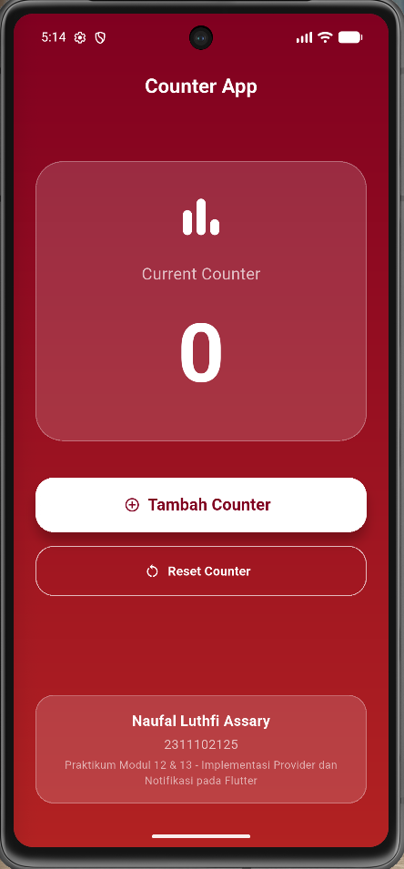
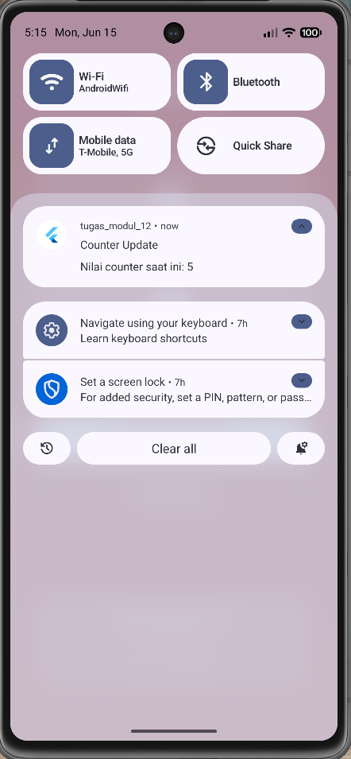
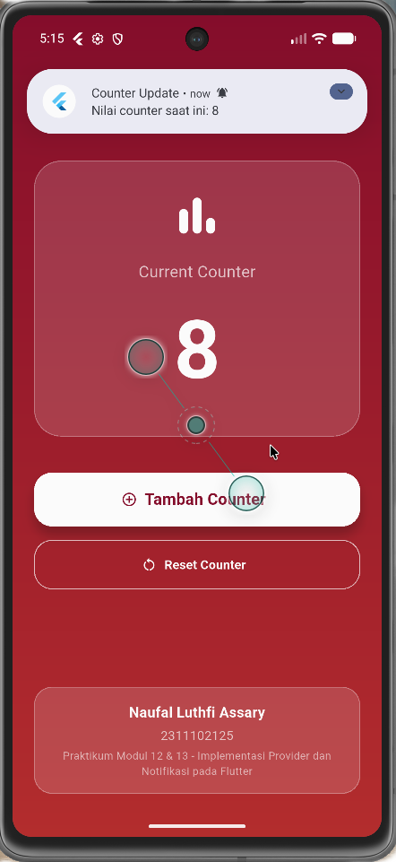
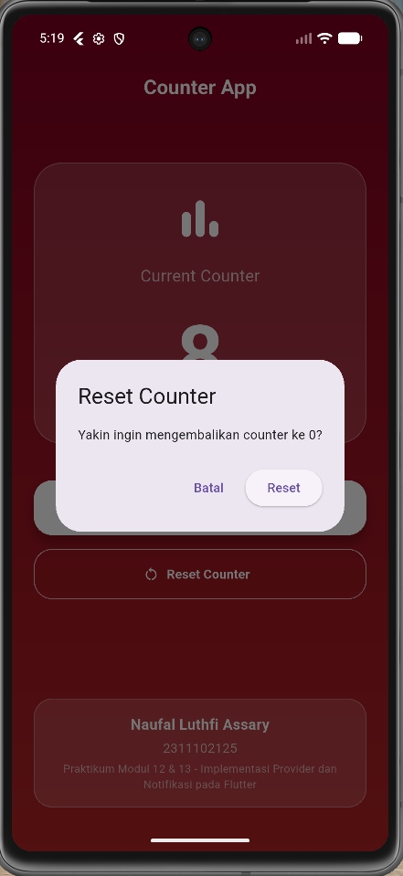
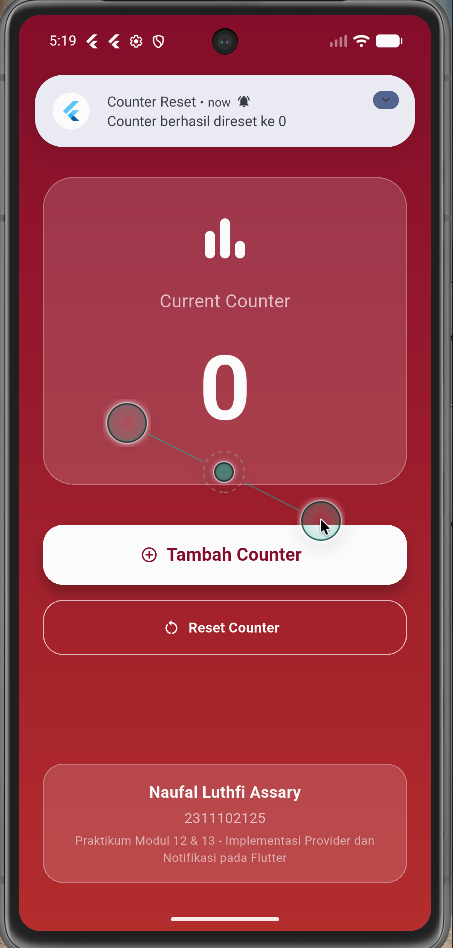

<div align="center">
  <br />
  <h1>LAPORAN PRAKTIKUM</h1>
  <h2>APLIKASI BERBASIS PLATFORM</h2>
  <br />
  <h3>Modul 12 & 13 Mobile<br> IMPLEMENTASI PROVIDER DAN NOTIFIKASI PADA FLUTTER </h3>
  <br />
  <br />
  
  <br />
  <br />
  <h3>Disusun Oleh :</h3>
  <p>
    <strong>NAUFAL LUTHFI ASSARY</strong><br>
    <strong>2311102125</strong><br>
    <strong>S1 IF-11-REG01</strong>
  </p>
  <br />
  <h3>Dosen Pengampu :</h3>
  <p>
    <strong>Dimas Fanny Hebrasianto Permadi, S.ST., M.Kom</strong>
  </p>
  <br />
  <h4>Asisten Praktikum :</h4>
  <p>
    <strong>Apri Pandu Wicaksono</strong><br>
    <strong>Rangga Pradarrell Fathi</strong>
  </p>
  <br />
  <h3>
    LABORATORIUM HIGH PERFORMANCE<br>
    FAKULTAS INFORMATIKA<br>
    UNIVERSITAS TELKOM PURWOKERTO<br>
    2026
  </h3>
</div>

---

## 1. Dasar Teori

State Management merupakan salah satu konsep penting dalam pengembangan aplikasi Flutter. State digunakan untuk menyimpan data yang dapat berubah selama aplikasi berjalan. Ketika state berubah, antarmuka pengguna (UI) perlu diperbarui agar dapat menampilkan data terbaru. Flutter menyediakan berbagai pendekatan state management, salah satunya adalah Provider.

Provider merupakan package yang digunakan untuk mengelola state secara terpusat dan efisien. Provider bekerja dengan konsep ChangeNotifier yang memungkinkan widget lain mendengarkan perubahan data. Ketika data berubah, Provider akan memanggil fungsi notifyListeners() sehingga widget yang menggunakan data tersebut dapat melakukan rebuild secara otomatis tanpa perlu mengelola state secara manual.

Selain state management, aplikasi mobile juga memerlukan mekanisme komunikasi dengan pengguna melalui notifikasi. Notifikasi digunakan untuk memberikan informasi atau pemberitahuan tertentu kepada pengguna tanpa harus membuka aplikasi. Pada Flutter, implementasi notifikasi lokal dapat dilakukan menggunakan package flutter_local_notifications.

Notifikasi lokal merupakan notifikasi yang dijalankan langsung oleh aplikasi pada perangkat tanpa memerlukan koneksi internet maupun server eksternal. Pada praktikum ini, notifikasi digunakan untuk memberikan informasi kepada pengguna ketika nilai counter berhasil ditambahkan maupun ketika counter direset kembali ke nilai awal.

---

## 2. Penjelasan Kode

---

### pubspec.yaml

Penjelasan Dependencies yang Digunakan

1. Provider
```yaml
provider: ^6.1.2
```
Package Provider digunakan sebagai State Management untuk mengelola data counter pada aplikasi. Provider memungkinkan data disimpan secara terpusat sehingga dapat diakses oleh berbagai widget tanpa perlu mengirim data secara berulang melalui constructor.

Pada aplikasi ini, Provider digunakan untuk:

* Menyimpan nilai counter.
* Mengelola perubahan nilai counter.
* Memperbarui tampilan secara otomatis ketika nilai counter berubah.
* Mengurangi penggunaan setState().

---

2. Flutter Local Notifications
```yaml
flutter_local_notifications: ^22.0.0
```
Package flutter_local_notifications digunakan untuk membuat dan menampilkan notifikasi lokal pada perangkat Android.

Pada aplikasi ini, package digunakan untuk:

* Menampilkan notifikasi ketika tombol Tambah Counter ditekan.
* Menampilkan notifikasi ketika counter direset.
* Memberikan informasi nilai counter terbaru kepada pengguna.

Fitur yang digunakan:

* Inisialisasi notifikasi lokal.
* Membuat channel notifikasi.
* Menampilkan judul dan isi notifikasi.
* Meminta izin notifikasi pada Android 13 ke atas.

---

### AndroidManifest.xml

Permission Notification
```xml
<uses-permission android:name="android.permission.POST_NOTIFICATIONS"/>
```
Permission ini digunakan untuk memberikan izin kepada aplikasi agar dapat menampilkan notifikasi pada perangkat Android.

Permission POST_NOTIFICATIONS diwajibkan pada Android 13 (API Level 33) ke atas.

Fungsi:

* Mengizinkan aplikasi menampilkan notifikasi.
* Mendukung implementasi flutter_local_notifications.
* Memberikan informasi perubahan counter kepada pengguna.

---

### File counter_provider.dart
```dart
import 'package:flutter/material.dart';
class CounterProvider extends ChangeNotifier {
  int _counter = 0;
  int get counter => _counter;
  void increment() {
    _counter++;
    notifyListeners();
  }
  void reset() {
    _counter = 0;
    notifyListeners();
  }
}
```
Import Library
```dart
import 'package:flutter/material.dart';
```
Digunakan untuk mengakses class ChangeNotifier yang menjadi dasar implementasi Provider.

---

Class CounterProvider
```dart
class CounterProvider extends ChangeNotifier
```
Class CounterProvider digunakan untuk menyimpan dan mengelola data counter. Class ini mewarisi ChangeNotifier sehingga dapat memberi tahu widget lain ketika terjadi perubahan data.

---

Variabel Counter
```dart
int _counter = 0;
```
Variabel private yang digunakan untuk menyimpan nilai counter.

Nilai awal counter adalah 0.

---

Getter Counter
```dart
int get counter => _counter;
```
Digunakan untuk mengambil nilai counter dari luar class tanpa memberikan akses langsung terhadap variabel private _counter.

---

Fungsi Increment
```dart
void increment() {
  _counter++;
  notifyListeners();
}
```
Digunakan untuk menambah nilai counter sebanyak satu.

Fungsi notifyListeners() akan memberi tahu seluruh widget yang menggunakan Provider bahwa data telah berubah sehingga tampilan dapat diperbarui secara otomatis.

---

Fungsi Reset
```dart
void reset() {
  _counter = 0;
  notifyListeners();
}
```
Digunakan untuk mengembalikan nilai counter menjadi 0 dan memperbarui tampilan aplikasi.

---

### File notification_service.dart
```dart
import 'package:flutter_local_notifications/flutter_local_notifications.dart';

class NotificationService {
  static final FlutterLocalNotificationsPlugin flutterLocalNotificationsPlugin =
      FlutterLocalNotificationsPlugin();

  static Future<void> init() async {
    const InitializationSettings initializationSettings =
        InitializationSettings(
          android: AndroidInitializationSettings('@mipmap/ic_launcher'),
        );

    await flutterLocalNotificationsPlugin.initialize(
      settings: initializationSettings,
    );
  }

  static Future<void> requestPermission() async {
    await flutterLocalNotificationsPlugin
        .resolvePlatformSpecificImplementation<
          AndroidFlutterLocalNotificationsPlugin
        >()
        ?.requestNotificationsPermission();
  }

  static Future<void> showNotification(int counterValue) async {
    const NotificationDetails notificationDetails = NotificationDetails(
      android: AndroidNotificationDetails(
        'counter_channel',
        'Counter Notification',
        channelDescription: 'Notification when counter changes',
        importance: Importance.max,
        priority: Priority.high,
      ),
    );

    await flutterLocalNotificationsPlugin.show(
      id: 0,
      title: 'Counter Update',
      body: 'Nilai counter saat ini: $counterValue',
      notificationDetails: notificationDetails,
    );
  }

  static Future<void> showResetNotification() async {
    const NotificationDetails notificationDetails = NotificationDetails(
      android: AndroidNotificationDetails(
        'counter_channel',
        'Counter Notification',
        channelDescription: 'Notification when counter changes',
        importance: Importance.max,
        priority: Priority.high,
      ),
    );

    await flutterLocalNotificationsPlugin.show(
      id: 1,
      title: 'Counter Reset',
      body: 'Counter berhasil direset ke 0',
      notificationDetails: notificationDetails,
    );
  }
}
```

Import Library
```dart
import 'package:flutter_local_notifications/flutter_local_notifications.dart';
```
Digunakan untuk mengakses fitur notifikasi lokal pada Flutter.

---

FlutterLocalNotificationsPlugin
```dart
static final FlutterLocalNotificationsPlugin
    flutterLocalNotificationsPlugin =
    FlutterLocalNotificationsPlugin();
```
Digunakan untuk membuat objek plugin notifikasi yang akan digunakan pada seluruh aplikasi.

---

Fungsi Init
```dart
static Future<void> init() async
```
Digunakan untuk melakukan inisialisasi plugin notifikasi sebelum aplikasi dijalankan.

Fungsi ini akan menghubungkan aplikasi dengan sistem notifikasi Android.

---

Fungsi Request Permission
```dart
static Future<void> requestPermission() async
```
Digunakan untuk meminta izin notifikasi kepada pengguna.

Permission ini diperlukan pada Android 13 ke atas agar notifikasi dapat ditampilkan.

---

Fungsi Show Notification
```dart
static Future<void> showNotification(
    int counterValue)
```
Digunakan untuk menampilkan notifikasi ketika nilai counter bertambah.

Isi notifikasi:
```dart
Counter Update
Nilai counter saat ini: X
```
X merupakan nilai counter terbaru.

---

Fungsi Show Reset Notification
```dart
static Future<void> showResetNotification()
```
Digunakan untuk menampilkan notifikasi ketika counter berhasil direset.

Isi notifikasi:
```dart
Counter Reset
Counter berhasil direset ke 0
```
---

### File main.dart
```dart
import 'package:flutter/material.dart';
import 'package:provider/provider.dart';

import 'counter_provider.dart';
import 'notification_service.dart';

void main() async {
  WidgetsFlutterBinding.ensureInitialized();

  await NotificationService.init();
  await NotificationService.requestPermission();

  runApp(
    ChangeNotifierProvider(
      create: (_) => CounterProvider(),
      child: const MyApp(),
    ),
  );
}

class MyApp extends StatelessWidget {
  const MyApp({super.key});

  @override
  Widget build(BuildContext context) {
    return MaterialApp(
      debugShowCheckedModeBanner: false,
      title: 'Counter App',
      theme: ThemeData(
        useMaterial3: true,
      ),
      home: const HomePage(),
    );
  }
}

class HomePage extends StatelessWidget {
  const HomePage({super.key});

  @override
  Widget build(BuildContext context) {
    final counterProvider =
        Provider.of<CounterProvider>(context);

    return Scaffold(
      extendBodyBehindAppBar: true,

      appBar: AppBar(
        centerTitle: true,
        elevation: 0,
        backgroundColor: Colors.transparent,
        title: const Text(
          "Counter App",
          style: TextStyle(
            color: Colors.white,
            fontSize: 22,
            fontWeight: FontWeight.bold,
          ),
        ),
      ),

      body: Container(
        width: double.infinity,

        decoration: const BoxDecoration(
          gradient: LinearGradient(
            begin: Alignment.topCenter,
            end: Alignment.bottomCenter,
            colors: [
              Color(0xFF800020),
              Color(0xFFB22222),
            ],
          ),
        ),

        child: SafeArea(
          child: Padding(
            padding: const EdgeInsets.all(24),

            child: Column(
              children: [
                const SizedBox(height: 30),

                Container(
                  width: double.infinity,
                  padding: const EdgeInsets.all(30),

                  decoration: BoxDecoration(
                    color:
                        Colors.white.withOpacity(0.15),

                    borderRadius:
                        BorderRadius.circular(30),

                    border: Border.all(
                      color:
                          Colors.white.withOpacity(
                        0.3,
                      ),
                    ),
                  ),

                  child: Column(
                    children: [
                      const Icon(
                        Icons.bar_chart_rounded,
                        size: 60,
                        color: Colors.white,
                      ),

                      const SizedBox(height: 20),

                      const Text(
                        "Current Counter",
                        style: TextStyle(
                          color: Colors.white70,
                          fontSize: 18,
                        ),
                      ),

                      const SizedBox(height: 10),

                      Text(
                        "${counterProvider.counter}",
                        style: const TextStyle(
                          fontSize: 90,
                          fontWeight:
                              FontWeight.bold,
                          color: Colors.white,
                        ),
                      ),
                    ],
                  ),
                ),

                const SizedBox(height: 40),

                SizedBox(
                  width: double.infinity,
                  height: 60,

                  child: ElevatedButton.icon(
                    icon: const Icon(
                      Icons.add_circle_outline,
                    ),

                    label: const Text(
                      "Tambah Counter",
                      style: TextStyle(
                        fontSize: 18,
                        fontWeight:
                            FontWeight.bold,
                      ),
                    ),

                    style:
                        ElevatedButton.styleFrom(
                      backgroundColor:
                          Colors.white,
                      foregroundColor:
                          const Color(
                        0xFF800020,
                      ),
                      elevation: 10,
                      shape:
                          RoundedRectangleBorder(
                        borderRadius:
                            BorderRadius.circular(
                          20,
                        ),
                      ),
                    ),

                    onPressed: () async {
                      counterProvider.increment();

                      await NotificationService
                          .showNotification(
                        counterProvider.counter,
                      );
                    },
                  ),
                ),

                const SizedBox(height: 15),

                SizedBox(
                  width: double.infinity,
                  height: 55,

                  child: OutlinedButton.icon(
                    icon: const Icon(
                      Icons.restart_alt,
                    ),

                    label: const Text(
                      "Reset Counter",
                      style: TextStyle(
                        fontWeight:
                            FontWeight.bold,
                      ),
                    ),

                    style:
                        OutlinedButton.styleFrom(
                      foregroundColor:
                          Colors.white,

                      side: BorderSide(
                        color:
                            Colors.white.withOpacity(
                          0.7,
                        ),
                      ),

                      shape:
                          RoundedRectangleBorder(
                        borderRadius:
                            BorderRadius.circular(
                          20,
                        ),
                      ),
                    ),

                    onPressed: () async {
                      final confirm =
                          await showDialog<bool>(
                        context: context,
                        builder: (context) {
                          return AlertDialog(
                            title: const Text(
                              "Reset Counter",
                            ),
                            content:
                                const Text(
                              "Yakin ingin mengembalikan counter ke 0?",
                            ),
                            actions: [
                              TextButton(
                                onPressed: () {
                                  Navigator.pop(
                                    context,
                                    false,
                                  );
                                },
                                child:
                                    const Text(
                                  "Batal",
                                ),
                              ),
                              ElevatedButton(
                                onPressed: () {
                                  Navigator.pop(
                                    context,
                                    true,
                                  );
                                },
                                child:
                                    const Text(
                                  "Reset",
                                ),
                              ),
                            ],
                          );
                        },
                      );

                      if (confirm == true) {
                        counterProvider.reset();

                        await NotificationService
                            .showResetNotification();
                      }
                    },
                  ),
                ),

                const Spacer(),

                Container(
                  width: double.infinity,
                  padding:
                      const EdgeInsets.all(16),

                  decoration: BoxDecoration(
                    color:
                        Colors.white.withOpacity(
                      0.15,
                    ),
                    borderRadius:
                        BorderRadius.circular(
                      20,
                    ),
                    border: Border.all(
                      color:
                          Colors.white.withOpacity(
                        0.3,
                      ),
                    ),
                  ),

                  child: const Column(
                    children: [
                      Text(
                        "Naufal Luthfi Assary",
                        style: TextStyle(
                          color: Colors.white,
                          fontWeight:
                              FontWeight.bold,
                          fontSize: 16,
                        ),
                      ),

                      SizedBox(height: 4),

                      Text(
                        "2311102125",
                        style: TextStyle(
                          color: Colors.white70,
                        ),
                      ),

                      SizedBox(height: 4),

                      Text(
                        "Praktikum Modul 12 & 13 - Implementasi Provider dan Notifikasi pada Flutter",
                        textAlign:
                            TextAlign.center,
                        style: TextStyle(
                          color: Colors.white60,
                          fontSize: 12,
                        ),
                      ),
                    ],
                  ),
                ),
              ],
            ),
          ),
        ),
      ),
    );
  }
}
```

Import Library
```dart
import 'package:flutter/material.dart';
import 'package:provider/provider.dart';
import 'counter_provider.dart';
import 'notification_service.dart';
```
Digunakan untuk mengakses widget Flutter, Provider, CounterProvider, dan NotificationService.

---

Fungsi Main
```dart
void main() async
```
Merupakan fungsi pertama yang dijalankan ketika aplikasi dibuka.

Pada fungsi ini dilakukan:

* Inisialisasi Flutter.
* Inisialisasi notifikasi.
* Meminta izin notifikasi.
* Menjalankan aplikasi.

---

WidgetsFlutterBinding.ensureInitialized()
```dart
WidgetsFlutterBinding.ensureInitialized();
```
Digunakan untuk memastikan Flutter telah selesai melakukan inisialisasi sebelum plugin dijalankan.

---

NotificationService.init()
```dart
await NotificationService.init();
```
Digunakan untuk mengaktifkan sistem notifikasi lokal.

---

NotificationService.requestPermission()
```dart
await NotificationService.requestPermission();
```
Digunakan untuk meminta izin notifikasi kepada pengguna.

---

ChangeNotifierProvider
```dart
ChangeNotifierProvider(
  create: (_) => CounterProvider(),
  child: const MyApp(),
)
```
Digunakan untuk menyediakan objek CounterProvider ke seluruh widget dalam aplikasi.

Dengan demikian data counter dapat diakses dari berbagai halaman tanpa perlu membuat objek baru.

---

MaterialApp
```dart
MaterialApp(
  debugShowCheckedModeBanner: false,
)
```
Digunakan sebagai root widget aplikasi Flutter.

Parameter debugShowCheckedModeBanner bernilai false digunakan untuk menghilangkan label DEBUG pada aplikasi.

---

Provider.of
```dart
Provider.of<CounterProvider>(context)
```
Digunakan untuk mengambil data counter yang tersimpan pada Provider.

Widget akan otomatis melakukan rebuild ketika nilai counter berubah.

---

Tombol Tambah Counter
```dart
counterProvider.increment();
```
Digunakan untuk menambah nilai counter sebanyak satu.

Setelah counter bertambah, aplikasi akan menampilkan notifikasi menggunakan:
```dart
NotificationService.showNotification(
  counterProvider.counter,
);
```
---

Tombol Reset Counter
```dart
counterProvider.reset();
```
Digunakan untuk mengembalikan nilai counter menjadi 0.

Setelah reset berhasil dilakukan, aplikasi akan menampilkan notifikasi reset.

---

Dialog Konfirmasi Reset
```dart
showDialog<bool>()
```
Digunakan untuk menampilkan dialog konfirmasi sebelum counter direset.

Tujuan penggunaan dialog:

* Mencegah reset yang tidak disengaja.
* Memberikan konfirmasi kepada pengguna.
* Meningkatkan pengalaman pengguna (User Experience).

---

## 3. Screenshot Hasil

### 1. Home


### 2. Notifikasi Muncul


### 3. Setelah menambah counter, dan notifikasi counter muncul


### 4. Konfirmasi untuk reset counter


### 5. Setelah reset, dan notifikasi reset muncul


---

## 4. Referensi

- [Flutter Docs](https://docs.flutter.dev)
- [Dart](https://dart.dev)
- [Modul](https://telkomuniversityofficial-my.sharepoint.com/:b:/g/personal/dimasfhp_telkomuniversity_ac_id/IQAzpAVjVmeTRYI3rgKxGZE7AcpC_xRo2dpbh8ZyHd3c1lQ?e=pZRgq9)
