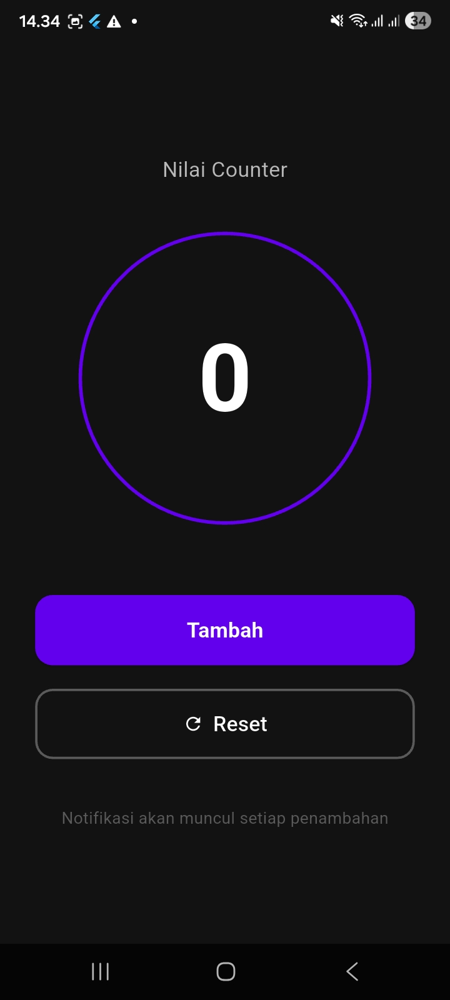
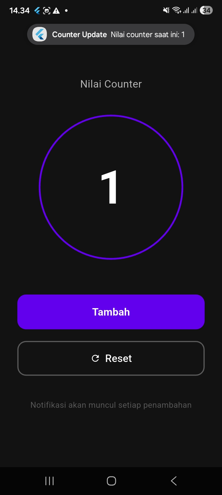
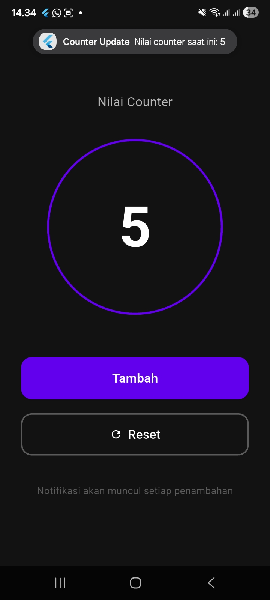

<div align="center">
  <br />
  <h1>LAPORAN PRAKTIKUM <br>APLIKASI BERBASIS PLATFORM</h1>
  <br />
  <h3>MODUL 12 & 13<br> IMPLEMENTASI PROVIDER & NOTIFIKASI <br>(Aplikasi Counter & State Management)</h3>
  <br />
   
  <br />
  <br />
  <br />
  <h3>Disusun Oleh :</h3>
  <p>
    <strong>Agnes Refilina Fiska</strong><br>
    <strong>2311102126</strong><br>
    <strong>S1 IF-11-REG01</strong>
  </p>
  <br />
  <br />
  <h3>Dosen Pengampu :</h3>
  <p>
    <strong>Dimas Fanny Hebrasianto Permadi, S.ST., M.Kom</strong>
  </p>
  <br />
  <br />
    <h4>Asisten Praktikum :</h4>
    <strong> Apri Pandu Wicaksono </strong> <br>
    <strong>Rangga Pradarrell Fathi</strong>
  <br />
  <h3>LABORATORIUM HIGH PERFORMANCE
 <br>FAKULTAS INFORMATIKA <br>UNIVERSITAS TELKOM PURWOKERTO <br>2026</h3>
</div>

---

## 1. Dasar Teori

### 1.1 Flutter

Flutter merupakan sebuah *framework* pengembangan aplikasi lintas platform yang dikembangkan oleh Google. *Framework* ini memungkinkan pengembang untuk membangun aplikasi berkualitas tinggi yang dikompilasi secara *native* pada berbagai sistem operasi, baik perangkat  *mobile* ,  *web* , maupun  *desktop* , hanya dengan menggunakan satu basis kode ( *codebase* ).

### 1.2 Provider (State Management)

*Provider* adalah salah satu pustaka ( *package* ) manajemen state yang dianjurkan oleh tim Flutter. Pustaka ini bekerja sebagai *wrapper* di atas  *InheritedWidget* , bertujuan untuk menyederhanakan cara data dikelola dan dibagikan antar komponen dalam aplikasi. Pendekatan utama yang ditawarkan adalah pemisahan yang jelas antara logika bisnis ( *business logic* ) dengan lapisan antarmuka ( *UI* ). Hal ini memastikan efisiensi performa karena hanya widget yang terikat langsung dengan data terkait yang akan diperbarui ( *rebuild* ) saat terjadi perubahan state.

### 1.3 Flutter Local Notifications

`flutter_local_notifications` merupakan sebuah *plugin* yang digunakan untuk mengimplementasikan fungsionalitas notifikasi lokal pada aplikasi. Berbeda dengan FCM ( *Firebase Cloud Messaging* ) yang memerlukan koneksi jaringan, notifikasi ini bekerja secara  *offline* . Plugin ini memungkinkan aplikasi untuk berinteraksi langsung dengan sistem notifikasi bawaan perangkat untuk menampilkan pemberitahuan kepada pengguna.

### 1.4 ChangeNotifier & Consumer

Implementasi state pada aplikasi ini didukung oleh `ChangeNotifier`, sebuah kelas dasar yang menyediakan mekanisme pembaruan state melalui fungsi `notifyListeners()`. Integrasi pada sisi antarmuka dilakukan menggunakan widget `Consumer`. Fungsi utama dari `Consumer` adalah untuk berlangganan ( *subscribe* ) terhadap perubahan data dari  *provider* , sehingga setiap kali terdapat pembaruan data yang dipicu oleh `notifyListeners()`, widget tersebut secara otomatis akan melakukan pembaruan antarmuka ( *rebuild* ) sesuai dengan nilai state terbaru.

---

## 2. Implementasi Program

### 2.1 Deskripsi Aplikasi

Aplikasi **"Counter Pro"** ini dirancang untuk menunjukkan integrasi manajemen state dengan **Provider** dan implementasi **Local Notification** pada Flutter. Fitur utama yang diimplementasikan meliputi:

1. **State Management** : Mengelola nilai counter secara terpusat agar data tetap sinkron antara UI dan logika.
2. **Fitur Interaktif** : Tombol **Tambah** untuk menambah nilai dan tombol **Reset** untuk mengembalikan nilai ke nol.
3. **Notifikasi Sistem** : Memberikan umpan balik instan melalui notifikasi sistem setiap kali terjadi penambahan nilai.
4. **Desain Modern** : Menggunakan palet warna elegan (Hitam, Ungu, Putih) dengan tata letak vertikal yang minimalis.

---

## 3. Code & Penjelasan

### 3.1 `pubspec.yaml` — Menambahkan Dependensi

Untuk menjalankan manajemen state dan fitur notifikasi lokal, diperlukan penambahan pustaka pihak ketiga berikut ke dalam file `pubspec.yaml`:

```gradle
dependencies:
  flutter:
    sdk: flutter
  provider: ^6.1.1
  flutter_local_notifications: ^17.2.0
```

**Penjelasan:**

- `provider`: **(^6.1.1):** Digunakan sebagai *State Management* untuk menyimpan variabel `_counter`. Dengan Provider, pembaruan nilai pada variabel `_counter` dapat langsung dipantau oleh antarmuka pengguna tanpa harus melakukan *state management* manual yang kompleks.
- `flutter_local_notifications`: **(^17.2.0):** Digunakan untuk mengintegrasikan fitur notifikasi sistem pada perangkat. Pustaka ini memungkinkan aplikasi untuk menampilkan *pop-up* pemberitahuan di bilah status perangkat secara *offline* (lokal) segera setelah nilai counter berubah.

---

### 3.2 Konfigurasi Android — `android/app/build.gradle`

Konfigurasi pada file `build.gradle` memastikan proyek Flutter dapat dikompilasi dengan benar oleh sistem Android. Berikut adalah pengaturan utama yang diterapkan:

```gradle
android {
    namespace = "com.example.flutter_application_modul12_13"
    compileSdk = flutter.compileSdkVersion
    ndkVersion = flutter.ndkVersion

    compileOptions {
        sourceCompatibility = JavaVersion.VERSION_1_8
        targetCompatibility = JavaVersion.VERSION_1_8
    }

    kotlinOptions {
        jvmTarget = JavaVersion.VERSION_1_8
    }

    defaultConfig {
        applicationId = "com.example.flutter_application_modul12_13"
        minSdk = flutter.minSdkVersion
        targetSdk = flutter.targetSdkVersion
        versionCode = flutter.versionCode
        versionName = flutter.versionName
    }
}
```

**Penjelasan:**

- **`compileSdk` & `targetSdk`:** Menggunakan referensi bawaan `flutter.compileSdkVersion` dan `flutter.targetSdkVersion`. Hal ini merupakan praktik terbaik ( *best practice* ) dalam pengembangan Flutter agar versi SDK selalu sinkron dengan versi Flutter yang terinstal di komputer.
- **`compileOptions` & `kotlinOptions`:** Mengatur kompatibilitas kode ke `JavaVersion.VERSION_1_8`. Pengaturan ini memastikan bahwa kode Java dan Kotlin dalam proyek dapat berjalan dengan stabil di lingkungan Android.
- **`namespace` & `applicationId`:** Menetapkan identitas unik aplikasi sesuai dengan struktur paket `com.example.flutter_application_modul12_13`. Penggunaan *namespace* ini penting bagi sistem Android untuk mengelola resource dan dependensi aplikasi secara unik di perangkat.

---

### 3.3 Konfigurasi Izin Notifikasi — `AndroidManifest.xml`

Untuk memastikan notifikasi dapat muncul dengan baik di perangkat pengguna, kita perlu menambahkan deklarasi izin ( *permission* ) ke dalam file `AndroidManifest.xml`.

```xml
<manifest xmlns:android="http://schemas.android.com/apk/res/android">
  
    <uses-permission android:name="android.permission.INTERNET"/>
  
    <uses-permission android:name="android.permission.POST_NOTIFICATIONS"/>
    <uses-permission android:name="android.permission.VIBRATE" />

    <application ...>
        ...
    </application>
</manifest>
```

**Penjelasan:**

* **`android.permission.POST_NOTIFICATIONS`** : Izin ini bersifat wajib untuk perangkat yang menjalankan Android 13 (API Level 33) ke atas. Tanpa izin ini, aplikasi tidak akan diizinkan menampilkan notifikasi *pop-up* di bilah status ( *status bar* ) perangkat.
* **`android.permission.VIBRATE`** : Digunakan agar aplikasi dapat memberikan umpan balik berupa getaran saat notifikasi muncul, sehingga interaksi notifikasi terasa lebih responsif bagi pengguna.
* **`android.permission.INTERNET`** : Izin standar Flutter yang memungkinkan alat pengembangan ( *Flutter Tool* ) melakukan komunikasi dengan aplikasi untuk fitur seperti *Hot Reload* dan  *Debugging* .

---

### 3.4 State Model & Logic— `main.dart`

Dalam proyek ini, kelas `CounterProvider` ditempatkan langsung di dalam `main.dart` agar aksesibilitas data menjadi lebih ringkas.

```dart
class CounterProvider extends ChangeNotifier {
  int _counter = 0;
  int get counter => _counter;

  void increment() {
    _counter++;
    notifyListeners(); // Memberitahu UI untuk update
    showNotification(_counter); // Memicu notifikasi lokal
  }

  void reset() {
    _counter = 0;
    notifyListeners();
  }
}
```

**Penjelasan:**
Fungsi `increment()` tidak hanya menaikkan nilai `_counter`, tetapi juga secara otomatis memanggil fungsi `showNotification` untuk memberikan informasi terbaru kepada pengguna.

---

### 3.5 Integrasi UI (Consumer) — `main.dart`

UI menggunakan `Consumer` untuk memantau perubahan data.

```dart
Consumer<CounterProvider>(
  builder: (context, provider, child) {
    return Text(
      '${provider.counter}',
      style: TextStyle(color: Colors.white, fontSize: 80, fontWeight: FontWeight.bold),
    );
  },
),
```

**Penjelasan:**
Widget `Consumer` memastikan hanya komponen angka yang mengalami *rebuild* saat state berubah, membuat aplikasi tetap ringan dan responsif.

---


## 4. Hasil Tampilan (*Output*)

Berikut adalah tangkapan layar (*screenshot*) dari aplikasi yang menunjukkan fitur Provider dan Notifikasi Lokal telah berjalan dengan baik.

### 1. Halaman Utama



### 2. Menekan Tombol Tambah +1 dan notifikasi Pop-Up (counter bertambah)



### 3. Menekan riset dan notifikasi Pop-Up (riset ulang)


