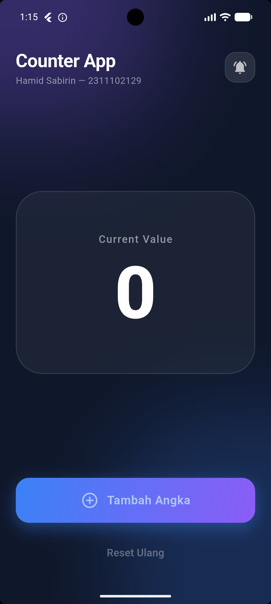
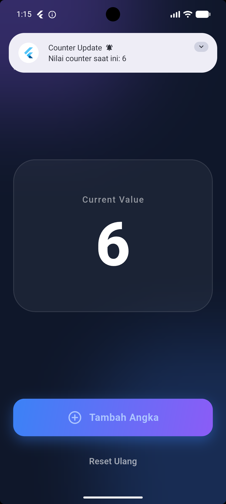
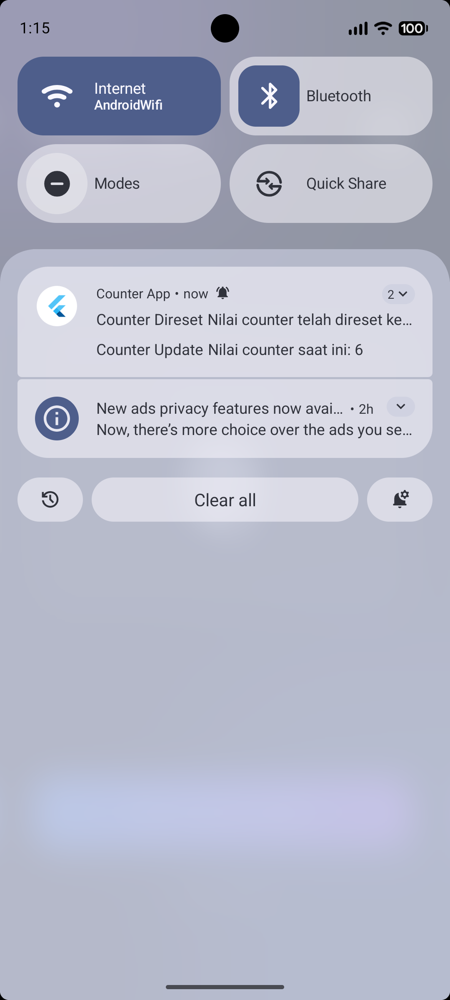
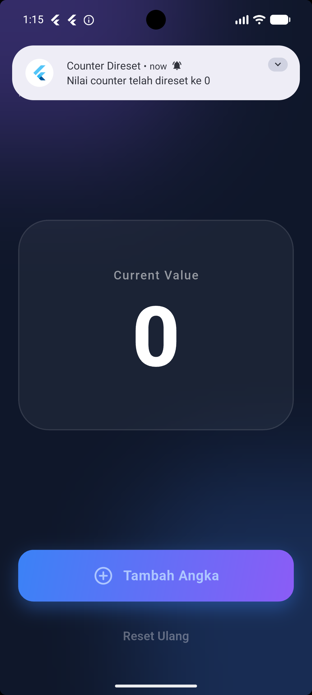

<div align="center">
  <br />
  <h1>LAPORAN PRAKTIKUM <br>APLIKASI BERBASIS PLATFORM</h1>
  <br />
  <h3>MODUL 12 & 13<br> IMPLEMENTASI PROVIDER & NOTIFIKASI <br>(Aplikasi Counter & State Management)</h3>
  <br />
   
  <br />
  <br />
  <br />
  <h3>Disusun Oleh :</h3>
  <p>
    <strong>HAMID SABIRIN</strong><br>
    <strong>2311102129</strong><br>
    <strong>S1 IF-11-REG01</strong>
  </p>
  <br />
  <br />
  <h3>Dosen Pengampu :</h3>
  <p>
    <strong>Dimas Fanny Hebrasianto Permadi, S.ST., M.Kom</strong>
  </p>
  <br />
  <br />
    <h4>Asisten Praktikum :</h4>
    <strong> Apri Pandu Wicaksono </strong> <br>
    <strong>Rangga Pradarrell Fathi</strong>
  <br />
  <h3>LABORATORIUM HIGH PERFORMANCE
 <br>FAKULTAS INFORMATIKA <br>UNIVERSITAS TELKOM PURWOKERTO <br>2026</h3>
</div>

---

## 1. Dasar Teori

### 1.1 Flutter
Flutter adalah framework antarmuka pengguna (UI) sumber terbuka dari Google yang digunakan untuk membangun aplikasi secara natively compiled untuk berbagai platform dari satu basis kode (codebase).

### 1.2 Provider (State Management)
`provider` adalah salah satu package manajemen state (state management) yang direkomendasikan secara resmi oleh tim Flutter. Provider berfungsi sebagai pembungkus (*wrapper*) di sekitar *InheritedWidget* untuk membuat penggunaan *InheritedWidget* menjadi lebih mudah dan terstruktur. Konsep utamanya adalah memisahkan antara *business logic* dan *UI*, sehingga saat terjadi perubahan state, hanya widget yang membutuhkan data tersebut yang akan di-rebuild.

### 1.3 Flutter Local Notifications
`flutter_local_notifications` adalah plugin untuk membuat dan menampilkan notifikasi pop-up secara lokal (offline) dari dalam aplikasi, tanpa melalui server atau internet (seperti Firebase Cloud Messaging). Notifikasi ini dikontrol secara langsung oleh sistem operasi ponsel.

### 1.4 ChangeNotifier & Consumer
Aplikasi ini memanfaatkan `ChangeNotifier`, yaitu sebuah kelas dasar bawaan Flutter yang menyediakan mekanisme pemberitahuan perubahan (*notifyListeners*). Di sisi UI, kita menggunakan widget `Consumer` yang berfungsi untuk "mendengarkan" perubahan dari provider dan membangun ulang (*rebuild*) dirinya secara otomatis setiap kali fungsi *notifyListeners()* dipanggil.

---

## 2. Implementasi Program

### 2.1 Deskripsi Aplikasi
Aplikasi bertema “Implementasi Provider & Notifikasi” ini dibuat untuk memahami cara mengelola perubahan state aplikasi skala menengah menggunakan pola desain manajemen state yang rapi. Fitur utama yang diimplementasikan:

1. **State Management Counter**: Menampilkan nilai angka counter yang state-nya dipertahankan secara terpusat.
2. **Penambahan Counter**: Terdapat tombol "Tambah Angka" untuk menaikkan nilai counter dengan fungsi *increment*.
3. **Reset Counter**: Terdapat tombol "Reset Ulang" untuk mengembalikan angka menjadi 0.
4. **Notifikasi Sistem**: 
   - Muncul notifikasi "Counter Update" ketika tombol tambah ditekan (menunjukkan angka terakhir).
   - Muncul notifikasi "Counter Direset" ketika tombol reset ditekan.
5. **Modern Glassmorphism UI**: Tampilan visual mengusung gaya masa kini (dark slate, frosted glass effect, gradient buttons).

---

## 3. Code & Penjelasan

### 3.1 `pubspec.yaml` (Menambahkan Dependensi)
Kita memerlukan dua library eksternal utama untuk menyelesaikan tugas modul ini, yaitu untuk state management dan integrasi API notifikasi OS.

```yaml
dependencies:
  flutter:
    sdk: flutter
  cupertino_icons: ^1.0.8
  provider: ^6.1.5+1 # Package manajemen state dari Flutter
  flutter_local_notifications: ^22.0.0 # Package integrasi Notifikasi
```

**Penjelasan:**
- `provider`: Digunakan untuk memisahkan logika aplikasi (seperti penambahan dan reset counter) dari antarmuka pengguna (UI), sehingga kode menjadi lebih bersih dan modular.
- `flutter_local_notifications`: Berfungsi sebagai jembatan untuk mengakses API notifikasi lokal yang ada pada sistem operasi perangkat (Android/iOS) secara *offline*.

### 3.2 Konfigurasi Izin Notifikasi (`AndroidManifest.xml`)
Sejak Android 13 (API Level 33), sistem operasi memblokir notifikasi pop-up secara default kecuali kita meminta izin eksplisit dari user. Izin ini di-deklarasikan pada *manifest*.

```xml
    <!-- Permission notifikasi lokal (wajib untuk Android 13 / API 33+) -->
    <uses-permission android:name="android.permission.POST_NOTIFICATIONS" />
    <uses-permission android:name="android.permission.RECEIVE_BOOT_COMPLETED" />
```

**Penjelasan:**
Penambahan izin `POST_NOTIFICATIONS` wajib dilakukan agar aplikasi tidak *crash* dan sistem operasi mengizinkan kemunculan *pop-up* notifikasi, khususnya pada smartphone dengan sistem Android 13 ke atas.

### 3.3 State Model (`counter_provider.dart`)
Kelas ini bertugas menampung variabel state dan semua fungsi mutasi data. Logika bisnis berjalan di file ini secara terisolasi tanpa mengetahui seperti apa bentuk UI-nya.

```dart
import 'package:flutter/material.dart';

class CounterProvider extends ChangeNotifier {
  int _counter = 0;

  int get counter => _counter;

  void increment() {
    _counter++;
    notifyListeners(); // Memicu rebuild pada Consumer
  }

  void reset() {
    _counter = 0;
    notifyListeners(); // Memicu rebuild pada Consumer
  }
}
```

**Penjelasan:**
Class `CounterProvider` yang merupakan turunan dari `ChangeNotifier` bertugas menyimpan nilai state `_counter`. Saat method `increment()` atau `reset()` dieksekusi, pemanggilan fungsi `notifyListeners()` akan memberitahu seluruh *Consumer* yang memantau provider ini untuk memperbarui (*render* ulang) tampilannya di layar.

### 3.4 Inisialisasi Sistem Notifikasi (`notification_service.dart`)
Kelas ini dibuat menggunakan pola desain *Singleton* agar satu instansiasi dapat digunakan berkali-kali tanpa memakan memori tambahan.

```dart
import 'package:flutter_local_notifications/flutter_local_notifications.dart';

class NotificationService {
  // Singleton pattern
  static final NotificationService _instance = NotificationService._internal();

  factory NotificationService() {
    return _instance;
  }

  NotificationService._internal();

  final FlutterLocalNotificationsPlugin flutterLocalNotificationsPlugin =
      FlutterLocalNotificationsPlugin();

  Future<void> initialize() async {
    const AndroidInitializationSettings initializationSettingsAndroid =
        AndroidInitializationSettings('@mipmap/ic_launcher');

    const InitializationSettings initializationSettings = InitializationSettings(
      android: initializationSettingsAndroid,
    );

    // Menginisialisasi pengaturan notifikasi menggunakan Named Parameters
    await flutterLocalNotificationsPlugin.initialize(
      settings: initializationSettings,
      onDidReceiveNotificationResponse: (NotificationResponse response) async {},
    );

    // Meminta izin untuk OS Android 13+
    await flutterLocalNotificationsPlugin
        .resolvePlatformSpecificImplementation<
            AndroidFlutterLocalNotificationsPlugin>()
        ?.requestNotificationsPermission();
  }
  // ... fungsi notifikasi (increment & reset) ...
}
```

**Penjelasan:**
Penerapan arsitektur pola desain **Singleton** memastikan bahwa objek dari sistem notifikasi hanya dibuat satu kali di dalam memori perangkat. Di akhir proses inisialisasi, pemanggilan `requestNotificationsPermission` berfungsi memunculkan dialog permintaan akses notifikasi langsung kepada *user* saat pertama kali aplikasi dibuka.

### 3.5 Pembuatan Jendela Notifikasi Increment & Reset

Di dalam file service yang sama, kita memiliki dua channel pemanggil notifikasi. Satu untuk *Update* dan satu untuk *Reset*.

```dart
  Future<void> showCounterNotification(int counterValue) async {
    const AndroidNotificationDetails androidPlatformChannelSpecifics =
        AndroidNotificationDetails(
      'counter_channel_id',
      'Counter Notifications',
      importance: Importance.max,
      priority: Priority.high,
    );

    await flutterLocalNotificationsPlugin.show(
      id: 0,
      title: 'Counter Update',
      body: 'Nilai counter saat ini: $counterValue',
      notificationDetails: NotificationDetails(android: androidPlatformChannelSpecifics),
    );
  }

  Future<void> showResetNotification() async {
    const AndroidNotificationDetails androidDetails =
        AndroidNotificationDetails(
      'counter_reset_channel',
      'Counter Reset Notifications',
      importance: Importance.max,
      priority: Priority.high,
    );

    await flutterLocalNotificationsPlugin.show(
      id: 1,
      title: 'Counter Direset',
      body: 'Nilai counter telah direset ke 0',
      notificationDetails: NotificationDetails(android: androidDetails),
    );
  }
```

**Penjelasan:**
Setiap notifikasi membutuhkan pengaturan detail seperti *Channel ID* dan tingkat kepentingan (*Importance*). Pada kode di atas, kita membuat dua buah ID notifikasi yang berbeda (`id: 0` untuk tambah dan `id: 1` untuk reset). Hal ini mencegah agar notifikasi yang baru tidak asal menimpa pesan notifikasi sebelumnya, sehingga log notifikasi tetap utuh.

### 3.6 Membungkus Aplikasi dengan Provider (`main.dart`)
Agar `CounterProvider` dapat diakses secara global, ia harus dibungkus (*wrap*) pada level tertinggi *widget tree* (yaitu di luar `MaterialApp`).

```dart
void main() async {
  WidgetsFlutterBinding.ensureInitialized();
  await NotificationService().initialize();
  runApp(
    ChangeNotifierProvider(
      create: (_) => CounterProvider(),
      child: const MyApp(),
    ),
  );
}
```

**Penjelasan:**
Keseluruhan widget utama (`MyApp`) dibungkus oleh `ChangeNotifierProvider` pada level paling tinggi dalam hierarki *widget tree*. Langkah wajib ini dilakukan untuk mendistribusikan instansiasi `CounterProvider()` sehingga setiap halaman (atau *child*) bisa mengakses state tersebut secara global.

### 3.7 Membaca State Menggunakan Consumer (`main.dart`)
Tampilan UI angka pada layar dibungkus dengan widget `Consumer` sehingga angka dapat berubah dinamis.

```dart
Consumer<CounterProvider>(
  builder: (context, counterProvider, _) {
    return Text(
      '${counterProvider.counter}',
      style: const TextStyle(
        fontSize: 110,
        fontWeight: FontWeight.w800,
        color: Colors.white,
      ),
    );
  },
),
```

Saat tombol ditekan, UI memanggil aksi ke Provider tanpa me-*rebuild* satu halaman utuh, dan diikuti dengan *trigger* notifikasi.

```dart
  Future<void> _onIncrement(BuildContext context) async {
    final provider = context.read<CounterProvider>();
    provider.increment();
    await NotificationService().showCounterNotification(provider.counter);
  }

  Future<void> _onReset(BuildContext context) async {
    final provider = context.read<CounterProvider>();
    provider.reset();
    await NotificationService().showResetNotification();
  }
```

**Penjelasan:**
- `Consumer<CounterProvider>`: Berfungsi sebagai *widget* pendengar. Ia hanya akan me-*rebuild* teks ukurannya saja setiap kali mendeteksi perubahan dari Provider. Strategi ini jauh lebih menghemat kinerja aplikasi dibandingkan me-*rebuild* satu halaman utuh (*Scaffold*).
- `context.read<CounterProvider>()`: Dipanggil di dalam aksi tombol (*onPressed*) untuk mengeksekusi metode mutasi data (*increment* dan *reset*). Berbeda dengan *Consumer* (`watch`), metode *read* dipanggil karena tombol tidak perlu ikut me-*rebuild* UI-nya sendiri.
- Setelah *state* data berhasil diubah, aplikasi langsung menjalankan fungsi `NotificationService()` untuk menembakkan (*trigger*) munculnya notifikasi sistem.

---

## 4. Hasil Tampilan (*Output*)

Berikut adalah tangkapan layar (*screenshot*) dari aplikasi yang menunjukkan fitur Provider dan Notifikasi Lokal telah berjalan dengan baik.

*(Ganti gambar ini dengan meletakkan hasil screenshot ke dalam folder `assets/` dengan nama yang sesuai)*

### A. Halaman Utama (Glassmorphism Modern UI)


### B. Menekan Tombol Tambah +1


### C. Notifikasi Pop-Up (Counter Bertambah)


### D. Notifikasi Pop-Up (Reset Ulang)

