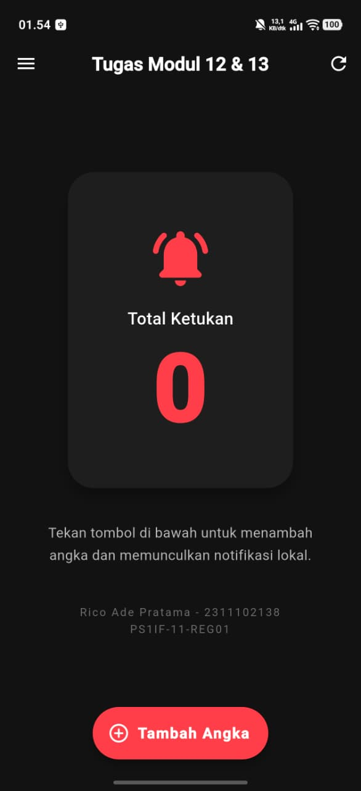
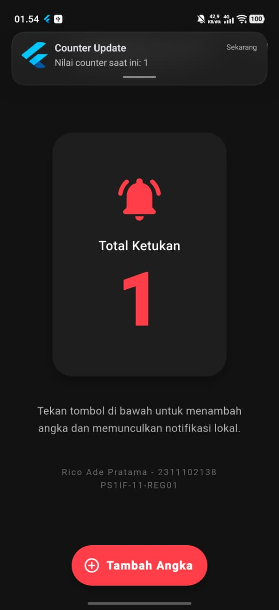
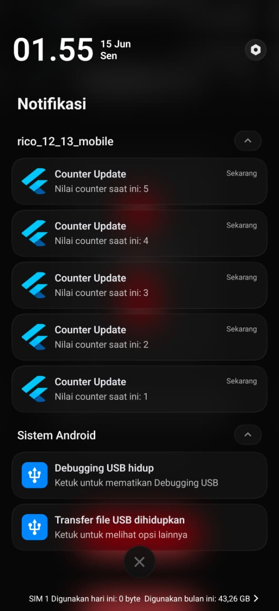
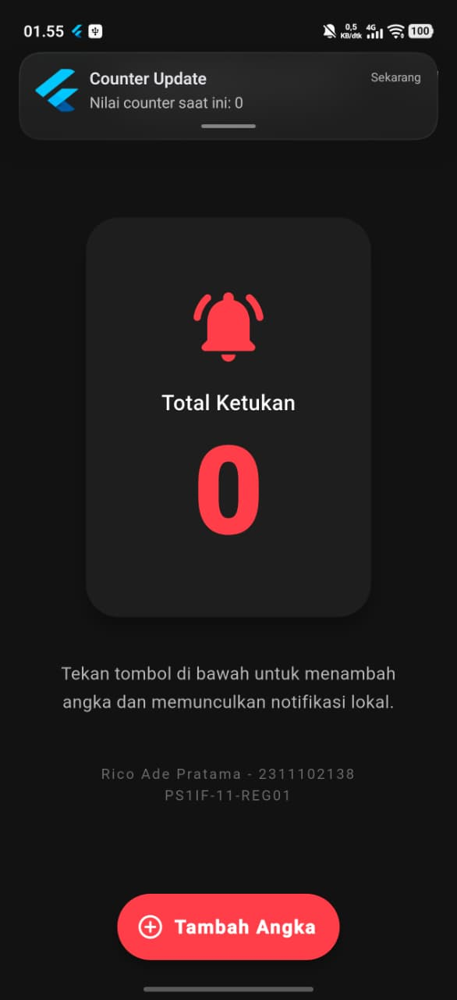

<div align="center">
   <h2>LAPORAN PRAKTIKUM<br>APLIKASI BERBASIS PLATFORM</h2>
   <h>
   <br>
   <h4>MODUL 12 & 13 Mobile<br>Implementasi Provider dan Notifikasi pada Flutter</h4>
   <br>
   
   <br><br>
 
**Disusun Oleh :**<br>
RICO ADE PRATAMA<br>
2311102138<br>
PS1IF-11-REG01
<br><br>
 
**Dosen Pengampu :**<br>
Dimas Fanny Hebrasianto Permadi, S.ST., M.Kom
<br><br>
 
**Assisten Praktikum :**<br>
Apri Pandu Wicaksono
<br>Rangga Pradarrell Fathi
<br><br>
 
PROGRAM STUDI S1 TEKNIK INFORMATIKA<br>
FAKULTAS INFORMATIKA<br>
UNIVERSITAS TELKOM PURWOKERTO<br>
2026

</div>

---

## 1. Dasar Teori

### 1.1 Implementasi _State Management_ (Provider) pada Flutter

**Provider** merupakan solusi yang memisahkan logika bisnis dari antarmuka pengguna (UI). Implementasinya bertumpu pada tiga komponen utama:

- **ChangeNotifier:** Kelas yang mengelola variabel data. Saat datanya berubah, komponen ini akan menjalankan `notifyListeners()` untuk memperbarui tampilan layar secara otomatis.
- **ChangeNotifierProvider:** Widget yang menyediakan dan mendistribusikan data ke seluruh _widget_ di bawahnya. Cara ini mencegah pengiriman parameter secara berulang dari satu widget ke widget lain (_prop drilling_).
- **Consumer:** Widget yang mengamati dan mendengarkan perubahan data pada sisi UI. Komponen ini mengoptimalkan performa dengan hanya membangun ulang (_rebuild_) elemen visual yang benar-benar membutuhkan data baru.

### 1.2 Implementasi Notifikasi Lokal (_Local Notification_)

**Notifikasi lokal** adalah fitur yang menampilkan peringatan langsung dari dalam aplikasi, tanpa mengandalkan _server_ luar. Implementasinya mencakup tiga tahap teknis:

- **Mengintegrasikan Pustaka:** Memanfaatkan paket `flutter_local_notifications` untuk mengakses fitur notifikasi bawaan perangkat.
- **Mengatur Saluran (_Notification Channel_):** Membuat saluran wajib untuk menentukan karakteristik notifikasi, seperti tingkat urgensi, suara, dan getaran.
- **Meminta Izin Akses (_Runtime Permission_):** Menyesuaikan standar keamanan Android 13 ke atas dengan secara dinamis meminta izin `POST_NOTIFICATIONS` kepada pengguna sebelum memunculkan notifikasi.

## 2. Kode Program Unguided

### Tugas Praktik Modul 12 & 13

### Implementasi Provider dan Notifikasi pada Flutter\*\*

### Deskripsi Tugas

Buatlah aplikasi Flutter sederhana yang menerapkan **State Management Provider** dan **Notifikasi**. Aplikasi cukup satu halaman yang menampilkan nilai counter dan sebuah tombol untuk menambah nilai counter.

### Ketentuan

1. Gunakan **Provider** untuk menyimpan dan mengelola nilai counter.
2. Tampilkan nilai counter pada layar utama aplikasi.
3. Sediakan tombol **Tambah (+)** untuk menambah nilai counter sebanyak 1 setiap kali ditekan.
4. Setiap kali nilai counter bertambah, tampilkan notifikasi yang berisi:
   - Judul: **Counter Update**
   - Pesan: "Nilai counter saat ini: X" (X adalah nilai counter terbaru)
5. Notifikasi dapat menggunakan:
   - Firebase Cloud Messaging (FCM), **atau**
   - Local Notification (lebih sederhana).
6. Tampilan aplikasi tidak perlu dibuat kompleks, cukup fungsional dan mudah digunakan.

## Output yang Dikumpulkan

1. Source code proyek Flutter.
2. Screenshot halaman aplikasi yang menampilkan nilai counter.
3. Screenshot notifikasi yang muncul setelah tombol ditekan.
4. Laporan singkat .md (maksimal 1 halaman) yang menjelaskan:
   - Cara kerja Provider pada aplikasi.
   - Cara kerja notifikasi yang digunakan.

### Struktur Project

```php
Modul_12_13_Mobile/rico_12_13_mobile/  # Folder utama proyek
├── android/                           # Konfigurasi platform Android
│   └── app/
│       └── build.gradle.kts           # Konfigurasi Gradle (desugaring)
├── lib/                               # Folder kode utama (Dart)
│   ├── counter_provider.dart          # Logika state (ChangeNotifier)
│   ├── main.dart                      # Titik awal program & UI utama
│   └── notification_service.dart      # Layanan notifikasi lokal
└── pubspec.yaml                       # Konfigurasi dependensi paket
```

### Kode pubspec.yaml

```yaml
name: rico_12_13_mobile
description: "A new Flutter project."
# The following line prevents the package from being accidentally published to
# pub.dev using `flutter pub publish`. This is preferred for private packages.
publish_to: "none" # Remove this line if you wish to publish to pub.dev

# The following defines the version and build number for your application.
# A version number is three numbers separated by dots, like 1.2.43
# followed by an optional build number separated by a +.
# Both the version and the builder number may be overridden in flutter
# build by specifying --build-name and --build-number, respectively.
# In Android, build-name is used as versionName while build-number used as versionCode.
# Read more about Android versioning at https://developer.android.com/studio/publish/versioning
# In iOS, build-name is used as CFBundleShortVersionString while build-number is used as CFBundleVersion.
# Read more about iOS versioning at
# https://developer.apple.com/library/archive/documentation/General/Reference/InfoPlistKeyReference/Articles/CoreFoundationKeys.html
# In Windows, build-name is used as the major, minor, and patch parts
# of the product and file versions while build-number is used as the build suffix.
version: 1.0.0+1

environment:
  sdk: ^3.11.5

# Dependencies specify other packages that your package needs in order to work.
# To automatically upgrade your package dependencies to the latest versions
# consider running `flutter pub upgrade --major-versions`. Alternatively,
# dependencies can be manually updated by changing the version numbers below to
# the latest version available on pub.dev. To see which dependencies have newer
# versions available, run `flutter pub outdated`.
dependencies:
  flutter:
    sdk: flutter
  provider: ^6.1.2
  flutter_local_notifications: ^19.4.0
  cupertino_icons: ^1.0.8

dev_dependencies:
  flutter_test:
    sdk: flutter

  # The "flutter_lints" package below contains a set of recommended lints to
  # encourage good coding practices. The lint set provided by the package is
  # activated in the `analysis_options.yaml` file located at the root of your
  # package. See that file for information about deactivating specific lint
  # rules and activating additional ones.
  flutter_lints: ^6.0.0

# For information on the generic Dart part of this file, see the
# following page: https://dart.dev/tools/pub/pubspec

# The following section is specific to Flutter packages.
flutter:
  # The following line ensures that the Material Icons font is
  # included with your application, so that you can use the icons in
  # the material Icons class.
  uses-material-design: true

  # To add assets to your application, add an assets section, like this:
  # assets:
  #   - images/a_dot_burr.jpeg
  #   - images/a_dot_ham.jpeg

  # An image asset can refer to one or more resolution-specific "variants", see
  # https://flutter.dev/to/resolution-aware-images

  # For details regarding adding assets from package dependencies, see
  # https://flutter.dev/to/asset-from-package

  # To add custom fonts to your application, add a fonts section here,
  # in this "flutter" section. Each entry in this list should have a
  # "family" key with the font family name, and a "fonts" key with a
  # list giving the asset and other descriptors for the font. For
  # example:
  # fonts:
  #   - family: Schyler
  #     fonts:
  #       - asset: fonts/Schyler-Regular.ttf
  #       - asset: fonts/Schyler-Italic.ttf
  #         style: italic
  #   - family: Trajan Pro
  #     fonts:
  #       - asset: fonts/TrajanPro.ttf
  #       - asset: fonts/TrajanPro_Bold.ttf
  #         weight: 700
  #
  # For details regarding fonts from package dependencies,
  # see https://flutter.dev/to/font-from-package
```

### Penjelasan Kode pubspec.yaml

File untuk kode **`pubspec.yaml`** ini merupakan pusat pengaturan proyek Flutter. Bagian paling penting untuk praktikum ini ada pada blok **`dependencies`**, yaitu tempat kita mendaftarkan _plugin_ tambahan agar aplikasi bisa menggunakan fitur bawaan HP. Terdapat 3 _plugin_ utama yang ditambahkan:

1. **`provider: ^6.1.2`**
   Paket ini **bertugas** untuk **mengelola** status (_state management_) aplikasi secara terpusat. Dalam tugas ini, paket tersebut **memisahkan** logika penghitungan angka (_counter_) dari antarmuka visual dan **memperbarui** tampilan antarmuka secara reaktif setiap kali terjadi perubahan data.
2. **`flutter_local_notifications: ^19.4.0`**
   Paket ini **berfungsi** untuk **memunculkan** peringatan sistem langsung ke layar perangkat. Paket inilah yang **mengeksekusi** tampilan notifikasi berisi angka terbaru setiap kali tombol ditekan, murni dari dalam perangkat tanpa **memerlukan** koneksi internet.
3. **`cupertino_icons: ^1.0.8`**
   Paket bawaan Flutter ini **menyediakan** kumpulan aset ikon standar yang **mengikuti** pedoman desain iOS (Cupertino). Keberadaannya **mendukung** kelengkapan elemen visual seperti ikon-ikon yang kita gunakan pada antarmuka aplikasi.

### Kode android/app/src/main/AndroidManifest.xml

```xml
<manifest xmlns:android="http://schemas.android.com/apk/res/android">

    <uses-permission android:name="android.permission.POST_NOTIFICATIONS"/>
    <uses-permission android:name="android.permission.VIBRATE" />

    <application
        android:label="rico_12_13_mobile"
        android:name="${applicationName}"
        android:icon="@mipmap/ic_launcher">
        <activity
            android:name=".MainActivity"
            android:exported="true"
            android:launchMode="singleTop"
            android:taskAffinity=""
            android:theme="@style/LaunchTheme"
            android:configChanges="orientation|keyboardHidden|keyboard|screenSize|smallestScreenSize|locale|layoutDirection|fontScale|screenLayout|density|uiMode"
            android:hardwareAccelerated="true"
            android:windowSoftInputMode="adjustResize">
            <meta-data
              android:name="io.flutter.embedding.android.NormalTheme"
              android:resource="@style/NormalTheme"
              />
            <intent-filter>
                <action android:name="android.intent.action.MAIN"/>
                <category android:name="android.intent.category.LAUNCHER"/>
            </intent-filter>
        </activity>
        <meta-data
            android:name="flutterEmbedding"
            android:value="2" />
    </application>
    <queries>
        <intent>
            <action android:name="android.intent.action.PROCESS_TEXT"/>
            <data android:mimeType="text/plain"/>
        </intent>
    </queries>
</manifest>

```

### Penjelasan Kode android/app/src/main/AndroidManifest.xml

File untuk kode **`AndroidManifest.xml`** ini merupakan pusat informasi yang dibaca oleh sistem Android sebelum aplikasi dijalankan. Modifikasi utama pada file ini berfokus pada penambahan izin akses (_permissions_) agar aplikasi dapat menjalankan fitur notifikasi lokal dengan baik. Berikut adalah rincian fungsionalitas dari kode yang ditambahkan:

- **`POST_NOTIFICATIONS`**: Mengizinkan aplikasi untuk menampilkan peringatan notifikasi di layar perangkat. Penambahan izin ini sangat penting untuk memenuhi standar keamanan sistem operasi, khususnya pada perangkat Android versi 13 ke atas yang mewajibkan permintaan izin secara eksplisit.
- **`VIBRATE`**: Memberikan akses agar aplikasi dapat menggetarkan perangkat bersamaan dengan munculnya notifikasi, sehingga pengguna lebih mudah menyadari adanya pembaruan data angka (_counter_).
- **Atribut `android:label`:** **Menentukan** nama identitas aplikasi (dalam hal ini "rico*12_13_mobile") yang akan **menghiasi** layar beranda (\_home screen*) perangkat pengguna di bawah ikon aplikasi.

### Kode lib/counter_provider.dart

```dart
import 'package:flutter/material.dart';
import 'notification_service.dart';

class CounterProvider with ChangeNotifier {
  int _counter = 0;

  int get counter => _counter;

  void increment() {
    _counter++;
    notifyListeners();
    NotificationService.showNotification(_counter);
  }

  void reset() {
    _counter = 0;
    notifyListeners();
    NotificationService.showNotification(_counter);
  }
}
```

### Penjelasan Kode lib/counter_provider.dart

kode **`counter_provider.dart`** ini merupakan pusat pengelola logika bisnis dan status (_state_) dari aplikasi. File ini bertugas memisahkan urusan perhitungan matematis dari tampilan antarmuka (UI), sehingga struktur kode proyek tetap rapi dan mudah dikembangkan. Berikut adalah fungsionalitas utama di dalam kode tersebut:

- **Integrasi `ChangeNotifier`:** Mewariskan kemampuan pada kelas `CounterProvider` agar dapat mengirimkan sinyal pembaruan data kepada _widget_ yang sedang aktif di layar.
- **Enkapsulasi Data:** Menyimpan status angka secara aman di dalam variabel privat `_counter`, dan menyediakan jalur akses (_getter_) agar antarmuka dapat membaca nilai tersebut tanpa diizinkan untuk mengubahnya secara langsung.
- **Fungsi `increment()`:** Menambahkan nilai variabel sebanyak satu angka. Blok kode ini kemudian menjalankan `notifyListeners()` untuk memperbarui tampilan angka di layar secara _real-time_, lalu mengeksekusi layanan notifikasi untuk memunculkan peringatan berisi angka terbaru.
- **Fungsi `reset()`:** Mengembalikan nilai angka menjadi nol. Setelah itu, aksi ini kembali memperbarui antarmuka visual dan memerintahkan layanan notifikasi untuk menampilkan peringatan sebagai konfirmasi bahwa penghitungan telah diatur ulang.

### Kode lib/notification_service.dart

```dart
import 'package:flutter_local_notifications/flutter_local_notifications.dart';

class NotificationService {
  static final FlutterLocalNotificationsPlugin _notificationsPlugin =
      FlutterLocalNotificationsPlugin();

  static Future<void> init() async {
    const AndroidInitializationSettings initializationSettingsAndroid =
        AndroidInitializationSettings('@mipmap/ic_launcher');

    const InitializationSettings initializationSettings =
        InitializationSettings(android: initializationSettingsAndroid);

    await _notificationsPlugin.initialize(initializationSettings);

    await _notificationsPlugin
        .resolvePlatformSpecificImplementation<
          AndroidFlutterLocalNotificationsPlugin
        >()
        ?.requestNotificationsPermission();
  }

  static Future<void> showNotification(int currentCount) async {
    const AndroidNotificationDetails androidPlatformChannelSpecifics =
        AndroidNotificationDetails(
          'counter_channel',
          'Counter Notifications',
          importance: Importance.max,
          priority: Priority.high,
        );

    const NotificationDetails platformChannelSpecifics = NotificationDetails(
      android: androidPlatformChannelSpecifics,
    );

    await _notificationsPlugin.show(
      currentCount,
      'Counter Update',
      'Nilai counter saat ini: $currentCount',
      platformChannelSpecifics,
    );
  }
}

```

### Penjelasan Kode lib/notification_service.dart

kode **`notification_service.dart`** ini merupakan layanan khusus yang mengelola seluruh interaksi antara aplikasi dengan fitur peringatan bawaan dari sistem operasi. File ini memusatkan seluruh konfigurasi dan eksekusi notifikasi agar dapat dipanggil dengan mudah oleh komponen lain, seperti kelas Provider. Berikut adalah fungsionalitas utama di dalam kode tersebut:

- **Inisialisasi Objek (`FlutterLocalNotificationsPlugin`):** Membuat sebuah instansi (_instance_) statis dari pustaka notifikasi lokal yang akan digunakan untuk menjalankan seluruh operasi peringatan sistem.
- **Pengaturan Awal (`init`):** **Mengeksekusi** konfigurasi dasar saat aplikasi pertama kali berjalan. Fungsi ini **menetapkan** ikon aplikasi (`@mipmap/ic_launcher`) yang akan muncul pada baris notifikasi. Selain itu, fungsi ini secara dinamis **meminta** izin akses notifikasi (`requestNotificationsPermission`) kepada pengguna sebagai bentuk kepatuhan terhadap keamanan perangkat Android modern.
- **Konfigurasi Saluran (`AndroidNotificationDetails`):** Mendefinisikan karakteristik identitas peringatan untuk sistem Android. Blok kode ini menetapkan ID saluran, nama saluran, serta memberikan tingkat prioritas dan urgensi maksimal (_high/max_) agar notifikasi langsung muncul berupa _pop-up_ di layar utama pengguna.
- **Pemanggilan Peringatan (`showNotification`):** Menampilkan notifikasi fisik ke layar HP. Fungsi ini menerima parameter angka terbaru dari Provider, lalu menyusun format judul dan pesan sesuai instruksi tugas, dan akhirnya menginstruksikan sistem perangkat untuk menerbitkan peringatan tersebut.

### Kode lib/main.dart

```dart
import 'package:flutter/material.dart';
import 'package:provider/provider.dart';
import 'counter_provider.dart';
import 'notification_service.dart';

void main() async {
  WidgetsFlutterBinding.ensureInitialized();
  await NotificationService.init();

  runApp(
    ChangeNotifierProvider(
      create: (context) => CounterProvider(),
      child: const MyApp(),
    ),
  );
}

class MyApp extends StatelessWidget {
  const MyApp({super.key});

  @override
  Widget build(BuildContext context) {
    const Color customAccentColor = Color(0xFFFF5252);
    const Color darkBackground = Color(0xFF121212);
    const Color cardBackground = Color(0xFF1E1E1E);

    return MaterialApp(
      title: 'Tugas Modul 12 & 13',
      debugShowCheckedModeBanner: false,
      theme: ThemeData(
        useMaterial3: true,
        brightness: Brightness.dark,
        scaffoldBackgroundColor: darkBackground,
        colorScheme: const ColorScheme.dark(
          primary: customAccentColor,
          secondary: customAccentColor,
          surface: cardBackground,
          onSurface: Colors.white,
          onPrimary: Colors.white,
        ),
        appBarTheme: const AppBarTheme(
          backgroundColor: Colors.transparent,
          elevation: 0,
          centerTitle: true,
          titleTextStyle: TextStyle(
            color: Colors.white,
            fontSize: 20,
            fontWeight: FontWeight.w600,
          ),
          iconTheme: IconThemeData(color: Colors.white),
        ),
      ),
      home: const CounterScreen(),
    );
  }
}

class CounterScreen extends StatelessWidget {
  const CounterScreen({super.key});

  @override
  Widget build(BuildContext context) {
    const Color accentColor = Color(0xFFFF5252);

    return Scaffold(
      appBar: AppBar(
        leading: IconButton(icon: const Icon(Icons.menu), onPressed: () {}),
        title: const Text('Tugas Modul 12 & 13'),
        actions: [
          IconButton(
            icon: const Icon(Icons.refresh),
            onPressed: () => context.read<CounterProvider>().reset(),
          ),
        ],
      ),
      body: Center(
        child: Padding(
          padding: const EdgeInsets.all(24.0),
          child: Column(
            mainAxisAlignment: MainAxisAlignment.center,
            crossAxisAlignment: CrossAxisAlignment.center,
            children: [
              Card(
                elevation: 10,
                shape: RoundedRectangleBorder(
                  borderRadius: BorderRadius.circular(28.0),
                ),
                child: Padding(
                  padding: const EdgeInsets.symmetric(
                    vertical: 56.0,
                    horizontal: 64.0,
                  ),
                  child: Column(
                    mainAxisSize: MainAxisSize.min,
                    children: [
                      const Icon(
                        Icons.notifications_active_rounded,
                        color: accentColor,
                        size: 72,
                      ),
                      const SizedBox(height: 16),
                      const Text(
                        'Total Ketukan',
                        style: TextStyle(
                          fontSize: 18,
                          fontWeight: FontWeight.w500,
                          color: Colors.white,
                        ),
                      ),
                      const SizedBox(height: 12),
                      Consumer<CounterProvider>(
                        builder: (context, counterProvider, child) {
                          return Text(
                            '${counterProvider.counter}',
                            style: const TextStyle(
                              fontSize: 100,
                              fontWeight: FontWeight.bold,
                              color: accentColor,
                              height: 1.0,
                            ),
                          );
                        },
                      ),
                    ],
                  ),
                ),
              ),
              const SizedBox(height: 32),
              const Padding(
                padding: EdgeInsets.symmetric(horizontal: 20.0),
                child: Text(
                  'Tekan tombol di bawah untuk menambah angka dan memunculkan notifikasi lokal.',
                  textAlign: TextAlign.center,
                  style: TextStyle(
                    fontSize: 15,
                    color: Colors.white70,
                    height: 1.6,
                  ),
                ),
              ),
              const SizedBox(height: 40),
              const Text(
                'Rico Ade Pratama - 2311102138\nPS1IF-11-REG01',
                textAlign: TextAlign.center,
                style: TextStyle(
                  fontSize: 12,
                  color: Colors.white38,
                  letterSpacing: 1.5,
                  height: 1.5,
                ),
              ),
              const SizedBox(height: 80),
            ],
          ),
        ),
      ),
      floatingActionButtonLocation: FloatingActionButtonLocation.centerFloat,
      floatingActionButton: FloatingActionButton.extended(
        onPressed: () => context.read<CounterProvider>().increment(),
        backgroundColor: accentColor,
        icon: const Icon(
          Icons.add_circle_outline_rounded,
          color: Colors.white,
          size: 24,
        ),
        label: const Text(
          'Tambah Angka',
          style: TextStyle(
            color: Colors.white,
            fontWeight: FontWeight.bold,
            fontSize: 16,
            letterSpacing: 1.1,
          ),
        ),
        elevation: 6,
        shape: RoundedRectangleBorder(
          borderRadius: BorderRadius.circular(100.0),
        ),
      ),
    );
  }
}
```

### Penjelasan Kode lib/main.dart

Pada kode **`main.dart`** ini merupakan titik awal eksekusi program sekaligus pusat antarmuka (_User Interface_) utama dari aplikasi. File ini bertugas menghubungkan logika bisnis yang ada di Provider dengan tampilan visual yang dilihat oleh pengguna. Berikut adalah fungsionalitas utama di dalam kode tersebut:

- **Fungsi `main()`:** Mengeksekusi pengaturan awal sistem Flutter (`WidgetsFlutterBinding`) dan layanan notifikasi sebelum aplikasi berjalan. Fungsi ini juga membungkus kerangka utama aplikasi menggunakan `ChangeNotifierProvider` untuk mendistribusikan akses data dari `CounterProvider` ke seluruh _widget_ turunan di bawahnya.
- **Pengaturan Tema (`MyApp`):** Mendefinisikan gaya visual dasar aplikasi. Pada kode ini, aplikasi menerapkan tema mode gelap (_dark mode_) yang disesuaikan menggunakan `ColorScheme` dengan warna aksen merah.
- **Optimalisasi _Rendering_ (`Consumer`):** Mengamati pembaruan nilai _counter_ secara _real-time_. _Widget_ `Consumer` ini ditempatkan tepat di teks angka bagian tengah layar agar dapat memperbarui teks tersebut secara efisien tanpa harus membangun ulang seluruh komponen antarmuka layar.
- **Interaksi Aksi (`context.read`):** Meneruskan aksi pengguna ke pengelola status (_state_). Tombol melayang (_Floating Action Button_) di bagian bawah memanggil fungsi `increment()` untuk menambah angka dan memicu notifikasi, sedangkan ikon putar ulang (_refresh_) di pojok kanan atas menjalankan fungsi `reset()` untuk mengembalikan angka menjadi nol.

### Hasil Output dan Contoh Langkah-langkah Penyelesaian

1. Tampilan Halaman Utama (Home)
   
2. Tampilan Hasil Tambah Angka beserta Notifikasinya (Jika klik tombol Tambah Angka)
   
3. Tampilan Notifikasi berhasil muncul spam
   
4. Tampilan Hasil Reset Angka menjadi nol (Jika klik ikon putar ulang)
   

## 3. Kesimpulan dan Penutup

Tugas Praktikum Modul 12 & 13 ini menghasilkan aplikasi penghitung (_counter_) sederhana berbasis Flutter. Fokus utamanya adalah menerapkan pustaka `provider` untuk mengelola status data secara efisien, serta mengintegrasikan `flutter_local_notifications` untuk memunculkan peringatan sistem. Cocok digunakan sebagai pembelajaran praktikum bagi mahasiswa program studi Informatika untuk merancang aplikasi mobile.

## 4. Referensi

- [1] [Materi Modul 12 & 13 Mobile](https://telkomuniversityofficial-my.sharepoint.com/personal/dimasfhp_telkomuniversity_ac_id/_layouts/15/onedrive.aspx?id=%2Fpersonal%2Fdimasfhp_telkomuniversity_ac_id%2FDocuments%2FAplikasi+Berbasis+Platform%2FMODUL+PRAKTIKUM+Pemrograman+Perangkat+Bergerak+2024.pdf&parent=%2Fpersonal%2Fdimasfhp_telkomuniversity_ac_id%2FDocuments%2FAplikasi+Berbasis+Platform&ga=1)
