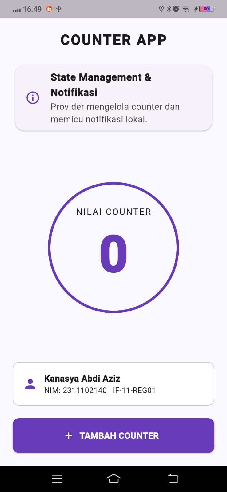
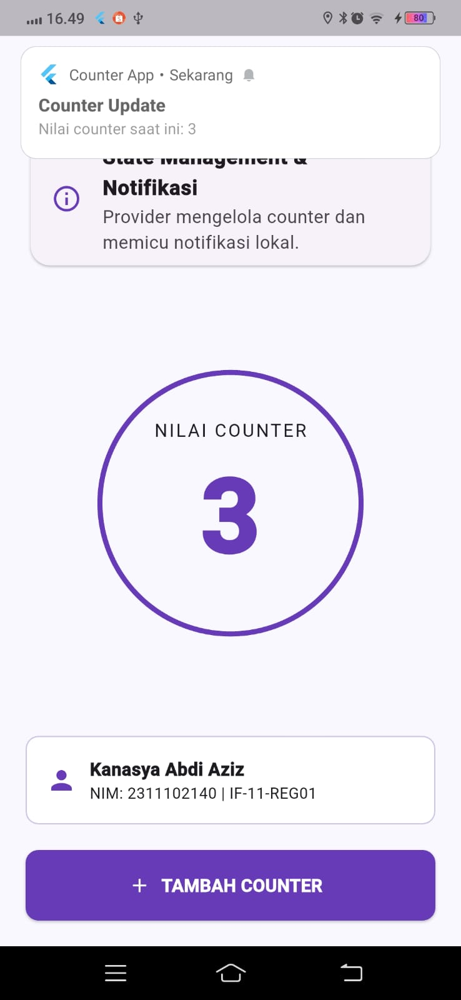
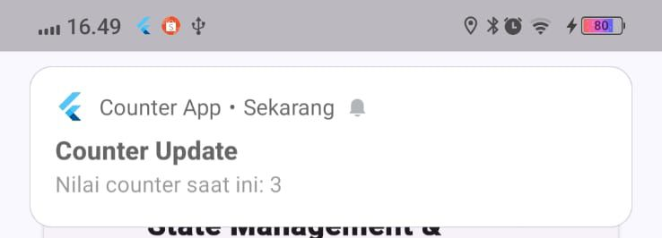

<div align="center">
  <br />
  <h1>LAPORAN PRAKTIKUM <br>APLIKASI BERBASIS PLATFORM</h1>
  <br />
  <h3>MODUL 12 & 13 <br> IMPLEMENTASI PROVIDER & NOTIFIKASI PADA FLUTTER </h3>
  <br />
  <br />
  
  <br />
  <br />
  <br />
  <h3>Disusun Oleh :</h3>
  <p>
    <strong>Kanasya Abdi Aziz</strong><br>
    <strong>2311102140</strong><br>
    <strong>S1 IF-11-REG01</strong><br>
  </p>
  <br />
  <h3>Dosen Pengampu :</h3>
  <p>
    <strong>Dimas Fanny Hebrasianto Permadi, S.ST., M.Kom</strong>
  </p>
  <br />
  <h3>Asisten Praktikum :</h3>
  <p>
    <strong>Apri Pandu Wicaksono</strong><br>
    <strong>Rangga Pradarrell Fathi</strong><br>
  </p>
  <br />
  <h3>LABORATORIUM HIGH PERFORMANCE<br>FAKULTAS INFORMATIKA <br>TELKOM UNIVERSITY PURWOKERTO <br>2026</h3>
</div>

---

# A. Dasar Teori

- **State Management (Provider)** Tim Flutter menyarankan Provider (State Management) sebagai pustaka manajemen status (*state management*) untuk mengelola data aplikasi secara efektif. Dengan menggunakan pola arsitektur Pub-Sub (Publisher-Subscriber), logika bisnis dipisahkan dari tampilan antarmuka pengguna (UI). Melalui konstruktor widget (*prop drilling*), Provider memungkinkan widget mana pun untuk mengakses data tanpa melewatkan parameter secara berantai.

- **ChangeNotifier** adalah kelas bawaan dari Flutter SDK yang memungkinkan objek pendengar (*listeners*) untuk menerima notifikasi perubahan kondisi. Kelas ini berfungsi sebagai model data, dan ketika data di dalamnya berubah, pemanggilan fungsi "notifyListeners()" akan memicu pembangunan kembali (*rebuild*) pada semua widget yang mengamati model tersebut.

- **ChangeNotifierProvider** adalah widget unik dari paket "provider" yang melengkapi sub-pohon widget dengan instansi "ChangeNotifier". Widget ini mengamati perubahan pada "ChangeNotifier" dan secara otomatis memperbarui widget konsumen di bawahnya saat notifikasi dikirim.

- **Consumer** adalah widget dari paket "provider" yang digunakan untuk mengakses data dari "ChangeNotifier". Keuntungan menggunakan "Consumer" adalah efisiensi rendering, karena hanya widget di dalam pembangun (*builder*) "Consumer" yang akan direkonstruksi saat terjadi perubahan status data, sedangkan bagian widget lain di luar Consumer tetap dipertahankan.

- **Local Notification** adalah metode untuk mengirimkan pesan atau peringatan kepada pengguna secara lokal langsung dari sistem operasi perangkat tanpa terhubung ke server internet; contohnya adalah Firebase Cloud Messaging. Fungsionalitas ini pada platform Android dan iOS difasilitasi oleh paket "flutter_local_notifications" dengan membuat saluran notifikasi (*notification channel*) yang menentukan tingkat kepentingan (*importance*), suara, dan getaran peringatan. Aplikasi harus meminta izin "POST_NOTIFICATIONS" secara dinamis pada Android versi lebih tinggi agar peringatan dapat ditampilkan di bilah status perangkat.

---

# B. Soal

Buatlah aplikasi Flutter sederhana yang menerapkan State Management Provider dan Notifikasi. Aplikasi cukup satu halaman yang menampilkan nilai counter dan sebuah tombol untuk menambah nilai counter.

### Ketentuan:
1. Gunakan Provider untuk menyimpan dan mengelola nilai counter.
2. Tampilkan nilai counter pada layar utama aplikasi.
3. Sediakan tombol Tambah (+) untuk menambah nilai counter sebanyak 1 setiap kali ditekan.
4. Setiap kali nilai counter bertambah, tampilkan notifikasi yang berisi:
   - Judul: Counter Update
   - Pesan: "Nilai counter saat ini: X" (X adalah nilai counter terbaru)
5. Notifikasi menggunakan Local Notification.

---

# C. Kode Program

### 1. Main Application (`lib/main.dart`)

- **Kode Program:**

```dart

import 'package:flutter/material.dart';
import 'package:provider/provider.dart';
import 'package:flutter_local_notifications/flutter_local_notifications.dart';

final FlutterLocalNotificationsPlugin flutterLocalNotificationsPlugin =
    FlutterLocalNotificationsPlugin();

void main() async {
  WidgetsFlutterBinding.ensureInitialized();

  const AndroidInitializationSettings initializationSettingsAndroid =
      AndroidInitializationSettings('@mipmap/ic_launcher');
  const InitializationSettings initializationSettings = InitializationSettings(
    android: initializationSettingsAndroid,
  );

  await flutterLocalNotificationsPlugin.initialize(
    initializationSettings,
    onDidReceiveNotificationResponse: (NotificationResponse response) {},
  );

  runApp(
    ChangeNotifierProvider(
      create: (_) => CounterProvider(),
      child: const MaterialApp(
        debugShowCheckedModeBanner: false,
        home: CounterPage(),
      ),
    ),
  );
}

class CounterProvider with ChangeNotifier {
  int _counter = 0;
  int get counter => _counter;

  void increment() {
    _counter++;
    notifyListeners();
    _showNotification(_counter);
  }

  Future<void> _showNotification(int count) async {
    const AndroidNotificationDetails androidDetails =
        AndroidNotificationDetails(
          'channel_id',
          'Counter Channel',
          importance: Importance.max,
          priority: Priority.high,
        );
    await flutterLocalNotificationsPlugin.show(
      0,
      'Counter Update',
      'Nilai counter saat ini: $count',
      const NotificationDetails(android: androidDetails),
    );
  }
}

class CounterPage extends StatelessWidget {
  const CounterPage({super.key});

  @override
  Widget build(BuildContext context) {
    // Menggunakan warna dominan ungu
    final Color primaryPurple = Colors.deepPurple;

    return Scaffold(
      backgroundColor: const Color(0xFFF9F7FF),
      body: SafeArea(
        child: Padding(
          padding: const EdgeInsets.all(20.0),
          child: Column(
            children: [
              const Text(
                "COUNTER APP",
                style: TextStyle(
                  fontSize: 22,
                  fontWeight: FontWeight.bold,
                  letterSpacing: 2,
                ),
              ),
              const SizedBox(height: 20),

              Card(
                shape: RoundedRectangleBorder(
                  borderRadius: BorderRadius.circular(15),
                ),
                child: ListTile(
                  leading: Icon(Icons.info_outline, color: primaryPurple),
                  title: const Text(
                    "State Management & Notifikasi",
                    style: TextStyle(fontWeight: FontWeight.bold),
                  ),
                  subtitle: const Text(
                    "Provider mengelola counter dan memicu notifikasi lokal.",
                  ),
                ),
              ),
              const Spacer(),

              Container(
                padding: const EdgeInsets.all(40),
                decoration: BoxDecoration(
                  shape: BoxShape.circle,
                  border: Border.all(color: primaryPurple, width: 4),
                ),
                child: Column(
                  children: [
                    const Text(
                      "NILAI COUNTER",
                      style: TextStyle(letterSpacing: 1.5),
                    ),
                    Consumer<CounterProvider>(
                      builder: (context, provider, _) => Text(
                        '${provider.counter}',
                        style: TextStyle(
                          fontSize: 80,
                          fontWeight: FontWeight.bold,
                          color: primaryPurple,
                        ),
                      ),
                    ),
                  ],
                ),
              ),
              const Spacer(),

              Container(
                padding: const EdgeInsets.all(15),
                decoration: BoxDecoration(
                  color: Colors.white,
                  borderRadius: BorderRadius.circular(10),
                  border: Border.all(color: Colors.deepPurple.shade100),
                ),
                child: const Row(
                  children: [
                    Icon(Icons.person, color: Colors.deepPurple),
                    SizedBox(width: 10),
                    Column(
                      crossAxisAlignment: CrossAxisAlignment.start,
                      children: [
                        Text(
                          "Kanasya Abdi Aziz",
                          style: TextStyle(fontWeight: FontWeight.bold),
                        ),
                        Text(
                          "NIM: 2311102140 | IF-11-REG01",
                          style: TextStyle(fontSize: 12),
                        ),
                      ],
                    ),
                  ],
                ),
              ),
              const SizedBox(height: 20),

              SizedBox(
                width: double.infinity,
                height: 55,
                child: ElevatedButton.icon(
                  style: ElevatedButton.styleFrom(
                    backgroundColor: primaryPurple,
                    foregroundColor: Colors.white,
                    shape: RoundedRectangleBorder(
                      borderRadius: BorderRadius.circular(10),
                    ),
                  ),
                  onPressed: () => context.read<CounterProvider>().increment(),
                  icon: const Icon(Icons.add),
                  label: const Text(
                    "TAMBAH COUNTER",
                    style: TextStyle(fontWeight: FontWeight.bold),
                  ),
                ),
              ),
            ],
          ),
        ),
      ),
    );
  }
}
```

- **Penjelasan Code:**
Kode ini membangun aplikasi penghitung (counter) berbasis Flutter yang memanfaatkan Provider untuk manajemen state secara reaktif dan library flutter_local_notifications untuk menampilkan notifikasi push pada perangkat setiap kali nilai angka bertambah. Struktur antarmukanya dirancang secara deklaratif menggunakan berbagai widget seperti Scaffold, Card, dan Container yang disusun rapi dalam Column dan Spacer untuk menciptakan tampilan yang estetis, di mana nilai counter diperbarui secara dinamis melalui Consumer yang mendengarkan perubahan dari CounterProvider, serta menyertakan identitas pengguna sebagai bagian dari komponen UI yang informatif.

---

# D. Hasil Tampilan (Screenshot)

### 1. Halaman Utama (Counter Awal 0)


---

### 2. Halaman Utama Setelah Ditambah


---

### 3. Notifikasi Berhasil Muncul


---

# E. Kesimpulan

Secara keseluruhan, aplikasi ini mengintegrasikan State Management menggunakan Provider untuk memastikan pembaruan nilai counter berjalan secara efisien dan sinkron di seluruh antarmuka, yang kemudian dikombinasikan dengan fitur Local Notifications untuk memberikan umpan balik instan kepada pengguna setiap kali tombol aksi ditekan. Dengan mengandalkan arsitektur widget yang terstruktur rapi dan responsif, aplikasi ini tidak hanya berfungsi sebagai alat penghitung yang intuitif, tetapi juga menunjukkan penerapan praktis dari prinsip dasar pengembangan aplikasi mobile modern, yakni pemisahan logika bisnis dari lapisan presentasi untuk menciptakan alur kerja yang bersih, terukur, dan mudah dikelola.