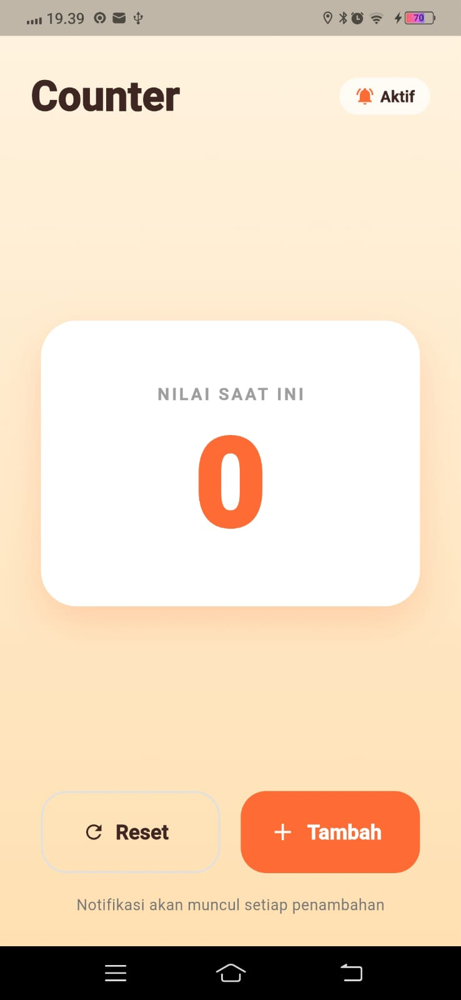
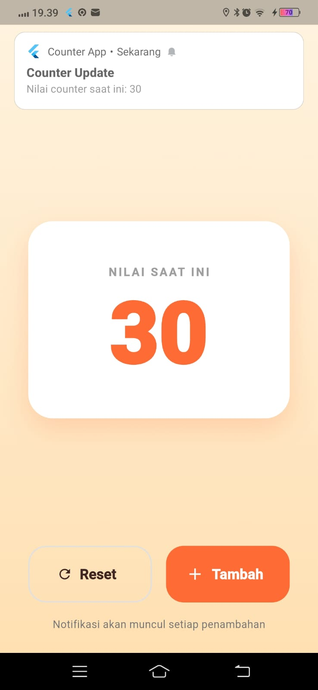
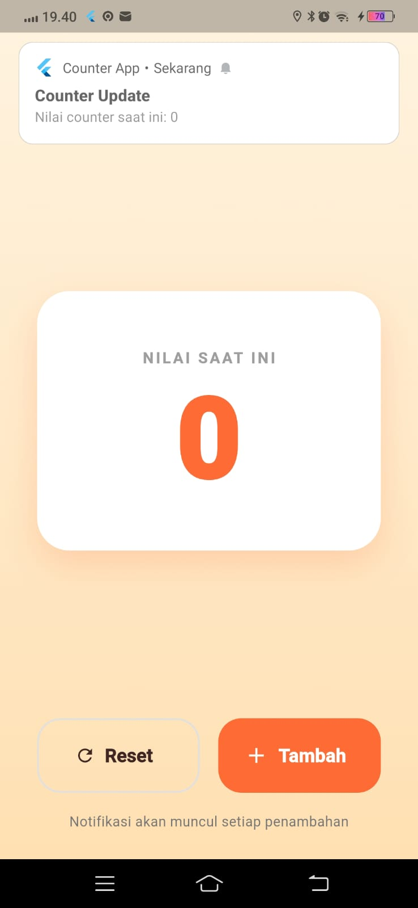

<div align="center">
  <br />
  <h1>LAPORAN PRAKTIKUM <br>APLIKASI BERBASIS PLATFORM</h1>
  <br />
  <h3>MODUL 12 & 13<br> Implementasi Provider dan Notifikasi pada Flutter </h3>
  <br />
   
  <br />
  <br />
  <br />
  <h3>Disusun Oleh :</h3>
  <p>
    <strong>Syamsul Adam</strong><br>
    <strong>2311102144</strong><br>
    <strong>S1 IF-11-REG01</strong>
  </p>
  <br />
  <br />
  <h3>Dosen Pengampu :</h3>
  <p>
    <strong>Dimas Fanny Hebrasianto Permadi, S.ST., M.Kom</strong>
  </p>
  <br />
  <br />
    <h4>Asisten Praktikum :</h4>
    <strong> Apri Pandu Wicaksono </strong> <br>
    <strong>Rangga Pradarrell Fathi</strong>
  <br />
  <h3>LABORATORIUM HIGH PERFORMANCE
 <br>FAKULTAS INFORMATIKA <br>UNIVERSITAS TELKOM PURWOKERTO <br>2026</h3>
</div>

---

# 1. Dasar Teori

### Flutter
Flutter merupakan framework open-source yang dikembangkan oleh Google untuk membangun aplikasi mobile, web, dan desktop menggunakan satu basis kode (single codebase). Flutter menggunakan bahasa pemrograman Dart dan menyediakan berbagai widget yang memudahkan pengembangan antarmuka pengguna.

### Provider
Provider adalah salah satu metode state management pada Flutter yang digunakan untuk mengelola dan membagikan data ke berbagai widget dalam aplikasi. Provider memanfaatkan class `ChangeNotifier` sehingga perubahan data dapat diperbarui secara otomatis melalui method `notifyListeners()`.

### Local Notification
Local Notification merupakan notifikasi yang dibuat dan ditampilkan langsung oleh aplikasi tanpa memerlukan server eksternal. Pada praktikum ini, notifikasi digunakan untuk memberikan informasi setiap kali nilai counter bertambah.

---

# 2. Implementasi Program

### File `main.dart`

```dart
import 'package:flutter/material.dart';
import 'package:provider/provider.dart';
import 'counter_provider.dart';
import 'notification_service.dart';

void main() async {
  WidgetsFlutterBinding.ensureInitialized();
  await NotificationService().init();

  runApp(
    ChangeNotifierProvider(
      create: (_) => CounterProvider(),
      child: const MyApp(),
    ),
  );
}

class MyApp extends StatelessWidget {
  const MyApp({super.key});

  @override
  Widget build(BuildContext context) {
    return MaterialApp(
      title: 'Counter App',
      debugShowCheckedModeBanner: false,
      theme: ThemeData(
        colorScheme: ColorScheme.fromSeed(
          seedColor: const Color(0xFFFF6B35),
          brightness: Brightness.light,
        ),
        useMaterial3: true,
      ),
      home: const CounterPage(),
    );
  }
}

class CounterPage extends StatelessWidget {
  const CounterPage({super.key});

  Future<void> _handleIncrement(BuildContext context) async {
    final provider = context.read<CounterProvider>();
    provider.increment();
    await NotificationService().showCounterNotification(provider.counter);
  }

  Future<void> _handleReset(BuildContext context) async {
    final provider = context.read<CounterProvider>();
    provider.reset();
    await NotificationService().showCounterNotification(provider.counter);
  }

  @override
  Widget build(BuildContext context) {
    final counter = context.watch<CounterProvider>().counter;

    return Scaffold(
      body: Container(
        decoration: const BoxDecoration(
          gradient: LinearGradient(
            begin: Alignment.topCenter,
            end: Alignment.bottomCenter,
            colors: [
              Color(0xFFFFF3E0),
              Color(0xFFFFE0B2),
            ],
          ),
        ),
        child: SafeArea(
          child: Column(
            children: [
              Padding(
                padding: const EdgeInsets.fromLTRB(24, 24, 24, 8),
                child: Row(
                  mainAxisAlignment: MainAxisAlignment.spaceBetween,
                  children: [
                    const Text(
                      'Counter',
                      style: TextStyle(
                        fontSize: 32,
                        fontWeight: FontWeight.bold,
                        color: Color(0xFF3E2723),
                      ),
                    ),
                    Container(
                      padding: const EdgeInsets.symmetric(
                          horizontal: 12, vertical: 6),
                      decoration: BoxDecoration(
                        color: Colors.white.withOpacity(0.7),
                        borderRadius: BorderRadius.circular(20),
                      ),
                      child: const Row(
                        children: [
                          Icon(Icons.notifications_active,
                              size: 16, color: Color(0xFFFF6B35)),
                          SizedBox(width: 4),
                          Text(
                            'Aktif',
                            style: TextStyle(
                              fontSize: 12,
                              fontWeight: FontWeight.w600,
                              color: Color(0xFF3E2723),
                            ),
                          ),
                        ],
                      ),
                    ),
                  ],
                ),
              ),
              const Spacer(),

              Container(
                margin: const EdgeInsets.symmetric(horizontal: 32),
                padding: const EdgeInsets.symmetric(vertical: 48),
                width: double.infinity,
                decoration: BoxDecoration(
                  color: Colors.white,
                  borderRadius: BorderRadius.circular(28),
                  boxShadow: [
                    BoxShadow(
                      color: const Color(0xFFFF6B35).withOpacity(0.2),
                      blurRadius: 24,
                      offset: const Offset(0, 12),
                    ),
                  ],
                ),
                child: Column(
                  children: [
                    Text(
                      'NILAI SAAT INI',
                      style: TextStyle(
                        color: Colors.grey.shade500,
                        fontSize: 13,
                        fontWeight: FontWeight.w600,
                        letterSpacing: 2,
                      ),
                    ),
                    const SizedBox(height: 12),
                    Text(
                      '$counter',
                      style: const TextStyle(
                        fontSize: 96,
                        fontWeight: FontWeight.w800,
                        color: Color(0xFFFF6B35),
                        height: 1,
                      ),
                    ),
                  ],
                ),
              ),

              const Spacer(),

              Padding(
                padding: const EdgeInsets.symmetric(horizontal: 32),
                child: Row(
                  children: [
                    Expanded(
                      child: SizedBox(
                        height: 64,
                        child: OutlinedButton.icon(
                          onPressed: () => _handleReset(context),
                          style: OutlinedButton.styleFrom(
                            foregroundColor: const Color(0xFF3E2723),
                            side: BorderSide(
                              color: Colors.grey.shade300,
                              width: 1.5,
                            ),
                            shape: RoundedRectangleBorder(
                              borderRadius: BorderRadius.circular(20),
                            ),
                          ),
                          icon: const Icon(Icons.refresh),
                          label: const Text(
                            'Reset',
                            style: TextStyle(
                              fontSize: 16,
                              fontWeight: FontWeight.w600,
                            ),
                          ),
                        ),
                      ),
                    ),
                    const SizedBox(width: 16),
                    Expanded(
                      child: SizedBox(
                        height: 64,
                        child: ElevatedButton.icon(
                          onPressed: () => _handleIncrement(context),
                          style: ElevatedButton.styleFrom(
                            backgroundColor: const Color(0xFFFF6B35),
                            foregroundColor: Colors.white,
                            elevation: 0,
                            shape: RoundedRectangleBorder(
                              borderRadius: BorderRadius.circular(20),
                            ),
                          ),
                          icon: const Icon(Icons.add, size: 22),
                          label: const Text(
                            'Tambah',
                            style: TextStyle(
                              fontSize: 16,
                              fontWeight: FontWeight.w700,
                            ),
                          ),
                        ),
                      ),
                    ),
                  ],
                ),
              ),
              const SizedBox(height: 16),
              Padding(
                padding: const EdgeInsets.only(bottom: 24),
                child: Text(
                  'Notifikasi akan muncul setiap penambahan',
                  style: TextStyle(
                    color: Colors.grey.shade600,
                    fontSize: 12,
                  ),
                ),
              ),
            ],
          ),
        ),
      ),
    );
  }
}
```

**Penjelasan Singkat:**

Counter sederhana menggunakan state management Provider. User bisa menambah angka counter lewat tombol "Tambah" atau mengembalikannya ke nol dengan tombol "Reset". Setiap kali nilai counter berubah, akan muncul notifikasi lokal yang menampilkan nilai terbaru. Tampilan dibuat dengan tema warna oranye dan latar gradasi krem, dengan nilai counter ditampilkan besar di tengah dalam sebuah kartu.


### Counter Provider

```dart
import 'package:flutter/foundation.dart';

class CounterProvider with ChangeNotifier {
  int _counter = 0;

  int get counter => _counter;

  void increment() {
    _counter++;
    notifyListeners();
  }

  void reset() {
    _counter = 0;
    notifyListeners();
  }
}
```

**Penjelasan Singkat:**

Kclass CounterProvider yang berfungsi sebagai state management menggunakan ChangeNotifier dari package Provider. Class ini menyimpan nilai counter dan menyediakan dua method utama: increment() untuk menambah nilai counter sebanyak satu, dan reset() untuk mengembalikan nilai counter ke nol. Setiap kali kedua method ini dipanggil, notifyListeners() akan dijalankan agar semua widget yang menggunakan provider ini otomatis memperbarui tampilannya.

### Tombol Increment dan Notifikasi

```dart
import 'package:flutter_local_notifications/flutter_local_notifications.dart';

class NotificationService {
  static final NotificationService _instance = NotificationService._internal();
  factory NotificationService() => _instance;
  NotificationService._internal();

  final FlutterLocalNotificationsPlugin _plugin =
      FlutterLocalNotificationsPlugin();

  Future<void> init() async {
    const androidSettings =
        AndroidInitializationSettings('@mipmap/ic_launcher');

    const darwinSettings = DarwinInitializationSettings(
      requestAlertPermission: true,
      requestBadgePermission: true,
      requestSoundPermission: true,
    );

    const initSettings = InitializationSettings(
      android: androidSettings,
      iOS: darwinSettings,
    );

    await _plugin.initialize(initSettings);

    // Request permission (Android 13+)
    await _plugin
        .resolvePlatformSpecificImplementation<
            AndroidFlutterLocalNotificationsPlugin>()
        ?.requestNotificationsPermission();
  }

  Future<void> showCounterNotification(int counterValue) async {
    const androidDetails = AndroidNotificationDetails(
      'counter_channel',
      'Counter Notifications',
      channelDescription: 'Notifikasi setiap counter bertambah',
      importance: Importance.high,
      priority: Priority.high,
      ticker: 'counter',
    );

    const notificationDetails = NotificationDetails(
      android: androidDetails,
      iOS: DarwinNotificationDetails(),
    );

    await _plugin.show(
      0,
      'Counter Update',
      'Nilai counter saat ini: $counterValue',
      notificationDetails,
    );
  }
}
```

**Penjelasan Singkat:**

class NotificationService yang dibuat dengan pola singleton, sehingga hanya ada satu instance yang digunakan di seluruh aplikasi. Class ini bertugas mengatur notifikasi lokal menggunakan package flutter_local_notifications.
Pada method init(), dilakukan inisialisasi pengaturan notifikasi untuk Android dan iOS, sekaligus meminta izin notifikasi dari pengguna (khususnya untuk Android 13 ke atas). Sedangkan method showCounterNotification() digunakan untuk menampilkan notifikasi berisi judul "Counter Update" beserta nilai counter terbaru setiap kali nilainya berubah.
---

# 3. Hasil Tampilan

### Tampilan Awal Aplikasi



Keterangan:

- Menampilkan nilai counter awal.
- Menggunakan tema soft orange.
- Counter angka 0 di tengah layar.

### Tampilan Setelah Tombol Ditekan



Keterangan:

- Nilai counter bertambah sesuai jumlah klik.
- Tampilan diperbarui secara otomatis oleh Provider.

### Tampilan reset dan notifikasi



Keterangan:

- Notifikasi muncul setiap kali counter bertambah/diriset.
- Isi notifikasi menampilkan nilai counter terbaru.

---

### Kesimpulan

Berdasarkan hasil implementasi yang telah dilakukan, Provider berhasil digunakan sebagai state management untuk mengelola nilai counter secara otomatis. Setiap perubahan data dapat langsung ditampilkan pada antarmuka tanpa perlu melakukan refresh halaman.

Selain itu, fitur Local Notification berhasil memberikan informasi kepada pengguna setiap kali nilai counter bertambah. Dengan menggabungkan Provider dan Local Notification, aplikasi menjadi lebih interaktif, responsif, dan mudah dikembangkan.
