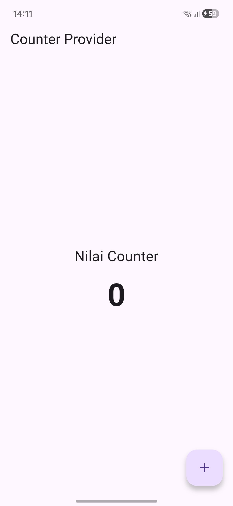
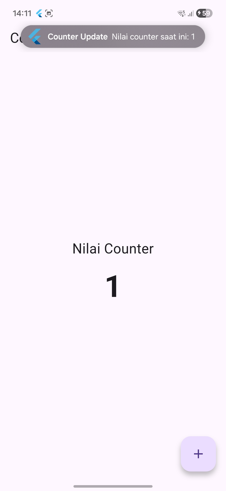
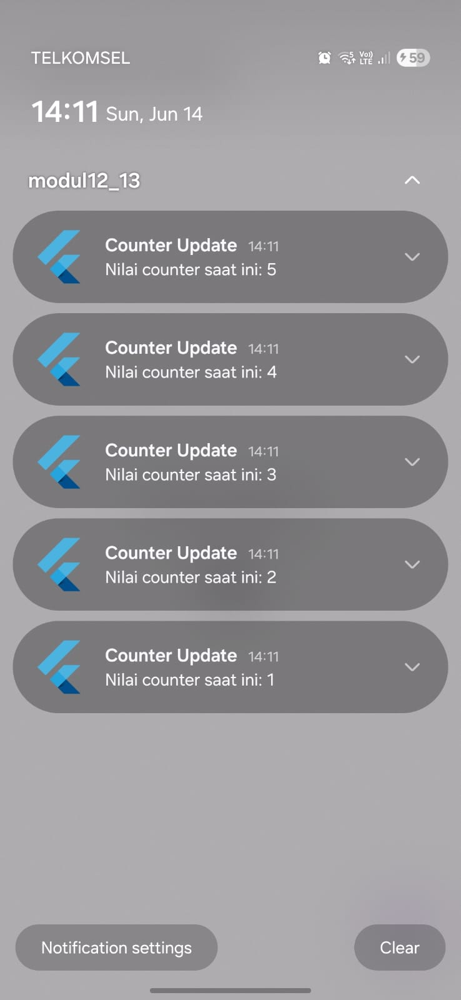

<div align="center">
  <br />
  <h1>LAPORAN PRAKTIKUM <br>APLIKASI BERBASIS PLATFORM</h1>
  <br />
  <h3>MODUL 12 & 13<br> IMPLEMENTASI PROVIDER & NOTIFIKASI</h3>
  <br />
   
  <br />
  <br />
  <br />
  <h3>Disusun Oleh :</h3>
  <p>
    <strong>DANENDRA ARDEN SHADUQ</strong><br>
    <strong>2311102146</strong><br>
    <strong>S1 IF-11-REG01</strong>
  </p>
  <br />
  <br />
  <h3>Dosen Pengampu :</h3>
  <p>
    <strong>Dimas Fanny Hebrasianto Permadi, S.ST., M.Kom</strong>
  </p>
  <br />
  <br />
    <h4>Asisten Praktikum :</h4>
    <strong> Apri Pandu Wicaksono </strong> <br>
    <strong>Rangga Pradarrell Fathi</strong>
  <br />
  <h3>LABORATORIUM HIGH PERFORMANCE
 <br>FAKULTAS INFORMATIKA <br>UNIVERSITAS TELKOM PURWOKERTO <br>2026</h3>
</div>

---

## 1. Dasar Teori

### State Management Provider

State Management merupakan teknik untuk mengelola data atau keadaan (state) dalam sebuah aplikasi agar perubahan data dapat diperbarui secara otomatis pada antarmuka pengguna. Salah satu metode yang populer pada Flutter adalah Provider, yaitu package yang menerapkan pola InheritedWidget untuk memudahkan pengelolaan state secara efisien. Provider memungkinkan data dibagikan ke berbagai widget tanpa perlu mengirimkan data secara berulang melalui constructor, sehingga kode menjadi lebih terstruktur, mudah dipelihara, dan mendukung pembaruan tampilan secara otomatis ketika terjadi perubahan data.

### Notifikasi

Notifikasi adalah mekanisme yang digunakan untuk memberikan informasi atau pemberitahuan kepada pengguna mengenai suatu peristiwa yang terjadi dalam aplikasi. Pada Flutter, notifikasi lokal dapat diimplementasikan menggunakan package seperti flutter_local_notifications, yang memungkinkan aplikasi menampilkan pesan pemberitahuan meskipun aplikasi sedang berjalan di latar belakang atau tidak aktif. Fitur notifikasi membantu meningkatkan interaksi pengguna dengan aplikasi serta memastikan informasi penting dapat diterima secara tepat waktu.

---

## 2. Code & Penjelasan

### pubspec.yaml

```dart
name: modul12_13
description: "A new Flutter project."
publish_to: 'none'

version: 1.0.0+1

environment:
  sdk: ^3.11.4

dependencies:
  flutter:
    sdk: flutter
  provider: ^6.1.2
  flutter_local_notifications: ^19.4.0
  cupertino_icons: ^1.0.8

dev_dependencies:
  flutter_test:
    sdk: flutter
  flutter_lints: ^6.0.0

flutter:
  uses-material-design: true
```
**Penjelasan:**

File pubspec.yaml merupakan berkas konfigurasi utama pada proyek Flutter yang digunakan untuk mendefinisikan informasi proyek, versi aplikasi, lingkungan SDK, serta daftar dependensi yang dibutuhkan. Pada konfigurasi tersebut, proyek bernama modul12_13 menggunakan SDK Dart versi 3.11.4 dengan versi aplikasi 1.0.0+1. Dependensi yang digunakan meliputi package provider untuk mengimplementasikan state management, flutter_local_notifications untuk menampilkan notifikasi lokal pada perangkat, dan cupertino_icons untuk menyediakan ikon bergaya iOS. Selain itu, terdapat flutter_test yang digunakan untuk pengujian aplikasi serta flutter_lints untuk membantu menjaga kualitas kode sesuai standar Flutter. Bagian uses-material-design: true menunjukkan bahwa aplikasi menggunakan komponen dan ikon yang disediakan oleh Material Design.

### AndroidManifest.xml

```dart
<manifest xmlns:android="http://schemas.android.com/apk/res/android">

    <!-- Permission untuk notifikasi Android 13+ -->
    <uses-permission android:name="android.permission.POST_NOTIFICATIONS"/>

    <application
        android:label="modul12_13"
        android:name="${applicationName}"
        android:icon="@mipmap/ic_launcher">

        <activity
            android:name=".MainActivity"
            android:exported="true"
            android:launchMode="singleTop"
            android:taskAffinity=""
            android:theme="@style/LaunchTheme"
            android:configChanges="orientation|keyboardHidden|keyboard|screenSize|smallestScreenSize|locale|layoutDirection|fontScale|screenLayout|density|uiMode"
            android:hardwareAccelerated="true"
            android:windowSoftInputMode="adjustResize">

            <meta-data
                android:name="io.flutter.embedding.android.NormalTheme"
                android:resource="@style/NormalTheme" />

            <intent-filter>
                <action android:name="android.intent.action.MAIN"/>
                <category android:name="android.intent.category.LAUNCHER"/>
            </intent-filter>

        </activity>

        <meta-data
            android:name="flutterEmbedding"
            android:value="2" />

    </application>

    <queries>
        <intent>
            <action android:name="android.intent.action.PROCESS_TEXT"/>
            <data android:mimeType="text/plain"/>
        </intent>
    </queries>

</manifest>
```
**Penjelasan:**

File **AndroidManifest.xml** merupakan berkas konfigurasi utama pada aplikasi Android yang berfungsi untuk mendefinisikan informasi aplikasi, izin (*permission*), komponen aplikasi, dan pengaturan sistem lainnya. Pada konfigurasi tersebut ditambahkan izin **`POST_NOTIFICATIONS`** yang diperlukan agar aplikasi dapat menampilkan notifikasi pada perangkat Android 13 (API Level 33) ke atas. Bagian **`application`** berisi identitas aplikasi seperti nama aplikasi (`android:label`), nama kelas aplikasi (`android:name`), dan ikon aplikasi (`android:icon`). Selanjutnya, komponen **`activity`** mendefinisikan **MainActivity** sebagai halaman utama yang dijalankan saat aplikasi dibuka, dengan berbagai pengaturan seperti tema, orientasi layar, dan dukungan perubahan konfigurasi perangkat. Di dalamnya terdapat **`intent-filter`** yang menetapkan aktivitas tersebut sebagai titik masuk utama aplikasi melalui aksi `MAIN` dan kategori `LAUNCHER`. Selain itu, metadata **`flutterEmbedding`** bernilai `2` menunjukkan bahwa aplikasi menggunakan Flutter Embedding versi 2. Bagian **`queries`** digunakan untuk mendeklarasikan kemampuan aplikasi dalam berinteraksi dengan aplikasi lain yang mendukung pemrosesan teks (`PROCESS_TEXT`) pada perangkat Android.

### Code main.dart

```dart
import 'package:flutter/material.dart';
import 'package:flutter_local_notifications/flutter_local_notifications.dart';
import 'package:provider/provider.dart';

final FlutterLocalNotificationsPlugin flutterLocalNotificationsPlugin =
    FlutterLocalNotificationsPlugin();

class CounterProvider extends ChangeNotifier {
  int _counter = 0;

  int get counter => _counter;

  Future<void> incrementCounter() async {
    _counter++;

    await _showNotification();

    notifyListeners();
  }

  Future<void> _showNotification() async {
    const AndroidNotificationDetails androidDetails =
        AndroidNotificationDetails(
      'counter_channel',
      'Counter Notifications',
      channelDescription: 'Notifikasi perubahan counter',
      importance: Importance.max,
      priority: Priority.high,
    );

    const NotificationDetails notificationDetails =
        NotificationDetails(
      android: androidDetails,
    );

    await flutterLocalNotificationsPlugin.show(
      _counter,
      'Counter Update',
      'Nilai counter saat ini: $_counter',
      notificationDetails,
    );
  }
}

Future<void> main() async {
  WidgetsFlutterBinding.ensureInitialized();

  const AndroidInitializationSettings androidSettings =
      AndroidInitializationSettings('@mipmap/ic_launcher');

  const InitializationSettings initializationSettings =
      InitializationSettings(
    android: androidSettings,
  );

  await flutterLocalNotificationsPlugin.initialize(
    initializationSettings,
  );

  // Membuat notification channel
  const AndroidNotificationChannel channel =
      AndroidNotificationChannel(
    'counter_channel',
    'Counter Notifications',
    description: 'Notifikasi perubahan counter',
    importance: Importance.high,
  );

  await flutterLocalNotificationsPlugin
      .resolvePlatformSpecificImplementation<
          AndroidFlutterLocalNotificationsPlugin>()
      ?.createNotificationChannel(channel);

  // Request permission Android 13+
  await flutterLocalNotificationsPlugin
      .resolvePlatformSpecificImplementation<
          AndroidFlutterLocalNotificationsPlugin>()
      ?.requestNotificationsPermission();

  runApp(
    ChangeNotifierProvider(
      create: (_) => CounterProvider(),
      child: const MyApp(),
    ),
  );
}

class MyApp extends StatelessWidget {
  const MyApp({super.key});

  @override
  Widget build(BuildContext context) {
    return MaterialApp(
      debugShowCheckedModeBanner: false,
      title: 'Provider Notification',
      theme: ThemeData(
        primarySwatch: Colors.blue,
      ),
      home: const HomePage(),
    );
  }
}

class HomePage extends StatelessWidget {
  const HomePage({super.key});

  @override
  Widget build(BuildContext context) {
    final counterProvider = Provider.of<CounterProvider>(context);

    return Scaffold(
      appBar: AppBar(
        title: const Text('Counter Provider'),
      ),
      body: Center(
        child: Column(
          mainAxisAlignment: MainAxisAlignment.center,
          children: [
            const Text(
              'Nilai Counter',
              style: TextStyle(
                fontSize: 22,
              ),
            ),
            const SizedBox(height: 10),
            Text(
              '${counterProvider.counter}',
              style: const TextStyle(
                fontSize: 48,
                fontWeight: FontWeight.bold,
              ),
            ),
          ],
        ),
      ),
      floatingActionButton: FloatingActionButton(
        onPressed: () async {
          await counterProvider.incrementCounter();
        },
        child: const Icon(Icons.add),
      ),
    );
  }
}
```

**Penjelasan:**

Program Flutter tersebut mengimplementasikan **State Management menggunakan Provider** yang dikombinasikan dengan **notifikasi lokal menggunakan flutter_local_notifications**. Kelas `CounterProvider` yang mewarisi `ChangeNotifier` digunakan untuk menyimpan dan mengelola nilai counter melalui variabel `_counter`. Ketika method `incrementCounter()` dipanggil, nilai counter akan bertambah satu, kemudian aplikasi menampilkan notifikasi yang berisi nilai counter terbaru melalui method `_showNotification()`, dan selanjutnya memanggil `notifyListeners()` agar seluruh widget yang menggunakan data tersebut diperbarui secara otomatis. Pada fungsi `main()`, dilakukan inisialisasi plugin notifikasi, pembuatan notification channel untuk Android, serta permintaan izin notifikasi pada Android 13 ke atas. Seluruh aplikasi kemudian dibungkus dengan `ChangeNotifierProvider` sehingga objek `CounterProvider` dapat diakses oleh widget lain. Pada halaman `HomePage`, nilai counter ditampilkan menggunakan `Provider.of<CounterProvider>(context)`, sehingga setiap perubahan nilai counter akan langsung diperbarui pada tampilan. Ketika pengguna menekan tombol `FloatingActionButton`, method `incrementCounter()` dijalankan untuk menambah nilai counter sekaligus menampilkan notifikasi yang menunjukkan nilai counter saat ini. Dengan demikian, aplikasi ini menunjukkan bagaimana Provider digunakan untuk mengelola state secara terpusat dan bagaimana notifikasi lokal dapat digunakan untuk memberikan umpan balik kepada pengguna setiap kali terjadi perubahan data.

---

## 3. Hasil Tampilan (*Output*)

### Halaman Home


### Menekan Tombol +


### Notifikasi Pop Up

