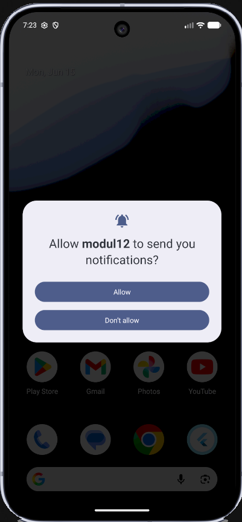
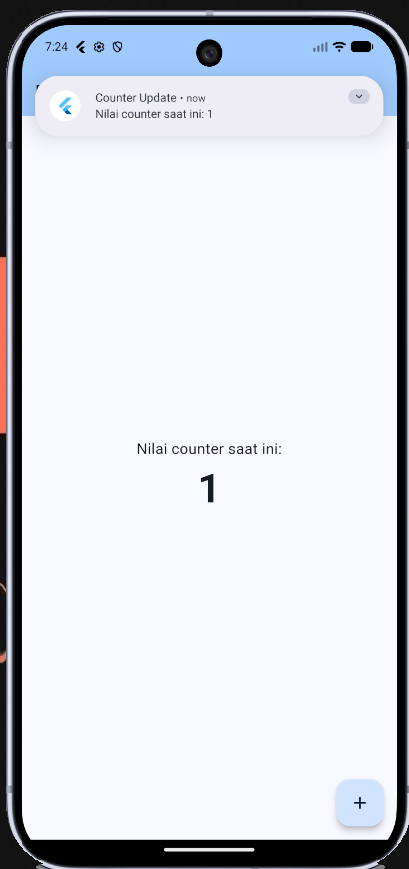
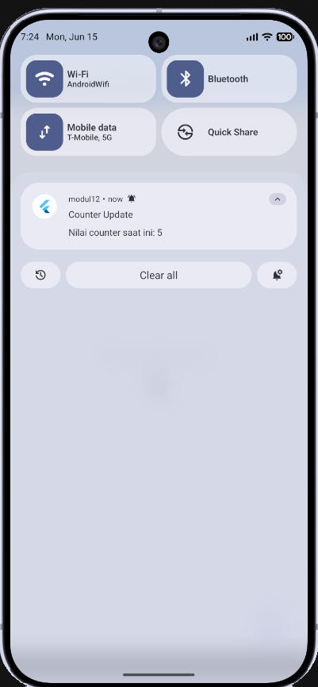

<div align="center">

<br>

# LAPORAN PRAKTIKUM  
# APLIKASI BERBASIS PLATFORM

<br>

## MODUL 12-13-Mobile
## Mobile - Implementasi Provider dan Notifikasi pada Flutter
<br>


<br><br>

### Disusun Oleh

**Yoga Hogantara**  
**2311102153**  
**S1 IF-11-REG01**

<br>

### Dosen Pengampu

**Dimas Fanny Hebrasianto Permadi, S.ST., M.Kom**

<br>

### Asisten Praktikum

**Apri Pandu Wicaksono**  
**Rangga Pradarrell Fathi**

<br><br>

### LABORATORIUM HIGH PERFORMANCE  
### FAKULTAS INFORMATIKA  
### UNIVERSITAS TELKOM PURWOKERTO  
### 2026

</div>

---


---

## 1. Dasar Teori
 
### 1.1 Flutter
Flutter adalah framework antarmuka pengguna (UI) sumber terbuka dari Google yang digunakan untuk membangun aplikasi secara *natively compiled* untuk berbagai platform dari satu basis kode (*codebase*).
 
### 1.2 Provider (State Management)
`provider` adalah salah satu package manajemen state (*state management*) yang direkomendasikan secara resmi oleh tim Flutter. Provider berfungsi sebagai pembungkus (*wrapper*) di sekitar *InheritedWidget* untuk membuat penggunaan *InheritedWidget* menjadi lebih mudah dan terstruktur. Konsep utamanya adalah memisahkan antara *business logic* dan *UI*, sehingga saat terjadi perubahan state, hanya widget yang membutuhkan data tersebut yang akan di-*rebuild*.
 
### 1.3 Flutter Local Notifications
`flutter_local_notifications` adalah plugin untuk membuat dan menampilkan notifikasi pop-up secara lokal (*offline*) dari dalam aplikasi, tanpa melalui server atau internet (seperti Firebase Cloud Messaging). Notifikasi ini dikontrol secara langsung oleh sistem operasi ponsel.
 
### 1.4 ChangeNotifier, context.watch, dan context.read
Aplikasi ini memanfaatkan `ChangeNotifier`, yaitu sebuah kelas dasar bawaan Flutter yang menyediakan mekanisme pemberitahuan perubahan (`notifyListeners()`). Di sisi UI, terdapat dua cara untuk berinteraksi dengan provider:
- **`context.watch<T>()`** — dipanggil di dalam metode `build()` untuk membaca state sekaligus mendaftarkan widget agar otomatis di-*rebuild* setiap kali `notifyListeners()` dipanggil.
- **`context.read<T>()`** — dipanggil di dalam *event handler* (misalnya `onPressed`) untuk mengeksekusi fungsi pada provider tanpa memicu *rebuild* widget pemanggil itu sendiri.
---
 
## 2. Implementasi Program
 
### 2.1 Deskripsi Aplikasi
Aplikasi bertema "Provider & Notifikasi" ini dibuat untuk memahami cara mengelola perubahan state aplikasi menggunakan pola desain manajemen state yang rapi dan terpisah dari UI. Fitur utama yang diimplementasikan:
 
1. **State Management Counter**: Menampilkan nilai angka counter yang state-nya dikelola secara terpusat oleh `CounterProvider`.
2. **Penambahan Counter**: Terdapat *Floating Action Button* (FAB) berikon `+` untuk menaikkan nilai counter dengan fungsi `increment()`.
3. **Notifikasi Sistem**: Setiap kali tombol FAB ditekan, muncul notifikasi *pop-up* sistem bertajuk "Counter Update" yang menampilkan nilai counter terkini.
---
 
## 3. Code & Penjelasan
 
### 3.1 `pubspec.yaml` (Menambahkan Dependensi)
Dua library eksternal utama ditambahkan untuk menyelesaikan tugas modul ini, yaitu untuk state management dan integrasi API notifikasi OS.
 
```yaml
dependencies:
  flutter:
    sdk: flutter
  provider: ^6.1.2              # Package manajemen state dari Flutter
  flutter_local_notifications: ^17.2.3  # Package integrasi Notifikasi
```
 
**Penjelasan:**
- `provider`: Digunakan untuk memisahkan logika aplikasi (seperti penambahan counter) dari antarmuka pengguna (UI), sehingga kode menjadi lebih bersih dan modular.
- `flutter_local_notifications`: Berfungsi sebagai jembatan untuk mengakses API notifikasi lokal yang ada pada sistem operasi perangkat (Android) secara *offline*.
---
 
### 3.2 Konfigurasi Izin Notifikasi (`AndroidManifest.xml`)
Sejak Android 13 (API Level 33), sistem operasi memblokir notifikasi *pop-up* secara default kecuali aplikasi meminta izin eksplisit dari pengguna. Izin ini dideklarasikan pada *manifest* beserta komponen *receiver* yang dibutuhkan plugin.
 
```xml
<uses-permission android:name="android.permission.POST_NOTIFICATIONS"/>
<uses-permission android:name="android.permission.SCHEDULE_EXACT_ALARM"/>
 
<application>
    <receiver
        android:exported="false"
        android:name="com.dexterous.flutterlocalnotifications.ScheduledNotificationReceiver"/>
    <receiver
        android:exported="false"
        android:name="com.dexterous.flutterlocalnotifications.ScheduledNotificationBootReceiver">
        <intent-filter>
            <action android:name="android.intent.action.BOOT_COMPLETED"/>
            <action android:name="android.intent.action.MY_PACKAGE_REPLACED"/>
            <action android:name="android.intent.action.QUICKBOOT_POWERON"/>
            <action android:name="com.htc.intent.action.QUICKBOOT_POWERON"/>
        </intent-filter>
    </receiver>
</application>
```
 
**Penjelasan:**
- `POST_NOTIFICATIONS`: Izin wajib agar sistem Android 13+ mengizinkan kemunculan notifikasi *pop-up* dari aplikasi.
- `SCHEDULE_EXACT_ALARM`: Izin untuk penjadwalan alarm yang tepat, diperlukan oleh plugin.
- `ScheduledNotificationReceiver` & `ScheduledNotificationBootReceiver`: Komponen *receiver* bawaan plugin yang memastikan notifikasi terjadwal tetap aktif bahkan setelah perangkat di-*restart*.
---
 
### 3.3 Inisialisasi Sistem Notifikasi
 
Inisialisasi dilakukan menggunakan instance global `FlutterLocalNotificationsPlugin` dan fungsi `initNotifications()` yang dipanggil sebelum aplikasi berjalan.
 
```dart
// Instance global plugin notifikasi
final FlutterLocalNotificationsPlugin flutterLocalNotificationsPlugin =
    FlutterLocalNotificationsPlugin();
 
Future<void> initNotifications() async {
  // Menggunakan icon bawaan aplikasi
  const AndroidInitializationSettings initializationSettingsAndroid =
      AndroidInitializationSettings('@mipmap/ic_launcher');
 
  const InitializationSettings initializationSettings =
      InitializationSettings(android: initializationSettingsAndroid);
 
  await flutterLocalNotificationsPlugin.initialize(initializationSettings);
 
  // Meminta permission untuk Android 13+
  await flutterLocalNotificationsPlugin
      .resolvePlatformSpecificImplementation<
          AndroidFlutterLocalNotificationsPlugin>()
      ?.requestNotificationsPermission();
}
```
 
**Penjelasan:**
- `AndroidInitializationSettings('@mipmap/ic_launcher')`: Mengatur ikon notifikasi menggunakan ikon bawaan launcher aplikasi.
- `initialize()`: Mendaftarkan konfigurasi awal ke sistem plugin.
- `requestNotificationsPermission()`: Memunculkan dialog permintaan akses notifikasi kepada pengguna saat pertama kali aplikasi dibuka (khusus Android 13+).
---
 
### 3.4 Fungsi Pembuatan Notifikasi
 
Fungsi ini bertanggung jawab membangun dan menampilkan notifikasi *pop-up* dengan nilai counter terkini.
 
```dart
Future<void> showCounterNotification(int counterValue) async {
  const AndroidNotificationDetails androidDetails = AndroidNotificationDetails(
    'counter_channel',         // ID Channel unik
    'Counter Notifications',   // Nama Channel
    importance: Importance.max,
    priority: Priority.high,
  );
 
  const NotificationDetails notificationDetails =
      NotificationDetails(android: androidDetails);
 
  await flutterLocalNotificationsPlugin.show(
    0,                                    // ID Notifikasi
    'Counter Update',                     // Judul
    'Nilai counter saat ini: $counterValue', // Pesan
    notificationDetails,
  );
}
```
 
**Penjelasan:**
- `AndroidNotificationDetails`: Mendefinisikan properti tampilan notifikasi, termasuk *channel* ID, nama, dan tingkat kepentingan (*importance*) agar notifikasi muncul sebagai *heads-up notification*.
- `flutterLocalNotificationsPlugin.show(...)`: Menampilkan notifikasi dengan ID `0`. Penggunaan ID yang sama pada setiap pemanggilan berarti notifikasi baru akan **menimpa** notifikasi sebelumnya, sehingga hanya satu notifikasi yang tampil di *notification tray*.
- Nilai `$counterValue` di-*interpolate* langsung ke dalam pesan notifikasi untuk menampilkan angka terkini.
---
 
### 3.5 State Model `CounterProvider`
 
Kelas ini bertugas menampung variabel state dan fungsi mutasi data. Logika bisnis berjalan di dalam kelas ini secara terisolasi tanpa mengetahui bentuk UI-nya.
 
```dart
class CounterProvider extends ChangeNotifier {
  int _counter = 0;
 
  // Getter untuk mengakses nilai counter dari luar kelas
  int get counter => _counter;
 
  void increment() {
    _counter++;
    notifyListeners();              // Memperbarui UI
    showCounterNotification(_counter); // Memicu notifikasi setelah nilai bertambah
  }
}
```
 
**Penjelasan:**
- `_counter`: Variabel *private* yang menyimpan state nilai counter.
- `int get counter`: Getter publik agar nilai `_counter` dapat dibaca dari widget UI tanpa mengubahnya secara langsung.
- `increment()`: Menaikkan nilai counter, lalu memanggil `notifyListeners()` untuk memberitahu semua widget pendengar agar memperbarui tampilannya. Setelah itu, langsung memicu `showCounterNotification()` dengan nilai terbaru.
---
 
### 3.6 Inisialisasi dan Pembungkusan Provider (`main()`)
 
Agar `CounterProvider` dapat diakses secara global oleh seluruh *widget tree*, ia dibungkus (*wrap*) pada level tertinggi di dalam fungsi `main()`.
 
```dart
void main() async {
  // Pastikan binding Flutter sudah siap sebelum inisialisasi plugin
  WidgetsFlutterBinding.ensureInitialized();
 
  // Memanggil inisialisasi notifikasi sebelum app berjalan
  await initNotifications();
 
  runApp(
    // Membungkus seluruh widget tree dengan Provider
    ChangeNotifierProvider(
      create: (context) => CounterProvider(),
      child: const MyApp(),
    ),
  );
}
```
 
**Penjelasan:**
- `WidgetsFlutterBinding.ensureInitialized()`: Wajib dipanggil sebelum menggunakan plugin apa pun di dalam `main()` yang bersifat `async`, agar *binding* Flutter telah siap menerima perintah plugin.
- `await initNotifications()`: Menjalankan proses inisialisasi notifikasi secara tuntas sebelum UI dijalankan.
- `ChangeNotifierProvider`: Membungkus `MyApp` sehingga instansiasi `CounterProvider()` tersedia secara global dan dapat diakses oleh seluruh widget turunan (*child*) dalam hierarki *widget tree*.
---
 
### 3.7 Tampilan UI dan Pembacaan State (`CounterPage`)
 
`CounterPage` adalah widget `StatelessWidget` yang membaca state dari `CounterProvider` menggunakan dua mekanisme berbeda sesuai kebutuhannya.
 
```dart
class CounterPage extends StatelessWidget {
  const CounterPage({super.key});
 
  @override
  Widget build(BuildContext context) {
    // context.watch<>() digunakan di build() agar UI otomatis update saat counter berubah
    final counter = context.watch<CounterProvider>().counter;
 
    return Scaffold(
      appBar: AppBar(
        title: const Text('Provider & Notifikasi'),
        backgroundColor: Theme.of(context).colorScheme.inversePrimary,
      ),
      body: Center(
        child: Column(
          mainAxisAlignment: MainAxisAlignment.center,
          children: <Widget>[
            const Text(
              'Nilai counter saat ini:',
              style: TextStyle(fontSize: 18),
            ),
            Text(
              '$counter',
              style: const TextStyle(
                fontSize: 48,
                fontWeight: FontWeight.bold,
              ),
            ),
          ],
        ),
      ),
      floatingActionButton: FloatingActionButton(
        // context.read<>() digunakan karena kita hanya memanggil fungsi, bukan membaca state untuk UI
        onPressed: () => context.read<CounterProvider>().increment(),
        tooltip: 'Tambah',
        child: const Icon(Icons.add),
      ),
    );
  }
}
```
 
**Penjelasan:**
- **`context.watch<CounterProvider>().counter`**: Dipanggil di dalam `build()` untuk membaca nilai counter sekaligus mendaftarkan `CounterPage` sebagai pendengar. Setiap kali `notifyListeners()` dipanggil oleh provider, `build()` akan dieksekusi ulang dan teks angka di layar otomatis diperbarui.
- **`context.read<CounterProvider>().increment()`**: Dipanggil di dalam `onPressed` pada `FloatingActionButton`. Metode `read` digunakan di sini karena tombol itu sendiri tidak perlu ikut di-*rebuild* — ia hanya perlu mengeksekusi aksi ke provider. Menggunakan `watch` di dalam *event handler* adalah praktik yang tidak dianjurkan karena dapat menyebabkan masalah.
---
 
### 3.8 Kode Lengkap (`main.dart`)
 
```dart
import 'package:flutter/material.dart';
import 'package:provider/provider.dart';
import 'package:flutter_local_notifications/flutter_local_notifications.dart';
 
// ==========================================
// 1. Notification Service
// ==========================================
final FlutterLocalNotificationsPlugin flutterLocalNotificationsPlugin =
    FlutterLocalNotificationsPlugin();
 
Future<void> initNotifications() async {
  // Menggunakan icon bawaan aplikasi
  const AndroidInitializationSettings initializationSettingsAndroid =
      AndroidInitializationSettings('@mipmap/ic_launcher');
  const InitializationSettings initializationSettings =
      InitializationSettings(android: initializationSettingsAndroid);
  await flutterLocalNotificationsPlugin.initialize(initializationSettings);
 
  // Meminta permission untuk Android 13+
  await flutterLocalNotificationsPlugin
      .resolvePlatformSpecificImplementation<
          AndroidFlutterLocalNotificationsPlugin>()
      ?.requestNotificationsPermission();
}
 
Future<void> showCounterNotification(int counterValue) async {
  const AndroidNotificationDetails androidDetails = AndroidNotificationDetails(
    'counter_channel',
    'Counter Notifications',
    importance: Importance.max,
    priority: Priority.high,
  );
  const NotificationDetails notificationDetails =
      NotificationDetails(android: androidDetails);
  await flutterLocalNotificationsPlugin.show(
    0,                                       // ID Notifikasi
    'Counter Update',                        // Judul
    'Nilai counter saat ini: $counterValue', // Pesan
    notificationDetails,
  );
}
 
// ==========================================
// 2. CounterProvider
// ==========================================
class CounterProvider extends ChangeNotifier {
  int _counter = 0;
 
  int get counter => _counter;
 
  void increment() {
    _counter++;
    notifyListeners();               // Memperbarui UI
    showCounterNotification(_counter); // Memicu notifikasi setelah nilai bertambah
  }
}
 
// ==========================================
// 3. main()
// ==========================================
void main() async {
  // Pastikan binding Flutter sudah siap sebelum inisialisasi plugin
  WidgetsFlutterBinding.ensureInitialized();
 
  // Memanggil inisialisasi notifikasi sebelum app berjalan
  await initNotifications();
 
  runApp(
    // Membungkus seluruh widget tree dengan Provider
    ChangeNotifierProvider(
      create: (context) => CounterProvider(),
      child: const MyApp(),
    ),
  );
}
 
// ==========================================
// 4. MyApp
// ==========================================
class MyApp extends StatelessWidget {
  const MyApp({super.key});
 
  @override
  Widget build(BuildContext context) {
    return MaterialApp(
      debugShowCheckedModeBanner: false,
      title: 'Tugas Modul 12 & 13',
      theme: ThemeData(
        colorScheme: ColorScheme.fromSeed(seedColor: Colors.blue),
        useMaterial3: true,
      ),
      home: const CounterPage(),
    );
  }
}
 
// ==========================================
// 5. CounterPage
// ==========================================
class CounterPage extends StatelessWidget {
  const CounterPage({super.key});
 
  @override
  Widget build(BuildContext context) {
    // context.watch<>() digunakan di build() agar UI otomatis update saat counter berubah
    final counter = context.watch<CounterProvider>().counter;
 
    return Scaffold(
      appBar: AppBar(
        title: const Text('Provider & Notifikasi'),
        backgroundColor: Theme.of(context).colorScheme.inversePrimary,
      ),
      body: Center(
        child: Column(
          mainAxisAlignment: MainAxisAlignment.center,
          children: <Widget>[
            const Text(
              'Nilai counter saat ini:',
              style: TextStyle(fontSize: 18),
            ),
            Text(
              '$counter',
              style: const TextStyle(
                fontSize: 48,
                fontWeight: FontWeight.bold,
              ),
            ),
          ],
        ),
      ),
      floatingActionButton: FloatingActionButton(
        // context.read<>() digunakan karena kita hanya memanggil fungsi, bukan membaca state untuk UI
        onPressed: () => context.read<CounterProvider>().increment(),
        tooltip: 'Tambah',
        child: const Icon(Icons.add),
      ),
    );
  }
}
```
 
---
 
## 4. Hasil Tampilan (*Output*)
 
Berikut adalah tangkapan layar (*screenshot*) dari aplikasi yang menunjukkan fitur Provider dan Notifikasi Lokal telah berjalan dengan baik.
 
*(Letakkan hasil screenshot ke dalam folder `assets/` dengan nama yang sesuai)*
 
### A. Halaman Utama

### B. Menekan Tombol Tambah (+)

### C. Notifikasi Pop-Up (Counter Bertambah)
