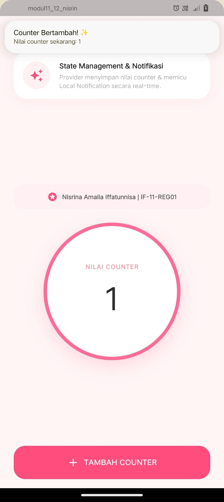
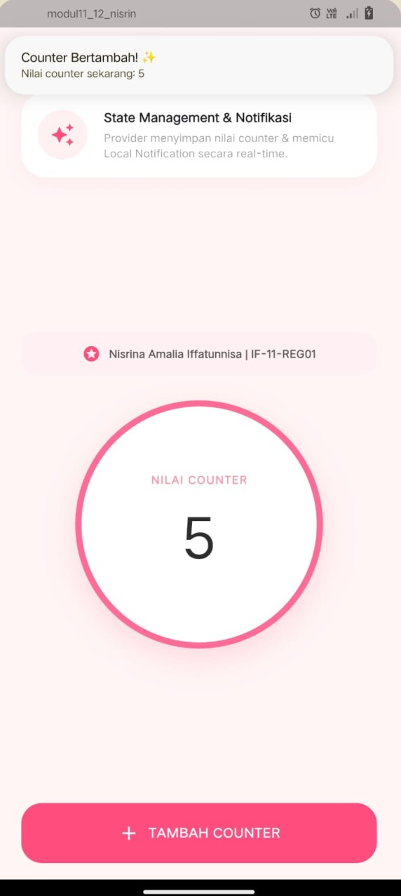

<div align="center">
  <br />
  <h1>LAPORAN PRAKTIKUM <br>APLIKASI BERBASIS PLATFORM</h1>
  <br />
  <h3> Modul 12-13 Mobile <br> Implementasi Provider dan Notifikasi pada Flutter </h3>
  <br />
   
  <br />
  <br />
  <br />
  <h3>Disusun Oleh :</h3>
  <p>
    <strong>Nisrina Amalia Iffatunnisa</strong><br>
    <strong>2311102156</strong><br>
    <strong>S1 IF-11-01</strong>
  </p>
  <br />
  <h3>Dosen Pengampu :</h3>
  <p>
    <strong>Dimas Fanny Hebrasianto Permadi, S.ST., M.Kom</strong>
  </p>
  <br />
  <br />
    <h4>Asisten Praktikum :</h4>
    <strong> Apri Pandu Wicaksono </strong> <br>
    <strong>Rangga Pradarrell Fathi</strong>
  <br />
  <h3>LABORATORIUM HIGH PERFORMANCE
 <br>FAKULTAS INFORMATIKA <br>UNIVERSITAS TELKOM PURWOKERTO <br>2026</h3>
</div>


## 1. Dasar Teori

### A. Pengertian 
Provider adalah pola manajemen state di Flutter yang bertugas mendistribusikan data ke seluruh aplikasi. Notifikasi adalah peringatan (lokal/push) untuk pengguna. Keduanya sering digabungkan. Provider mengelola data aplikasi, dan saat terjadi pembaruan (seperti notifikasi pesan masuk), Provider akan memicu UI agar diperbarui secara otomatis.

1.) Provider (Manajemen State)Provider memungkinkan Anda menyimpan data (state) di satu tempat dan membagikannya ke banyak widget. Kelas ChangeNotifier digunakan agar UI diberitahu secara otomatis saat ada perubahan.Instalasi dengan menambahkan dependensi ke dalam pubspec.yaml:

``` yaml
dependencies:
  flutter:
    sdk: flutter
  provider: ^6.0.0 # Pastikan cek versi terbaru
```

2.) Notifikasi Lokal untuk memunculkan notifikasi langsung dari perangkat (tanpa server), dapat menggunakan package flutter_local_notifications.Instalasi sebagai berikut:

```yaml
dependencies:
  flutter_local_notifications: ^17.1.2 
```

## 2. Sourcecode 

### Sourcecode main.dart
``` Dart
import 'package:flutter/material.dart';
import 'package:provider/provider.dart';
import 'package:flutter_local_notifications/flutter_local_notifications.dart';

// ==========================================================
// 1. NOTIFICATION SERVICE (Logika Notifikasi HP)
// ==========================================================
class NotificationService {
  static final NotificationService _instance = NotificationService._internal();
  factory NotificationService() => _instance;
  NotificationService._internal();

  final FlutterLocalNotificationsPlugin _notificationsPlugin = FlutterLocalNotificationsPlugin();

  Future<void> initNotification() async {
    const AndroidInitializationSettings initializationSettingsAndroid =
        AndroidInitializationSettings('@mipmap/ic_launcher');

    const InitializationSettings initializationSettings =
        InitializationSettings(android: initializationSettingsAndroid);
        
    await _notificationsPlugin.initialize(initializationSettings);

    // Meminta izin notifikasi untuk Android 13+
    await _notificationsPlugin
        .resolvePlatformSpecificImplementation<AndroidFlutterLocalNotificationsPlugin>()
        ?.requestNotificationsPermission();
  }

  Future<void> showCounterNotification(int currentCounter) async {
    const AndroidNotificationDetails androidPlatformChannelSpecifics =
        AndroidNotificationDetails(
      'counter_channel_id',
      'Counter Notifications',
      importance: Importance.max,
      priority: Priority.high,
    );

    const NotificationDetails platformChannelSpecifics =
        NotificationDetails(android: androidPlatformChannelSpecifics);

    await _notificationsPlugin.show(
      0,
      'Counter Bertambah! ✨',
      'Nilai counter sekarang: $currentCounter',
      platformChannelSpecifics,
    );
  }
}

// ==========================================================
// 2. COUNTER PROVIDER (Logika State Management)
// ==========================================================
class CounterProvider with ChangeNotifier {
  int _counter = 0;
  int get counter => _counter;

  void incrementCounter() {
    _counter++;
    notifyListeners(); // Update angka di lingkaran secara real-time
    
    // Pemicu Notifikasi Lokal
    NotificationService().showCounterNotification(_counter);
  }
}

// ==========================================================
// 3. MAIN ENTRY POINT
// ==========================================================
void main() async {
  WidgetsFlutterBinding.ensureInitialized();
  
  // Inisialisasi Service Notifikasi
  await NotificationService().initNotification();

  runApp(
    ChangeNotifierProvider(
      create: (context) => CounterProvider(),
      child: const MyApp(),
    ),
  );
}

class MyApp extends StatelessWidget {
  const MyApp({super.key});

  @override
  Widget build(BuildContext context) {
    return MaterialApp(
      debugShowCheckedModeBanner: false,
      theme: ThemeData(
        scaffoldBackgroundColor: const Color(0xFFFFF5F5), // Background pink soft
        useMaterial3: true,
      ),
      home: const CounterScreen(),
    );
  }
}

// ==========================================================
// 4. UI SCREEN (Tampilan Aplikasi)
// ==========================================================
class CounterScreen extends StatelessWidget {
  const CounterScreen({super.key});

  @override
  Widget build(BuildContext context) {
    final counterProvider = Provider.of<CounterProvider>(context);

    return Scaffold(
      body: SafeArea(
        child: Padding(
          padding: const EdgeInsets.symmetric(horizontal: 24.0, vertical: 16.0),
          child: Column(
            crossAxisAlignment: CrossAxisAlignment.stretch,
            children: [
              // HEADER
              const Text(
                'counter_app ✨',
                style: TextStyle(
                  fontSize: 18, 
                  color: Color(0xFF8A7968), 
                  fontWeight: FontWeight.w500
                ),
              ),
              const SizedBox(height: 24),

              // CARD INFORMASI
              Container(
                padding: const EdgeInsets.all(16),
                decoration: BoxDecoration(
                  color: Colors.white,
                  borderRadius: BorderRadius.circular(24),
                  boxShadow: [
                    BoxShadow(
                      color: Colors.pink.withOpacity(0.05),
                      blurRadius: 15,
                      offset: const Offset(0, 5),
                    )
                  ],
                ),
                child: Row(
                  children: [
                    Container(
                      padding: const EdgeInsets.all(12),
                      decoration: const BoxDecoration(
                        color: Color(0xFFFFF0F2),
                        shape: BoxShape.circle,
                      ),
                      child: const Icon(Icons.auto_awesome, color: Color(0xFFFF4D7D)),
                    ),
                    const SizedBox(width: 16),
                    const Expanded(
                      child: Column(
                        crossAxisAlignment: CrossAxisAlignment.start,
                        children: [
                          Text(
                            'State Management & Notifikasi',
                            style: TextStyle(fontWeight: FontWeight.bold, fontSize: 14),
                          ),
                          SizedBox(height: 4),
                          Text(
                            'Provider menyimpan nilai counter & memicu Local Notification secara real-time.',
                            style: TextStyle(color: Colors.grey, fontSize: 12),
                          ),
                        ],
                      ),
                    )
                  ],
                ),
              ),
              
              const Spacer(),

              // IDENTITAS (SEKARANG DI ATAS LINGKARAN)
              Container(
                padding: const EdgeInsets.all(12),
                decoration: BoxDecoration(
                  color: const Color(0xFFFFF0F2).withOpacity(0.8),
                  borderRadius: BorderRadius.circular(16),
                ),
                child: const Row(
                  mainAxisAlignment: MainAxisAlignment.center,
                  children: [
                    Icon(Icons.stars, color: Color(0xFFFF4D7D), size: 18),
                    SizedBox(width: 8),
                    Text(
                      'Nisrina Amalia Iffatunnisa | IF-11-REG01',
                      style: TextStyle(
                        fontSize: 12, 
                        fontWeight: FontWeight.w600, 
                        color: Color(0xFF555555)
                      ),
                    ),
                  ],
                ),
              ),
              
              const SizedBox(height: 24),

              // LINGKARAN COUNTER
              Center(
                child: Container(
                  width: 240,
                  height: 240,
                  decoration: BoxDecoration(
                    color: Colors.white,
                    shape: BoxShape.circle,
                    border: Border.all(color: const Color(0xFFFF6B97), width: 6),
                    boxShadow: [
                      BoxShadow(
                        color: const Color(0xFFFF6B97).withOpacity(0.2),
                        blurRadius: 25,
                        offset: const Offset(0, 10),
                      )
                    ],
                  ),
                  child: Column(
                    mainAxisAlignment: MainAxisAlignment.center,
                    children: [
                      const Text(
                        'NILAI COUNTER',
                        style: TextStyle(
                          color: Color(0xFFFF8FA3),
                          fontWeight: FontWeight.bold,
                          letterSpacing: 1.2,
                          fontSize: 12,
                        ),
                      ),
                      const SizedBox(height: 8),
                      Text(
                        '${counterProvider.counter}',
                        style: const TextStyle(
                          fontSize: 64,
                          fontWeight: FontWeight.w400,
                          color: Color(0xFF2D2D2D),
                        ),
                      ),
                    ],
                  ),
                ),
              ),
              
              const Spacer(),

              // TOMBOL TAMBAH
              ElevatedButton(
                onPressed: () {
                  counterProvider.incrementCounter();
                },
                style: ElevatedButton.styleFrom(
                  backgroundColor: const Color(0xFFFF4D7D),
                  foregroundColor: Colors.white,
                  padding: const EdgeInsets.symmetric(vertical: 18),
                  shape: RoundedRectangleBorder(borderRadius: BorderRadius.circular(20)),
                  elevation: 0,
                ),
                child: const Row(
                  mainAxisAlignment: MainAxisAlignment.center,
                  children: [
                    Icon(Icons.add, size: 22),
                    SizedBox(width: 8),
                    Text(
                      'TAMBAH COUNTER',
                      style: TextStyle(
                        fontSize: 15, 
                        fontWeight: FontWeight.bold, 
                        letterSpacing: 0.5
                      ),
                    ),
                  ],
                ),
              ),
            ],
          ),
        ),
      ),
    );
  }
}
```
### 3. Hasil Penugasan



## 4. Penjelasan
a. File: counter_provider.dart (Pengatur Angka)

```Dart
class CounterProvider with ChangeNotifier {
  int _counter = 0;
  int get counter => _counter;

  void incrementCounter() {
    _counter++;
    notifyListeners(); 
    NotificationService().showCounterNotification(_counter);
  }
}
```
- with ChangeNotifier: Kode ini membuat class bisa menjadi "alarm". Jadi kalau ada data yang berubah, ini akan memberi bisa tahu komponen lain.
- _counter & get counter: Tempat menyimpan angka counter. Dibuat rapi supaya UI hanya bisa mengambil nilainya dan tidak bisa asal mengubahnya.
- _counter++: Setiap kali tombol ditekan, fungsinya bakal menambah angka counter sebanyak 1.
- notifyListeners(): Ini bagian paling penting di Provider untuk memicu layar agar mengganti angka secara real-time.
- NotificationService().showCounterNotification(_counter): Setelah angkanya bertambah, baris ini langsung menyuruh sistem notifikasi untuk memunculkan pesan di HP.

b. File: notification_service.dart (Pengirim Notifikasi)
```Dart
class NotificationService {
  static final NotificationService _instance = NotificationService._internal();
  factory NotificationService() => _instance;
  NotificationService._internal();
  
  final FlutterLocalNotificationsPlugin _notificationsPlugin = FlutterLocalNotificationsPlugin();
```
- Singleton Pattern (_internal): Pengirim notifikasinya cuma ada satu instansi di dalam aplikasi.
- _notificationsPlugin: Remote kontrol utama dari library untuk mengatur semua notifikasi.

```Dart
  Future<void> initNotification() async {
    const AndroidInitializationSettings initializationSettingsAndroid =
        AndroidInitializationSettings('@mipmap/ic_launcher');
    // ... setup & request permission
  }
```
- initNotification(): Bertugas menyiapkan ikon notifikasi (@mipmap/ic_launcher) dan langsung meminta izin (permission) ke HP/perangkat (khususnya Android 13+).

```Dart
  Future<void> showCounterNotification(int currentCounter) async {
    const AndroidNotificationDetails androidPlatformChannelSpecifics =
        AndroidNotificationDetails(
      'counter_channel_id', 'Counter Notifications',
      importance: Importance.max, priority: Priority.high,
    );
    // ...
    await _notificationsPlugin.show(0, 'Counter Bertambah! ✨', 'Nilai counter sekarang: $currentCounter', ...);
  }
```
- Importance.max & Priority.high: Mengatur agar notifikasinya muncul mengambang di atas layar, tidak hanya sembunyi di status bar.
- _notificationsPlugin.show(...): Perintah untuk memunculkan teksnya. Judulnya diset tetap (Counter Bertambah! ✨), sedangkan isinya dinamis mengikuti variabel $currentCounter.

c. File: main.dart
```Dart
void main() async {
  WidgetsFlutterBinding.ensureInitialized();
  await NotificationService().initNotification(); // Nyalakan notifikasi

  runApp(
    ChangeNotifierProvider(
      create: (context) => CounterProvider(), // Daftarkan pengatur angka
      child: const MyApp(),
    ),
  );
}
```
- await initNotification(): Memastikan sistem notifikasi sudah siap bekerja sebelum layar aplikasi muncul.
- ChangeNotifierProvider: Membungkus seluruh aplikasi agar semua halaman di bawahnya bisa memakai dan melihat data angka dari CounterProvider.

```Dart
class CounterScreen extends StatelessWidget {
  @override
  Widget build(BuildContext context) {
    final counterProvider = Provider.of<CounterProvider>(context);
    // ...
    Text('${counterProvider.counter}')
    // ...
    ElevatedButton(onPressed: () { counterProvider.incrementCounter(); })
  }
}
```
- Provider.of<CounterProvider>(context): Alat untuk "mengintip" dan menghubungkan halaman UI dengan si pengatur angka.
- ${counterProvider.counter}: Menampilkan angka terbaru ke dalam lingkaran pink di layar.
- counterProvider.incrementCounter(): Dipasang di tombol. Pas diklik, ini akan memicu fungsi tambah angka + kirim notifikasi yang ada di file pertama tadi.

### 5. Kesimpulan
Aplikasi ini berhasil menggabungkan Provider untuk memperbarui angka di layar secara real-time dan Local Notification untuk memunculkan pemberitahuan di HP setiap kali tombol ditekan. Semua logika kode dipisah ke dalam filenya masing-masing agar struktur aplikasi menjadi jauh lebih rapi, teratur, dan mudah dikembangkan.


