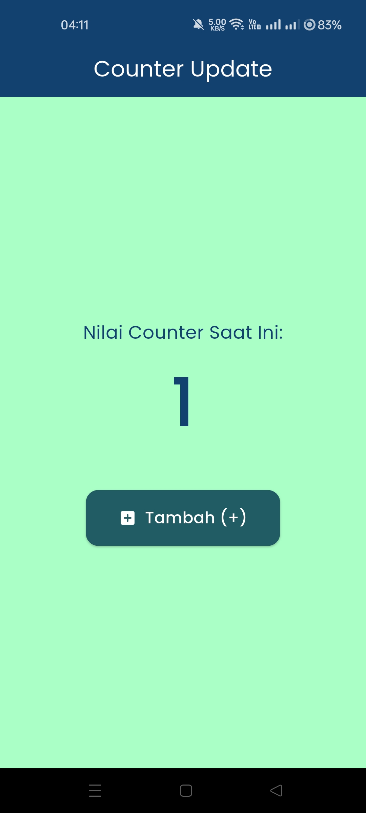
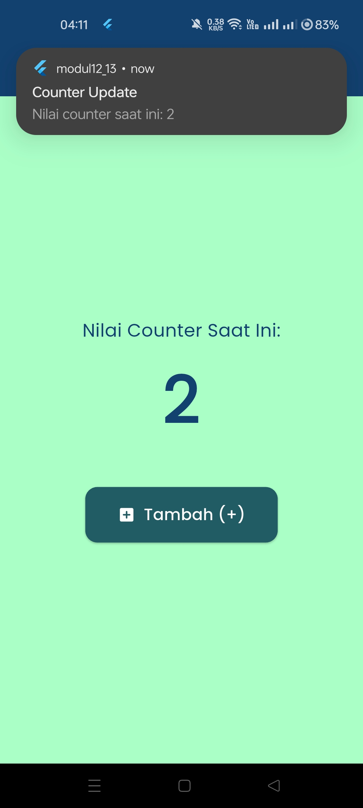

<div align="center">
  <br />

  <h1>LAPORAN PRAKTIKUM <br>
  APLIKASI BERBASIS PLATFORM
  </h1>

  <br />

<h3>MODUL 12 & 13 <br>
NAVIGASI DAN NOTIFIKASI
</h3>

  <br />

  

  <br />
  <br />
  <br />

<h3>Disusun Oleh :</h3>

  <p>
    <strong>Fahreza Ilham Wicaksono</strong><br>
    <strong>2311102191</strong><br>
    <strong>S1 IF-11-REG01</strong>
  </p>

  <br />

<h3>Dosen Pengampu :</h3>

  <p>
    <strong>Dimas Fanny Hebrasianto Permadi, S.ST., M.Kom</strong>
  </p>

  <br />
  <br />
    <h4>Asisten Praktikum :</h4>
    <strong> Apri Pandu Wicaksono </strong> <br>
    <strong>Rangga Pradarrell Fathi</strong>
  <br />

<h3>LABORATORIUM HIGH PERFORMANCE
<br>FAKULTAS INFORMATIKA <br>UNIVERSITAS TELKOM PURWOKERTO <br>2026</h3>
</div>

<hr>

## Tugas

NBuatlah aplikasi Flutter sederhana yang menerapkan **State Management Provider** dan **Notifikasi**. Aplikasi cukup satu halaman yang menampilkan nilai counter dan sebuah tombol untuk menambah nilai counter.

#### Ketentuan

1. Gunakan **Provider** untuk menyimpan dan mengelola nilai counter.
2. Tampilkan nilai counter pada layar utama aplikasi.
3. Sediakan tombol **Tambah (+)** untuk menambah nilai counter sebanyak 1 setiap kali ditekan.
4. Setiap kali nilai counter bertambah, tampilkan notifikasi yang berisi:

    * Judul: **Counter Update**
    * Pesan: **"Nilai counter saat ini: X"** (X adalah nilai counter terbaru)
5. Notifikasi dapat menggunakan:

    * Firebase Cloud Messaging (FCM), **atau**
    * Local Notification (lebih sederhana).
6. Tampilan aplikasi tidak perlu dibuat kompleks, cukup fungsional dan mudah digunakan.

#### Output yang Dikumpulkan

1. Source code proyek Flutter.
2. Screenshot halaman aplikasi yang menampilkan nilai counter.
3. Screenshot notifikasi yang muncul setelah tombol ditekan.
4. Laporan singkat .md (maksimal 1 halaman) yang menjelaskan:

    * Cara kerja Provider pada aplikasi.
    * Cara kerja notifikasi yang digunakan.

## Pengerjaan

Aplikasi ini merupakan aplikasi sederhana untuk menerpakan mekanisme counter dengan `Provider`. Di dalam aplikasi terdapat tombol untuk menambah counter yang mana setelah tombol diklik akan mengupdate nilai counter dan menampilkan notifikasi dengan flutter local notification.

### Main

```dart
void main() {
  runApp(
    ChangeNotifierProvider(
      create: (context) => CounterProvider(),
      child: const CounterNotificationApp(),
    ),
  );
}
```

Aplikasi dimulai dari fungsi `main()`. Fungsi `runApp()` digunakan untuk menjalankan aplikasi Flutter. Widget `ChangeNotifierProvider` membungkus seluruh aplikasi dan bertugas menyediakan objek `CounterProvider` kepada seluruh widget di bawahnya. Dengan cara ini, data counter dapat diakses dan diperbarui dari berbagai bagian aplikasi tanpa perlu mengirim data secara manual melalui `constructor`.

### CounterProvider

```dart
class CounterProvider with ChangeNotifier {
  int _counter = 0;

  //   Getter untuk mengambil nilai counter
  int get counter => _counter;

  //   Fungsi untuk menambah counter
  void increment() {
    _counter++;
    notifyListeners(); // mengirim sinyal ke UI bahwa data telah berubah
  }
}
```

Kelas ini berfungsi sebagai penyimpan `state` (data) counter. Penggunaan `ChangeNotifier` memungkinkan kelas mengirimkan notifikasi ketika data berubah. Getter `counter` digunakan untuk mengambil nilai counter dari luar kelas tanpa memberikan akses langsung ke variabel `_counter`. Method `increment()` digunakan untuk menambah nilai counter sebanyak satu. Setelah nilai berubah, `notifyListeners()` dipanggil untuk memberi tahu widget yang sedang memantau provider agar melakukan rebuild dan menampilkan data terbaru.

### CounterNotificationApp

```dart
class CounterNotificationApp extends StatelessWidget {
  const CounterNotificationApp({super.key});

  @override
  Widget build(BuildContext context) {
    return MaterialApp(
      title: 'Counter Provider & Notifikasi',
      debugShowCheckedModeBanner: false,
      theme: ThemeData(
        scaffoldBackgroundColor: const Color(0xFFAAFFC7),
        colorScheme: ColorScheme.fromSeed(seedColor: const Color(0xFF215B63)),
        textTheme: GoogleFonts.poppinsTextTheme(Theme
            .of(context)
            .textTheme),
      ),
      home: const CounterPage(),
    );
  }
}
```

Kelas `CounterNotificationApp` merupakan root widget aplikasi yang bertugas mengatur konfigurasi dasar aplikasi Flutter. Kelas ini menggunakan `StatelessWidget` karena tidak memiliki state internal yang berubah selama aplikasi berjalan. Di dalam method `build`, widget `MaterialApp` digunakan sebagai kerangka utama aplikasi dengan menerapkan konsep `Material Design`. Properti `title` menentukan nama aplikasi, sedangkan `theme` mengatur tampilan visual seperti warna latar belakang, skema warna, dan jenis font menggunakan `GoogleFonts.poppinsTextTheme`. Properti `home` menunjuk ke `CounterPage` sebagai halaman pertama yang ditampilkan saat aplikasi dijalankan.

### CounterPage dan _CounterPageState

```dart
class CounterPage extends StatefulWidget {
  const CounterPage({super.key});

  @override
  State<CounterPage> createState() => _CounterPageState();
}

class _CounterPageState extends State<CounterPage> {
  final FlutterLocalNotificationsPlugin _localNotificationsPlugin =
  FlutterLocalNotificationsPlugin();

  // Inisialisasi
  @override
  void initState() {
    super.initState();
    _initNotifications();
  }

  // Fungsi untuk setup dan izin notifikasi
  Future<void> _initNotifications() async {
    const AndroidInitializationSettings androidInitializationSettings =
    AndroidInitializationSettings('@mipmap/ic_launcher');

    const InitializationSettings initializationSettings = InitializationSettings(
        android: androidInitializationSettings
    );

    //  Jalankan init
    await _localNotificationsPlugin.initialize(initializationSettings);

    // Izin notifikasi
    await _localNotificationsPlugin
        .resolvePlatformSpecificImplementation<
        AndroidFlutterLocalNotificationsPlugin>()
        ?.requestNotificationsPermission();
  }

  Future<void> _showNotification(int newCounterValue) async {
    const AndroidNotificationDetails androidNotificationDetails = AndroidNotificationDetails(
      'conter_channel_id',
      'Notifikasi Counter',
      channelDescription: 'Notifikasi saat nilai counter bertambah',
      importance: Importance.max,
      priority: Priority.high,
    );

    const NotificationDetails notificationDetails = NotificationDetails(
      android: androidNotificationDetails,
    );

    await _localNotificationsPlugin.show(
        1,
        'Counter Update',
        'Nilai counter saat ini: $newCounterValue',
        notificationDetails,
    );
  }

  @override
  Widget build(BuildContext context) {
    return Scaffold(
      appBar: AppBar(
        title: const Text('Counter Update'),
        backgroundColor: const Color(0xFF124170),
        foregroundColor: Colors.white,
        centerTitle: true,
      ),
      body: Center(
        child: Column(
          mainAxisAlignment: MainAxisAlignment.center,
          children: [
            const Text(
              'Nilai Counter Saat Ini:',
              style: TextStyle(fontSize: 18, color: Color(0xFF124170)),
            ),
            const SizedBox(height: 10),

            Text(
              '${context
                  .watch<CounterProvider>()
                  .counter}',
              style: const TextStyle(
                fontSize: 64,
                fontWeight: FontWeight.bold,
                color: Color(0xFF124170),
              ),
            ),

            const SizedBox(height: 40),

            //   Tombol Tambah
            ElevatedButton.icon(
              onPressed: () async {
                // tambah nilai counter di provider
                context.read<CounterProvider>().increment();

                // ambil nilai counter terbaru
                int currentCounter = context.read<CounterProvider>().counter;

                // tampilkan notifikasi
                await _showNotification(currentCounter);
              },
              icon: const Icon(Icons.add_box_rounded),
              label: const Text('Tambah (+)', style: TextStyle(fontSize: 16)),
              style: ElevatedButton.styleFrom(
                backgroundColor: const Color(0xFF215B63),
                foregroundColor: Colors.white,
                padding: const EdgeInsets.symmetric(
                  horizontal: 32,
                  vertical: 16,
                ),
                shape: RoundedRectangleBorder(
                  borderRadius: BorderRadius.circular(12),
                ),
              ),
            ),
          ],
        ),
      ),
    );
  }
}
```

Kelas `CounterPage` merupakan halaman utama aplikasi yang diturunkan dari `StatefulWidget`. Penggunaan `StatefulWidget` diperlukan karena halaman ini memiliki data dan proses yang dapat berubah selama aplikasi berjalan, yaitu pengelolaan notifikasi lokal. Method `createState()` menghubungkan widget ini dengan kelas `_CounterPageState`, yang berisi logika dan state yang digunakan oleh halaman.

Kelas `_CounterPageState` bertanggung jawab mengelola seluruh proses yang terjadi pada halaman, mulai dari inisialisasi notifikasi, menampilkan notifikasi, hingga membangun antarmuka pengguna. Pada kelas ini dibuat objek `FlutterLocalNotificationsPlugin` yang digunakan untuk mengelola notifikasi lokal Android. Method `initState()` dijalankan saat halaman pertama kali dibuat dan memanggil `_initNotifications()` untuk menginisialisasi plugin notifikasi serta meminta izin notifikasi kepada pengguna. Selain itu, kelas ini juga memiliki method `_showNotification()` yang digunakan untuk menampilkan notifikasi ketika nilai counter berubah. Seluruh komponen antarmuka, seperti teks nilai counter dan tombol tambah, dibangun melalui method `build()` yang akan diperbarui secara otomatis ketika terjadi perubahan data pada `CounterProvider`.

## Source Code

```dart
import 'dart:ui';

import 'package:flutter/material.dart';
import 'package:flutter_local_notifications/flutter_local_notifications.dart';
import 'package:google_fonts/google_fonts.dart';
import 'package:provider/provider.dart';

void main() {
  runApp(
    ChangeNotifierProvider(
      create: (context) => CounterProvider(),
      child: const CounterNotificationApp(),
    ),
  );
}

class CounterProvider with ChangeNotifier {
  int _counter = 0;

  //   Getter untuk mengambil nilai counter
  int get counter => _counter;

  //   Fungsi untuk menambah counter
  void increment() {
    _counter++;
    notifyListeners(); // mengirim sinyal ke UI bahwa data telah berubah
  }
}

class CounterNotificationApp extends StatelessWidget {
  const CounterNotificationApp({super.key});

  @override
  Widget build(BuildContext context) {
    return MaterialApp(
      title: 'Counter Provider & Notifikasi',
      debugShowCheckedModeBanner: false,
      theme: ThemeData(
        scaffoldBackgroundColor: const Color(0xFFAAFFC7),
        colorScheme: ColorScheme.fromSeed(seedColor: const Color(0xFF215B63)),
        textTheme: GoogleFonts.poppinsTextTheme(Theme
            .of(context)
            .textTheme),
      ),
      home: const CounterPage(),
    );
  }
}

class CounterPage extends StatefulWidget {
  const CounterPage({super.key});

  @override
  State<CounterPage> createState() => _CounterPageState();
}

class _CounterPageState extends State<CounterPage> {
  final FlutterLocalNotificationsPlugin _localNotificationsPlugin =
  FlutterLocalNotificationsPlugin();

  // Inisialisasi
  @override
  void initState() {
    super.initState();
    _initNotifications();
  }

  // Fungsi untuk setup dan izin notifikasi
  Future<void> _initNotifications() async {
    const AndroidInitializationSettings androidInitializationSettings =
    AndroidInitializationSettings('@mipmap/ic_launcher');

    const InitializationSettings initializationSettings = InitializationSettings(
        android: androidInitializationSettings
    );

    //  Jalankan init
    await _localNotificationsPlugin.initialize(initializationSettings);

    // Izin notifikasi
    await _localNotificationsPlugin
        .resolvePlatformSpecificImplementation<
        AndroidFlutterLocalNotificationsPlugin>()
        ?.requestNotificationsPermission();
  }

  Future<void> _showNotification(int newCounterValue) async {
    const AndroidNotificationDetails androidNotificationDetails = AndroidNotificationDetails(
      'conter_channel_id',
      'Notifikasi Counter',
      channelDescription: 'Notifikasi saat nilai counter bertambah',
      importance: Importance.max,
      priority: Priority.high,
    );

    const NotificationDetails notificationDetails = NotificationDetails(
      android: androidNotificationDetails,
    );

    await _localNotificationsPlugin.show(
        1,
        'Counter Update',
        'Nilai counter saat ini: $newCounterValue',
        notificationDetails,
    );
  }

  @override
  Widget build(BuildContext context) {
    return Scaffold(
      appBar: AppBar(
        title: const Text('Counter Update'),
        backgroundColor: const Color(0xFF124170),
        foregroundColor: Colors.white,
        centerTitle: true,
      ),
      body: Center(
        child: Column(
          mainAxisAlignment: MainAxisAlignment.center,
          children: [
            const Text(
              'Nilai Counter Saat Ini:',
              style: TextStyle(fontSize: 18, color: Color(0xFF124170)),
            ),
            const SizedBox(height: 10),

            Text(
              '${context
                  .watch<CounterProvider>()
                  .counter}',
              style: const TextStyle(
                fontSize: 64,
                fontWeight: FontWeight.bold,
                color: Color(0xFF124170),
              ),
            ),

            const SizedBox(height: 40),

            //   Tombol Tambah
            ElevatedButton.icon(
              onPressed: () async {
                // tambah nilai counter di provider
                context.read<CounterProvider>().increment();

                // ambil nilai counter terbaru
                int currentCounter = context.read<CounterProvider>().counter;

                // tampilkan notifikasi
                await _showNotification(currentCounter);
              },
              icon: const Icon(Icons.add_box_rounded),
              label: const Text('Tambah (+)', style: TextStyle(fontSize: 16)),
              style: ElevatedButton.styleFrom(
                backgroundColor: const Color(0xFF215B63),
                foregroundColor: Colors.white,
                padding: const EdgeInsets.symmetric(
                  horizontal: 32,
                  vertical: 16,
                ),
                shape: RoundedRectangleBorder(
                  borderRadius: BorderRadius.circular(12),
                ),
              ),
            ),
          ],
        ),
      ),
    );
  }
}
```

## Output



