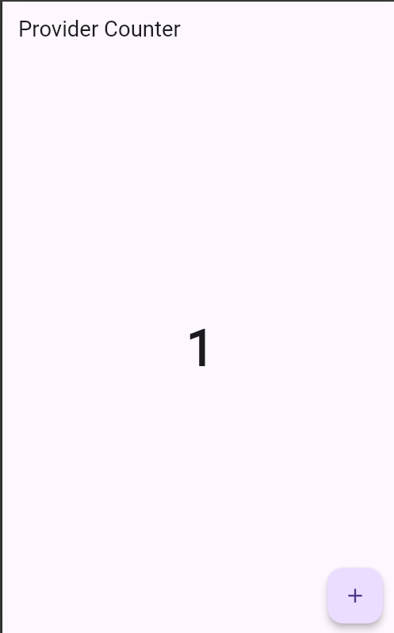
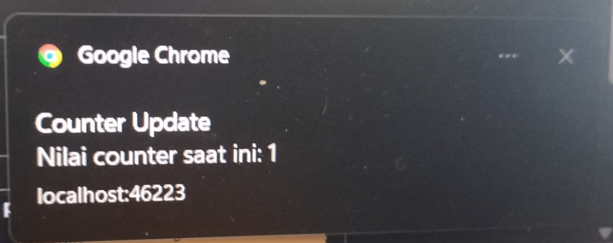

<div align="center">
  <br />

  <h1>LAPORAN PRAKTIKUM <br>
  APLIKASI BERBASIS PLATFORM
  </h1>

  <br />

  <h3>MODUL XII & XIII

  Implementasi Provider dan Notifikasi pada Flutter
  </h3>

  <br />

  

  <br />
  <br />
  <br />

  <h3>Disusun Oleh :</h3>

  <p>
    <strong>Andreas Besar Wibowo</strong><br>
    <strong>2311102198</strong><br>
    <strong>S1 IF-11-REG01</strong>
  </p>

  <br />

  <h3>Dosen Pengampu :</h3>

  <p>
    <strong>Dimas Fanny Hebrasianto Permadi, S.ST., M.Kom</strong>
  </p>
  
  <br />
    <h4>Asisten Praktikum :</h4>
    <strong>Apri Pandu Wicaksono </strong> <br>
    <strong>Rangga Pradarrell Fathi</strong>
  <br />

  <h3>LABORATORIUM HIGH PERFORMANCE
 <br>FAKULTAS INFORMATIKA <br>UNIVERSITAS TELKOM PURWOKERTO <br>2026</h3>
</div>

<hr>

## Tugas
**Tugas Praktik Modul 12 & 13 – Implementasi Provider dan Notifikasi pada Flutter**

### Deskripsi Tugas
Buatlah aplikasi Flutter sederhana yang menerapkan State Management Provider dan Notifikasi. Aplikasi cukup satu halaman yang menampilkan nilai counter dan sebuah tombol untuk menambah nilai counter.
### Ketentuan
1. Gunakan Provider untuk menyimpan dan mengelola nilai counter.
2. Tampilkan nilai counter pada layar utama aplikasi.
3. Sediakan tombol Tambah (+) untuk menambah nilai counter sebanyak 1 setiap kali ditekan.
4. Setiap kali nilai counter bertambah, tampilkan notifikasi yang berisi:
- Judul: Counter Update
- Pesan: "Nilai counter saat ini: X" (X adalah nilai counter terbaru)
5. Notifikasi dapat menggunakan:
- Firebase Cloud Messaging (FCM), atau
- Local Notification (lebih sederhana).
6. Tampilan aplikasi tidak perlu dibuat kompleks, cukup fungsional dan mudah digunakan.

### Output yang Dikumpulkan
1. Source code proyek Flutter.
2. Screenshot halaman aplikasi yang menampilkan nilai counter.
3. Screenshot notifikasi yang muncul setelah tombol ditekan.
4. Laporan singkat .md (maksimal 1 halaman) yang menjelaskan:
- Cara kerja Provider pada aplikasi.
- Cara kerja notifikasi yang digunakan.

## Hasil
### Output
1. Home



2. Camera



### Source Code
1. counter_provider.dart
```dart
import 'package:flutter/material.dart';
import 'notification_service.dart';

class CounterProvider extends ChangeNotifier {
  int _counter = 0;

  int get counter => _counter;

  void incrementCounter() {
    _counter++;

    NotificationService.showNotification(
      title: 'Counter Update',
      body: 'Nilai counter saat ini: $_counter',
    );

    notifyListeners();
  }
}
```
2. notification_service.dart
```dart
import 'dart:html' as html;

class NotificationService {
  static Future<void> initialize() async {
    if (html.Notification.permission != 'granted') {
      await html.Notification.requestPermission();
    }
  }

  static void showNotification({
    required String title,
    required String body,
  }) {
    if (html.Notification.permission == 'granted') {
      html.Notification(
        title,
        body: body,
      );
    }
  }
}
```
3. main.dart
```dart
import 'package:flutter/material.dart';
import 'package:provider/provider.dart';

import 'counter_provider.dart';
import 'notification_service.dart';

void main() async {
  WidgetsFlutterBinding.ensureInitialized();

  await NotificationService.initialize();

  runApp(
    ChangeNotifierProvider(
      create: (_) => CounterProvider(),
      child: const MyApp(),
    ),
  );
}

class MyApp extends StatelessWidget {
  const MyApp({super.key});

  @override
  Widget build(BuildContext context) {
    return MaterialApp(
      debugShowCheckedModeBanner: false,
      home: const CounterPage(),
    );
  }
}

class CounterPage extends StatelessWidget {
  const CounterPage({super.key});

  @override
  Widget build(BuildContext context) {
    final counterProvider = Provider.of<CounterProvider>(context);

    return Scaffold(
      appBar: AppBar(
        title: const Text('Provider Counter'),
      ),
      body: Center(
        child: Text(
          '${counterProvider.counter}',
          style: const TextStyle(
            fontSize: 50,
            fontWeight: FontWeight.bold,
          ),
        ),
      ),
      floatingActionButton: FloatingActionButton(
        onPressed: counterProvider.incrementCounter,
        child: const Icon(Icons.add),
      ),
    );
  }
}
```

### Penjelasan Singkat
#### 1. Cara kerja Provider pada aplikasi.
Pada aplikasi ini, Provider digunakan sebagai state management untuk mengelola dan menyimpan nilai counter secara terpusat. Provider dipilih karena mampu memisahkan logika bisnis dari tampilan (UI), sehingga kode menjadi lebih terstruktur dan mudah dimaintenance.

Kelas `CounterProvider` dibuat dengan mewarisi `(extends) ChangeNotifier`. Di dalam kelas tersebut terdapat variabel private `_counter` yang digunakan untuk menyimpan nilai counter. Selain itu, terdapat getter `counter` yang memungkinkan widget lain membaca nilai counter tanpa dapat mengubahnya secara langsung.

Ketika pengguna menekan tombol tambah (`+`), aplikasi akan memanggil method `incrementCounter()`. Method ini akan menambah nilai `_counter` sebesar satu. Setelah nilai berhasil diperbarui, method `notifyListeners()` dijalankan. Method ini berfungsi untuk memberi tahu seluruh widget yang sedang mendengarkan (listening) perubahan data pada Provider bahwa state telah berubah.

Pada file `main.dart`, `CounterProvider` didaftarkan menggunakan `ChangeNotifierProvider`. Dengan demikian, widget pada aplikasi dapat mengakses data counter melalui Provider. Widget yang menampilkan nilai counter menggunakan `Provider.of<CounterProvider>(context)` untuk mengambil data terbaru. Ketika `notifyListeners()` dipanggil, widget tersebut akan melakukan rebuild secara otomatis dan menampilkan nilai counter yang baru tanpa perlu melakukan refresh halaman secara manual.

Alur kerja Provider pada aplikasi dapat digambarkan sebagai berikut:
1. Pengguna menekan tombol tambah (`+`).
2. Method `incrementCounter()` dipanggil.
3. Nilai `_counter` bertambah satu.
4. Method `notifyListeners()` dijalankan.
5. Widget yang menggunakan Provider menerima informasi perubahan state.
6. Tampilan diperbarui dan menampilkan nilai counter terbaru.

Dengan mekanisme ini, pengelolaan state menjadi lebih efisien karena perubahan data hanya dilakukan pada satu tempat, yaitu Provider.

#### 2. Cara kerja notifikasi yang digunakan.
Aplikasi ini menggunakan notifikasi untuk memberikan informasi kepada pengguna setiap kali terjadi perubahan pada nilai counter. Notifikasi berfungsi sebagai umpan balik (feedback) yang menunjukkan bahwa proses penambahan counter telah berhasil dilakukan.

Ketika pengguna menekan tombol tambah (`+`), method `incrementCounter()` akan dijalankan. Setelah nilai counter berhasil ditambahkan, aplikasi memanggil fungsi `showNotification()` dari kelas `NotificationService`. Fungsi tersebut bertugas membuat dan menampilkan notifikasi kepada pengguna.

Notifikasi yang ditampilkan memiliki format sebagai berikut:
- Judul: Counter Update
- Pesan: Nilai counter saat ini: X

di mana X merupakan nilai counter terbaru setelah proses penambahan.


Jika aplikasi dijalankan pada Flutter Web (Chrome), notifikasi ditampilkan menggunakan Browser Notification API. Saat aplikasi pertama kali dijalankan, browser akan meminta izin kepada pengguna untuk menampilkan notifikasi. Setelah izin diberikan, aplikasi dapat mengirim notifikasi setiap kali nilai counter berubah. Notifikasi akan muncul di area notifikasi browser atau sistem operasi yang digunakan.

Alur kerja notifikasi pada aplikasi adalah sebagai berikut:
1. Pengguna menekan tombol tambah (`+`).
2. Nilai counter diperbarui oleh Provider.
3. Fungsi `showNotification()` dipanggil.
4. Sistem membuat notifikasi dengan judul dan pesan yang telah ditentukan.
5. Notifikasi ditampilkan kepada pengguna.
6. Pengguna menerima informasi mengenai nilai counter terbaru.

Dengan adanya notifikasi, pengguna dapat mengetahui perubahan nilai counter secara langsung tanpa harus selalu memperhatikan tampilan utama aplikasi.