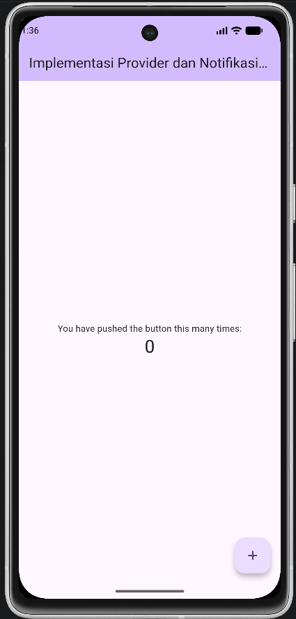
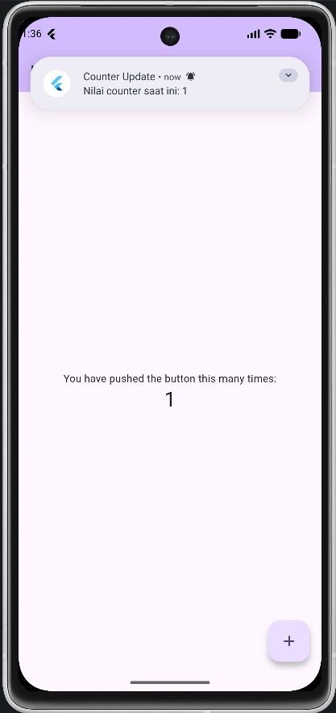

<div align="center">
  <br>

  <h1>LAPORAN PRAKTIKUM <br>
  APLIKASI BERBASIS PLATFORM
  </h1>

  <br>

  <h3>Modul 12-13</h3>
  <h3>Mobile</h3>

  <br>

  


  <br>
  <br>
  <br>

  <h3>Disusun Oleh :</h3>

  <p>
    <strong>Irshad Benaya Fardeca</strong><br>
    <strong>2311102199</strong><br>
    <strong>S1 IF-11-REG01</strong>
  </p>

  <br>

  <h3>Dosen Pengampu :</h3>

  <p>
    <strong>Dimas Fanny Hebrasianto Permadi, S.ST., M.Kom</strong>
  </p>
  
  <br>
  <br>
    <h4>Asisten Praktikum :</h4>
    <strong>Apri Pandu Wicaksono </strong> <br>
    <strong>Rangga Pradarrell Fathi</strong>
  <br>

  <h3>LABORATORIUM HIGH PERFORMANCE
 <br>FAKULTAS INFORMATIKA <br>UNIVERSITAS TELKOM PURWOKERTO <br>2026</h3>
</div>
<hr>

# Tugas
### Tugas Praktik Modul 12 & 13

**Implementasi Provider dan Notifikasi pada Flutter**

#### Deskripsi Tugas

Buatlah aplikasi Flutter sederhana yang menerapkan **State Management Provider** dan **Notifikasi**. Aplikasi cukup satu halaman yang menampilkan nilai counter dan sebuah tombol untuk menambah nilai counter.

#### Ketentuan

1. Gunakan **Provider** untuk menyimpan dan mengelola nilai counter.
2. Tampilkan nilai counter pada layar utama aplikasi.
3. Sediakan tombol **Tambah (+)** untuk menambah nilai counter sebanyak 1 setiap kali ditekan.
4. Setiap kali nilai counter bertambah, tampilkan notifikasi yang berisi:

   * Judul: **Counter Update**
   * Pesan: **"Nilai counter saat ini: X"** (X adalah nilai counter terbaru)
5. Notifikasi dapat menggunakan:

   * Firebase Cloud Messaging (FCM), **atau**
   * Local Notification (lebih sederhana).
6. Tampilan aplikasi tidak perlu dibuat kompleks, cukup fungsional dan mudah digunakan.

#### Output yang Dikumpulkan

1. Source code proyek Flutter.
2. Screenshot halaman aplikasi yang menampilkan nilai counter.
3. Screenshot notifikasi yang muncul setelah tombol ditekan.
4. Laporan singkat .md (maksimal 1 halaman) yang menjelaskan:

   * Cara kerja Provider pada aplikasi.
   * Cara kerja notifikasi yang digunakan.

<br>

# Source Code
```dart
import 'package:flutter/material.dart';
import 'package:provider/provider.dart';
import 'package:flutter_local_notifications/flutter_local_notifications.dart';

void main() {
  runApp(
    ChangeNotifierProvider(
      create: (context) => CounterProvider(),
      child: const MyApp(),
    ),
  );
}

// ==========================================
// 1. NOTIFICATION SERVICE
// ==========================================
class NotificationService {
  final FlutterLocalNotificationsPlugin _notificationsPlugin = FlutterLocalNotificationsPlugin();

  Future<void> initNotification() async {
    const AndroidInitializationSettings initializationSettingsAndroid =
        AndroidInitializationSettings('@mipmap/ic_launcher');
    const InitializationSettings initializationSettings =
        InitializationSettings(android: initializationSettingsAndroid);

    await _notificationsPlugin.initialize(initializationSettings);
    
    // Request permission for Android 13+
    await _notificationsPlugin
        .resolvePlatformSpecificImplementation<AndroidFlutterLocalNotificationsPlugin>()
        ?.requestNotificationsPermission();
  }

  Future<void> showNotification(int value) async {
    const AndroidNotificationDetails androidDetails = AndroidNotificationDetails(
      'counter_channel',
      'Counter Updates',
      importance: Importance.max,
      priority: Priority.high,
    );
    await _notificationsPlugin.show(
      0,
      'Counter Update',
      'Nilai counter saat ini: $value',
      const NotificationDetails(android: androidDetails),
    );
  }
}

// ==========================================
// 2. PROVIDER (STATE MANAGEMENT)
// ==========================================
class CounterProvider extends ChangeNotifier {
  int _counter = 0;
  final NotificationService _notificationService = NotificationService();

  int get counter => _counter;

  CounterProvider() {
    _notificationService.initNotification();
  }

  void increment() {
    _counter++;
    notifyListeners();
    _notificationService.showNotification(_counter);
  }
}

// ==========================================
// 3. UI
// ==========================================
class MyApp extends StatelessWidget {
  const MyApp({super.key});

  @override
  Widget build(BuildContext context) {
    return MaterialApp(
      title: 'Tugas Praktik Modul 12 & 13',
      theme: ThemeData(
        colorScheme: ColorScheme.fromSeed(seedColor: Colors.deepPurple),
        useMaterial3: true,
      ),
      home: const MyHomePage(title: 'Implementasi Provider dan Notifikasi pada Flutter'),
      debugShowCheckedModeBanner: false,
    );
  }
}

class MyHomePage extends StatelessWidget {
  const MyHomePage({super.key, required this.title});
  final String title;

  @override
  Widget build(BuildContext context) {
    return Scaffold(
      appBar: AppBar(
        backgroundColor: Theme.of(context).colorScheme.inversePrimary,
        title: Text(title),
      ),
      body: Center(
        child: Column(
          mainAxisAlignment: MainAxisAlignment.center,
          children: [
            const Text('You have pushed the button this many times:'),
            // Menggunakan Consumer untuk mendengarkan perubahan state
            Consumer<CounterProvider>(
              builder: (context, provider, child) {
                return Text(
                  '${provider.counter}',
                  style: Theme.of(context).textTheme.headlineMedium,
                );
              },
            ),
          ],
        ),
      ),
      floatingActionButton: FloatingActionButton(
        onPressed: () {
          // Memanggil fungsi increment dari Provider
          Provider.of<CounterProvider>(context, listen: false).increment();
        },
        tooltip: 'Increment',
        child: const Icon(Icons.add),
      ),
    );
  }
}
```

## 1. Cara Kerja Provider pada Aplikasi

Provider digunakan sebagai **state management** untuk mengelola data yang dapat diakses oleh banyak widget dalam aplikasi. Pada program ini, `CounterProvider` bertugas menyimpan dan mengelola nilai counter.

### Alur Kerja Provider

1. Pada fungsi `main()`, aplikasi dibungkus dengan `ChangeNotifierProvider`.

```dart
ChangeNotifierProvider(
  create: (context) => CounterProvider(),
  child: const MyApp(),
)
```

2. `CounterProvider` merupakan turunan dari `ChangeNotifier` yang menyimpan nilai `_counter`.

```dart
class CounterProvider extends ChangeNotifier {
  int _counter = 0;

  int get counter => _counter;
}
```

3. Ketika tombol `FloatingActionButton` ditekan, fungsi `increment()` dipanggil.

```dart
Provider.of<CounterProvider>(
  context,
  listen: false,
).increment();
```

4. Fungsi `increment()` akan:

   * Menambah nilai counter.
   * Memanggil `notifyListeners()`.

```dart
void increment() {
  _counter++;
  notifyListeners();
}
```

5. Widget `Consumer<CounterProvider>` akan mendengarkan perubahan state. Saat `notifyListeners()` dipanggil, nilai counter pada tampilan akan diperbarui secara otomatis tanpa perlu melakukan refresh manual.

```dart
Consumer<CounterProvider>(
  builder: (context, provider, child) {
    return Text('${provider.counter}');
  },
)
```

### Keuntungan Menggunakan Provider

* Memisahkan logika bisnis dari tampilan (UI).
* Memudahkan pengelolaan state aplikasi.
* Perubahan data dapat langsung memperbarui widget yang membutuhkan data tersebut.
* Kode menjadi lebih terstruktur dan mudah dipelihara.

---

## 2. Cara Kerja Notifikasi yang Digunakan

Aplikasi menggunakan package `flutter_local_notifications` untuk menampilkan notifikasi lokal pada perangkat Android.

### Inisialisasi Notifikasi

Pada kelas `NotificationService`, objek `FlutterLocalNotificationsPlugin` dibuat untuk mengelola notifikasi.

```dart
final FlutterLocalNotificationsPlugin
    _notificationsPlugin =
    FlutterLocalNotificationsPlugin();
```

Kemudian dilakukan inisialisasi:

```dart
await _notificationsPlugin.initialize(
  initializationSettings,
);
```

Untuk Android 13 ke atas, aplikasi juga meminta izin notifikasi:

```dart
await _notificationsPlugin
    .resolvePlatformSpecificImplementation<
        AndroidFlutterLocalNotificationsPlugin>()
    ?.requestNotificationsPermission();
```

### Menampilkan Notifikasi

Ketika nilai counter berubah, fungsi `showNotification()` dipanggil.

```dart
_notificationService.showNotification(
  _counter,
);
```

Fungsi tersebut membuat detail notifikasi Android:

```dart
const AndroidNotificationDetails
    androidDetails =
    AndroidNotificationDetails(
  'counter_channel',
  'Counter Updates',
  importance: Importance.max,
  priority: Priority.high,
);
```

Lalu notifikasi ditampilkan:

```dart
await _notificationsPlugin.show(
  0,
  'Counter Update',
  'Nilai counter saat ini: $value',
  const NotificationDetails(
    android: androidDetails,
  ),
);
```

### Alur Kerja Notifikasi

1. Aplikasi dijalankan.
2. `NotificationService` melakukan inisialisasi notifikasi.
3. Pengguna menekan tombol tambah (`+`).
4. Nilai counter bertambah melalui Provider.
5. `notifyListeners()` memperbarui tampilan angka counter.
6. `showNotification()` dipanggil.
7. Sistem Android menampilkan notifikasi berisi nilai counter terbaru.

### Hasil Implementasi

Setiap kali tombol tambah ditekan:

* Nilai counter pada layar bertambah.
* Notifikasi muncul di perangkat Android yang menampilkan nilai counter terkini.

Dengan demikian, aplikasi berhasil menggabungkan **Provider** sebagai manajemen state dan **Flutter Local Notifications** sebagai media pemberitahuan kepada pengguna.


## Output
### Tampilan Awal


### Notifikasi

