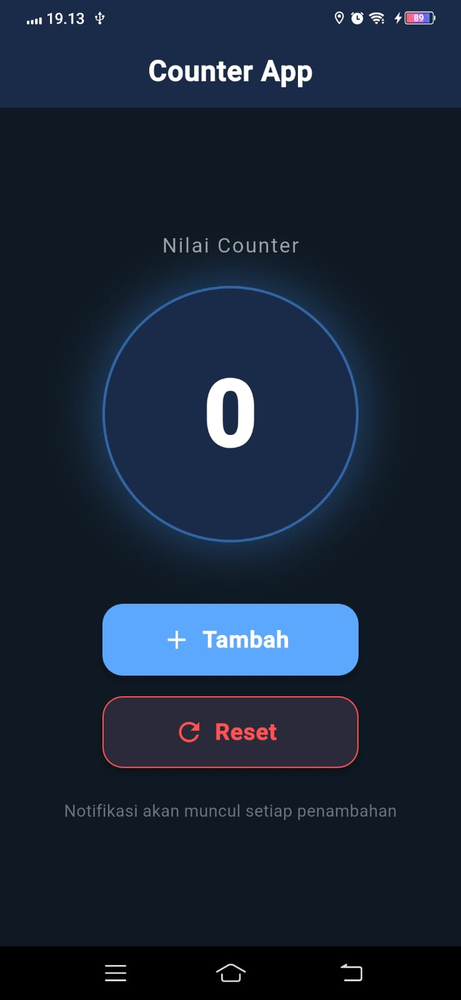
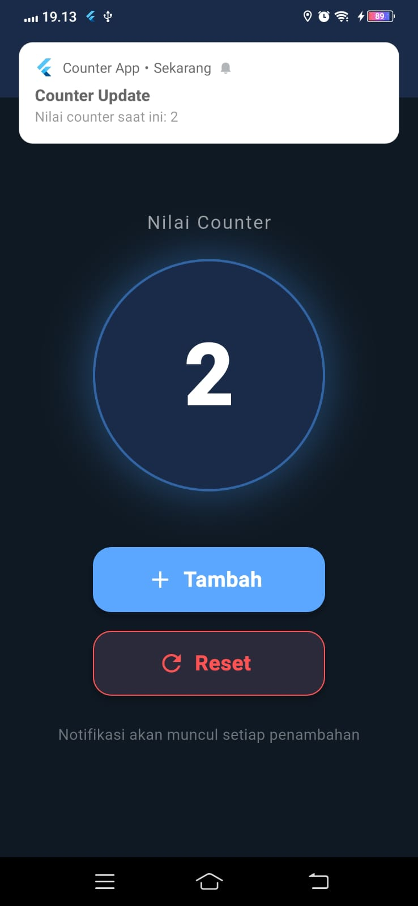
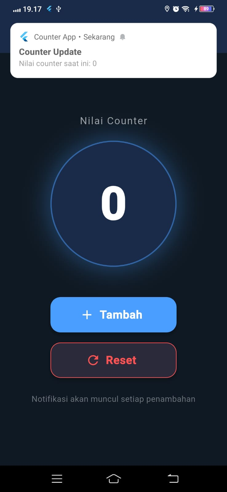

<div align="center">
  <br />
  <h1>LAPORAN PRAKTIKUM <br>APLIKASI BERBASIS PLATFORM</h1>
  <br />
  <h3>MODUL 12 & 13<br> IMPLEMENTASI PROVIDER & NOTIFIKASI <br>(Aplikasi Counter & State Management)</h3>
  <br />
   
  <br />
  <br />
  <br />
  <h3>Disusun Oleh :</h3>
  <p>
    <strong>M.Faleno Albar Firjatulloh</strong><br>
    <strong>2311102297</strong><br>
    <strong>S1 IF-11-REG01</strong>
  </p>
  <br />
  <br />
  <h3>Dosen Pengampu :</h3>
  <p>
    <strong>Dimas Fanny Hebrasianto Permadi, S.ST., M.Kom</strong>
  </p>
  <br />
  <br />
    <h4>Asisten Praktikum :</h4>
    <strong> Apri Pandu Wicaksono </strong> <br>
    <strong>Rangga Pradarrell Fathi</strong>
  <br />
  <h3>LABORATORIUM HIGH PERFORMANCE
 <br>FAKULTAS INFORMATIKA <br>UNIVERSITAS TELKOM PURWOKERTO <br>2026</h3>
</div>

---

## 1. Dasar Teori

### 1.1 Flutter
Flutter adalah framework antarmuka pengguna (UI) sumber terbuka dari Google yang digunakan untuk membangun aplikasi secara natively compiled untuk berbagai platform dari satu basis kode (codebase).

### 1.2 Provider (State Management)
`provider` adalah salah satu package manajemen state (state management) yang direkomendasikan secara resmi oleh tim Flutter. Provider berfungsi sebagai pembungkus (*wrapper*) di sekitar *InheritedWidget* untuk membuat penggunaan *InheritedWidget* menjadi lebih mudah dan terstruktur. Konsep utamanya adalah memisahkan antara *business logic* dan *UI*, sehingga saat terjadi perubahan state, hanya widget yang membutuhkan data tersebut yang akan di-rebuild.

### 1.3 Flutter Local Notifications
`flutter_local_notifications` adalah plugin untuk membuat dan menampilkan notifikasi pop-up secara lokal (offline) dari dalam aplikasi, tanpa melalui server atau internet (seperti Firebase Cloud Messaging). Notifikasi ini dikontrol secara langsung oleh sistem operasi ponsel.

### 1.4 ChangeNotifier & Consumer
Aplikasi ini memanfaatkan `ChangeNotifier`, yaitu sebuah kelas dasar bawaan Flutter yang menyediakan mekanisme pemberitahuan perubahan (*notifyListeners*). Di sisi UI, kita menggunakan widget `Consumer` yang berfungsi untuk "mendengarkan" perubahan dari provider dan membangun ulang (*rebuild*) dirinya secara otomatis setiap kali fungsi *notifyListeners()* dipanggil.

---

## 2. Implementasi Program

### 2.1 Deskripsi Aplikasi
Aplikasi bertema **"Implementasi Provider & Notifikasi"** ini dibuat untuk memahami cara mengelola perubahan state aplikasi skala menengah menggunakan pola desain manajemen state yang rapi. Fitur utama yang diimplementasikan:

1. **State Management Counter**: Menampilkan nilai angka counter yang state-nya dipertahankan secara terpusat.
2. **Penambahan Counter**: Terdapat tombol **"Tambah"** untuk menaikkan nilai counter dengan fungsi *increment*.
3. **Reset Counter**: Terdapat tombol **"Reset"** untuk mengembalikan angka menjadi 0.
4. **Notifikasi Sistem**:
   - Muncul notifikasi **"Counter Update"** ketika tombol tambah ditekan (menampilkan angka terakhir).
   - Muncul notifikasi **"Counter Direset"** ketika tombol reset ditekan.
5. **Modern Dark UI**: Tampilan visual mengusung gaya *dark navy* dengan elemen lingkaran bercahaya biru dan tombol bergaya modern.

---

## 3. Code & Penjelasan

### 3.1 `pubspec.yaml` — Menambahkan Dependensi

Dua library eksternal utama yang digunakan untuk menyelesaikan modul ini:

```yaml
dependencies:
  flutter:
    sdk: flutter
  provider: ^6.1.2
  flutter_local_notifications: ^17.2.4
```

**Penjelasan:**
- `provider`: Digunakan untuk memisahkan logika aplikasi (penambahan dan reset counter) dari antarmuka pengguna (UI), sehingga kode menjadi lebih bersih dan modular.
- `flutter_local_notifications`: Berfungsi sebagai jembatan untuk mengakses API notifikasi lokal yang ada pada sistem operasi perangkat (Android/iOS) secara *offline*.

---

### 3.2 Konfigurasi Android — `android/app/build.gradle`

Library `flutter_local_notifications` membutuhkan **core library desugaring** agar bisa berjalan di Android versi lama.

```gradle
android {
    compileOptions {
        isCoreLibraryDesugaringEnabled = true
        sourceCompatibility = JavaVersion.VERSION_17
        targetCompatibility = JavaVersion.VERSION_17
    }

    defaultConfig {
        minSdk = 21
        ...
    }
}

dependencies {
    coreLibraryDesugaring("com.android.tools:desugar_jdk_libs:2.0.4")
}
```

**Penjelasan:**
- `isCoreLibraryDesugaringEnabled = true` diperlukan agar library notifikasi tidak gagal saat proses Gradle build.
- `minSdk = 21` di-hardcode karena `flutter_local_notifications` tidak mendukung Android di bawah API 21.

---

### 3.3 Konfigurasi Izin Notifikasi — `AndroidManifest.xml`

Sejak Android 13 (API Level 33), sistem operasi memblokir notifikasi pop-up secara default kecuali izin eksplisit diminta dari pengguna.

```xml
<uses-permission android:name="android.permission.POST_NOTIFICATIONS"/>
<uses-permission android:name="android.permission.RECEIVE_BOOT_COMPLETED"/>
<uses-permission android:name="android.permission.VIBRATE" />
```

**Penjelasan:**
Penambahan izin `POST_NOTIFICATIONS` wajib dilakukan agar aplikasi tidak *crash* dan sistem operasi mengizinkan kemunculan pop-up notifikasi, khususnya pada perangkat dengan Android 13 ke atas.

---

### 3.4 State Model — `counter_provider.dart`

Kelas ini bertugas menampung variabel state dan semua fungsi mutasi data. Logika bisnis berjalan di file ini secara terisolasi tanpa mengetahui bentuk UI-nya.

```dart
import 'package:flutter/foundation.dart';

class CounterProvider with ChangeNotifier {
  int _counter = 0;

  int get counter => _counter;

  void increment() {
    _counter++;
    notifyListeners(); // Memicu rebuild pada Consumer
  }

  void reset() {
    _counter = 0;
    notifyListeners(); // Memicu rebuild pada Consumer
  }
}
```

**Penjelasan:**
Class `CounterProvider` yang merupakan turunan dari `ChangeNotifier` bertugas menyimpan nilai state `_counter`. Saat method `increment()` atau `reset()` dieksekusi, pemanggilan `notifyListeners()` akan memberitahu seluruh widget yang memantau provider ini untuk memperbarui tampilannya di layar.

---

### 3.5 Inisialisasi Sistem Notifikasi — `notification_service.dart`

Kelas ini dibuat menggunakan pola desain *Singleton* agar satu instansiasi dapat digunakan berkali-kali tanpa memakan memori tambahan.

```dart
import 'package:flutter_local_notifications/flutter_local_notifications.dart';

class NotificationService {
  static final NotificationService _instance = NotificationService._internal();
  factory NotificationService() => _instance;
  NotificationService._internal();

  final FlutterLocalNotificationsPlugin _plugin =
      FlutterLocalNotificationsPlugin();

  Future<void> init() async {
    const androidSettings =
        AndroidInitializationSettings('@mipmap/ic_launcher');

    const initSettings = InitializationSettings(
      android: androidSettings,
      iOS: DarwinInitializationSettings(),
    );

    await _plugin.initialize(initSettings);

    await _plugin
        .resolvePlatformSpecificImplementation<
            AndroidFlutterLocalNotificationsPlugin>()
        ?.requestNotificationsPermission();
  }
}
```

**Penjelasan:**
Penerapan arsitektur pola desain **Singleton** memastikan bahwa objek dari sistem notifikasi hanya dibuat satu kali di dalam memori perangkat. Pemanggilan `requestNotificationsPermission` memunculkan dialog permintaan akses notifikasi kepada pengguna saat pertama kali aplikasi dibuka.

---

### 3.6 Pembuatan Notifikasi Increment & Reset — `notification_service.dart`

Di dalam file service yang sama, terdapat dua fungsi pemanggil notifikasi — satu untuk *increment* dan satu untuk *reset*.

```dart
Future<void> showCounterNotification(int counterValue) async {
  const androidDetails = AndroidNotificationDetails(
    'counter_channel',
    'Counter Notifications',
    channelDescription: 'Notifikasi setiap counter bertambah',
    importance: Importance.high,
    priority: Priority.high,
  );

  await _plugin.show(
    0,
    'Counter Update',
    'Nilai counter saat ini: $counterValue',
    const NotificationDetails(android: androidDetails),
  );
}

Future<void> showResetNotification() async {
  const androidDetails = AndroidNotificationDetails(
    'counter_reset_channel',
    'Counter Reset Notifications',
    importance: Importance.high,
    priority: Priority.high,
  );

  await _plugin.show(
    1,
    'Counter Direset',
    'Nilai counter telah direset ke 0',
    const NotificationDetails(android: androidDetails),
  );
}
```

**Penjelasan:**
Setiap notifikasi memiliki *Channel ID* yang berbeda dan ID notifikasi yang berbeda (`id: 0` untuk tambah, `id: 1` untuk reset). Hal ini mencegah notifikasi baru menimpa notifikasi sebelumnya, sehingga log notifikasi tetap utuh di panel notifikasi.

---

### 3.7 Membungkus Aplikasi dengan Provider — `main.dart`

Agar `CounterProvider` dapat diakses secara global, ia harus dibungkus pada level tertinggi *widget tree*.

```dart
void main() async {
  WidgetsFlutterBinding.ensureInitialized();
  await NotificationService().init();

  runApp(
    ChangeNotifierProvider(
      create: (_) => CounterProvider(),
      child: const MyApp(),
    ),
  );
}
```

**Penjelasan:**
Keseluruhan widget utama (`MyApp`) dibungkus oleh `ChangeNotifierProvider` pada level paling tinggi dalam hierarki *widget tree*. Langkah ini dilakukan untuk mendistribusikan instansiasi `CounterProvider()` sehingga setiap halaman atau *child widget* bisa mengakses state tersebut secara global.

---

### 3.8 Membaca State dan Menangani Aksi Tombol — `main.dart`

Tampilan UI angka pada layar menggunakan `context.watch` agar otomatis rebuild saat state berubah. Sedangkan aksi tombol menggunakan `context.read` untuk memanggil mutasi data.

```dart
// Membaca state untuk tampilan UI (auto-rebuild)
final counter = context.watch<CounterProvider>().counter;

// Aksi tombol Tambah
Future<void> _handleIncrement(BuildContext context) async {
  final provider = context.read<CounterProvider>();
  provider.increment();
  await NotificationService().showCounterNotification(provider.counter);
}

// Aksi tombol Reset
Future<void> _handleReset(BuildContext context) async {
  final provider = context.read<CounterProvider>();
  provider.reset();
  await NotificationService().showResetNotification();
}
```

**Penjelasan:**
- `context.watch<CounterProvider>()`: Mendengarkan perubahan state dan otomatis me-*rebuild* widget yang memanggilnya setiap kali `notifyListeners()` dipicu.
- `context.read<CounterProvider>()`: Dipanggil di dalam aksi tombol untuk mengeksekusi metode mutasi data. Berbeda dengan `watch`, metode `read` tidak memicu *rebuild* UI.
- Setelah state berhasil diubah, aplikasi langsung menjalankan fungsi `NotificationService()` untuk memunculkan notifikasi sistem yang sesuai.

---
## 4. Hasil Tampilan (*Output*)

Berikut adalah tangkapan layar (*screenshot*) dari aplikasi yang menunjukkan fitur Provider dan Notifikasi Lokal telah berjalan dengan baik.

*(Ganti gambar ini dengan meletakkan hasil screenshot ke dalam folder `assets/` dengan nama yang sesuai)*

### A. Halaman Utama


### B. Menekan Tombol Tambah +1 dan notifikasi Pop-Up (counter bertambah)


### C. Menekan Tombol Tambah +1 dan notifikasi Pop-Up (riset ulang)

